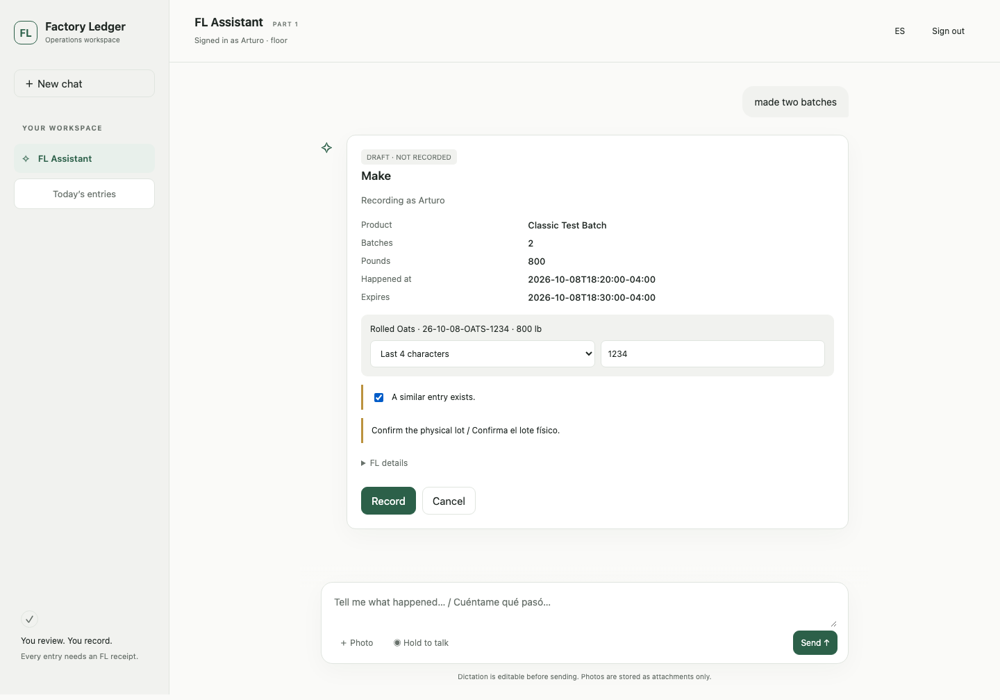
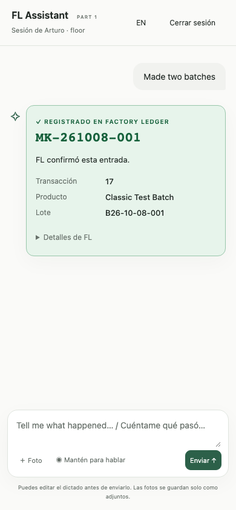

# FL Assistant part 1

Builder: Codex. Reviewer: Claude Code. Draft PR; do not merge.
Base: origin/main de31023 after A5 #88 and A2 #89 merged on 2026-10-08.
Implements phase1-safe-operating-system §1.8, F1 and §11 for staging only.
Shared FL permission and lot validators remain authoritative.

Merge order: **A5 → A2 → F1**. Apply **068 by hand with lock_timeout and
statement_timeout before ever enabling ASSISTANT_ENABLED in production**.
See [deployment and recovery notes](../deployments/f1-assistant.md).
GET /correction-reasons becomes a read-only route for master/actor keys even
when the assistant is disabled; GET /dash/fl-assistant returns 404 while disabled.

## Boundaries

- `/dash/fl-assistant` is served by FastAPI; every API request uses that
  page's origin. Personal actor keys use existing authentication. A11 sessions
  can use the same header once supported by FL; PIN login is deferred.
- `/assistant/*` authenticates the caller and relays allowlisted requests to
  the same FastAPI application through ASGI, including FL authentication.
  There is no alternate ledger implementation, privileged relay key or MCP.
- OpenAI Responses uses function tools, `tool_choice=required`, sequential
  calls and no text escape tool. Model prose is not rendered. Resolved IDs
  come from FL matches or explicit candidate selections, never model guesses.
- Only the separate Record endpoint can commit. Durable, actor-bound draft
  IDs refer to the original server-held ticket and payload hash. Neither
  reaches the model/browser. Retry always commits that exact ticket.
  A durable Record-attempt marker prevents Cancel from claiming an uncertain
  commit was cancelled. A definitive first-attempt 4xx clears its marker for Cancel;
  an uncertain or concurrent attempt still requires retrying Record to establish the outcome.
  FL's output-SKU blocker has a separate human confirmation button; it creates
  a fresh prepare result and still requires Record. The model cannot supply
  either SKU confirmation or lot-confirmation evidence.
- Choice, draft, blocker and read cards use FL JSON. Green receipts require
  an actual successful commit response with a receipt number. Failures retain
  a red NOT recorded state and the retryable draft.
- A5 annotations on `draft.input_plan` drive last-four/full-code inputs.
  Evidence passes unchanged to commit; FL validates it. Before A5 merges,
  suggested lots remain visible without pretending confirmation is enforced.
- Photos are bounded private attachments, stored durably with actor/session
  ownership and optionally linked to a draft. Their bytes never reach a model.
  Audio goes only to OpenAI transcription; editable text never auto-sends.
- Unmatched resolver queries are stored for review. No automatic alias learning.
- Correction choices come from FL's eight-row `correction_reasons` catalog.
  F1 does not define correction, inventory, permission or lot-validity rules.

## Delivery checkpoints

1. Contract and draft PR.
2. Backend transport, durable state, function tools, attachments and tests.
3. Bilingual chat, dictation, choice/draft/receipt cards and browser checks.
4. Complete Python/JavaScript suites; explicit staging migration and deployment;
   live staging acceptance, changelogs and reviewer handoff.

Migration `068_fl_assistant.sql` is additive F1 state only; merged 062–065 belong
to A5/A2, unmerged 066 is deferred, and 067 is left available to A3b. No startup migration is added.
`ASSISTANT_ENABLED=1` and `OPENAI_API_KEY` are set only on FastAPI-staging.

## Validation and operations

- Fresh dedicated PostgreSQL 17 database, `127.0.0.1:57690/fl_f1_release`:
  **1,829 Python tests passed**, zero failures/skips; **72 JavaScript tests passed**.
  The F1 suite includes real independent-connection concurrent commits and a
  response lost after a committed ledger write; each ticket posts once.
- Browser harness: `tests/visual/run-fl-assistant.mjs`. Desktop/390px,
  light/dark, English/Spanish, warnings, lot inputs, candidate escaping,
  lost-response retry, reload recovery, uploads and unsent/editable dictation.
- GPT OpenAPI stays unchanged at 30 operations. Production and other worktrees
  are unchanged. The proof-of-concept checkout was read only.
- Explicit migration: `python scripts/check_assistant_staging.py --apply-migration`.
  Hosted smoke: the same script without that flag (optional `--audio-file`).
  Its fixtures are marked `STG-F1-*`; its temporary actor is always deactivated.
- Page: `https://fastapi-staging-production-dd7b.up.railway.app/dash/fl-assistant`.
  API calls are locked to the page origin; use this Railway page, not a copied
  HTML file on another host. Authentication is a personal staging actor key.
- Photos are stored privately in PostgreSQL bytea for part 1 (5 MB/photo,
  50 MB/chat); no extra Storage credential is needed. The user sees the
  attachment on its draft. A6 integration/retention policy is part 2. Session
  history, receipts, attachment links and original tickets survive restarts.
  Application rollback disables `ASSISTANT_ENABLED`; retain the additive
  tables and committed evidence. No destructive down-migration is supplied.
- A2 permissions and A5 lot rules are exercised through the same ASGI relay.
  The nine assistant transport routes are explicitly listed in A2 UNGATED_ROUTES;
  F1 authenticates every request, and the relayed actions enforce their role and
  lot checks. The test operator supplies confirmation evidence for make/pack.
- A3b owns enforcement of the fixed reason catalog's applicability, sign and
  note rules. F1 exposes the eight catalog values and passes FL responses
  through; it does not implement those business rules itself.

The final live results and deployment identifier are recorded in
`docs/validation/fl-assistant-part1-staging.json` after hosted acceptance.

Hosted acceptance passed for all five actions under fixture `STG-F1-85AAC3C9FC`:
RCV-261008-008, MK-261008-008, PK-261008-004, ADJ-261008-003, FND-261008-003.
Two simultaneous Record calls per draft yielded one ledger post and the same
receipt. Real transcription returned “I received two cases.”, editable/unsent.
The temporary actor (1000000010) is deactivated; synthetic evidence is retained.

The worktree-free merge simulations found no conflicting business handlers.
A2 needs both `import permissions` and `import fl_assistant` retained in
`main.py`; both integrations need append-only log reconciliation and both
pending migration includes retained in `tests/schema/schema.sql`.

Part 2: photo-to-draft extraction and A6 evidence storage integration; A11 PIN
login; A9 shift-summary tool when its endpoint exists; full A5 acceptance after
merge; production readiness including owner-managed spend cap and email alerts.

API references: [function calling](https://developers.openai.com/api/docs/guides/function-calling)
and [transcription](https://developers.openai.com/api/docs/guides/speech-to-text).

Final hosted code: `337ea51`, successful staging deployment
`6117e0d1-17e4-41a7-a562-e29dc88f8108`. Post-deploy page and JavaScript bytes
match the workspace; actual Responses read and editable/unsent transcription
passed again. The final smoke actor was deactivated. The quiet hourly
`rebase-f1-after-a2-and-a5-merge` follow-up will integrate newly merged #89/#88,
re-test and deploy only to staging, leaving #90 draft for Claude Code review.

## Review fixes after A5/A2 merge — 2026-10-08

Rebased onto `de31023`. Fresh local PostgreSQL 17 database `fl_f1_full`:
**2,186 Python / 72 JavaScript passed**, no failures/skips. F1 browser checks
passed again, including EN/ES, 390px light/dark, confirmation controls, retry,
attachments and editable unsent dictation. A2 route completeness passes and
real make/pack commits require A5 operator lot evidence. The integration
follow-up described above is fulfilled by this rebase; staging verification
for the reviewed code is recorded separately below when complete.

Reviewed code `04f42a0` deployed successfully to staging as
`e922cda2-182a-4fb8-b558-48c98f34a031`. All five hosted real-model actions
passed: **RCV-261008-009, MK-261008-009, PK-261008-005, ADJ-261008-004,
FND-261008-004**. Concurrent retries returned matching receipts; direct
staging queries verified one ledger post per ticket, A2 actor attribution
on all five and A5 lot confirmations on make/pack. Temporary actor
`1000000012` is verified inactive. Health is 200 and hosted page/JS
bytes match the tested worktree. Production was not accessed; PR #90 remains
unmerged. Full evidence is under `review_fixes_acceptance` in the validation JSON.

## Merged A3b integration — 2026-10-09

Rebased onto `origin/main` at `ce7bb57` after A5, A2 and A3b. The schema
dump includes 062–065 and 069–071; its only pending include is 068.
F1 history rows are 171–172, after the unchanged merged rollout rows 168–170.

The physical-tag prompt spells out the last four characters **including the
hyphen**, e.g. `-004`. Full-code, scan and pallet options send the operator's
input unchanged; pallet evidence requires the full lot code and FL verifies
its recent move to production. The assistant never fills lot evidence itself.

A3b shortage warnings appear on make/pack drafts and flagged receipts.
A definitive HTTP 202 hold shows **Waiting for owner approval**, without a
receipt or Cancel. Reload restores that state; Check approval retries the
same FL ticket and shows its receipt only after FL confirms the post.
Photos remain attachment-only in part 1. The model cannot supply
`attachment_ref` to bypass the owner-approval gate.

Fresh local PostgreSQL 17 database `fl_f1_review_full_20261009`:
**2,272 Python / 73 JavaScript passed**, zero failures/skips. Browser checks
passed for lot prompts, draft and receipt shortages, restored bilingual
holds, same-ticket approval checks, editable dictation, attachments and
390px light/dark layouts. The A2 completeness, disabled-page flag matrix,
definitive-4xx cancellation, status-only logging and crash-lease recovery
regressions all pass. Production was not accessed; no merge.

Staging deployment `3ef82577-7bcf-47dc-9591-4715b58bee17` is **SUCCESS**
from tested code `ca201d8`. Live real-model acceptance passed all five actions:
**RCV-261009-002, MK-261009-001, PK-261009-001, ADJ-261009-001, FND-261009-001**. Make and pack each flagged a 10 lb
shortage; the 600 lb adjustment held with zero posts until synthetic owner
approval, then replayed the same receipt. Direct staging reads verified one
ledger post per ticket, floor actor attribution on all five and persisted
A5 lot evidence. Both temporary actors are inactive. Health is 200 and page,
JavaScript and CSS bytes match the tested worktree.

An earlier attempt retained receive `RCV-261009-001`, then stopped on an
OpenAI HTTP 503 before a make draft was saved; both actors were deactivated.
The final runner recovers transient provider failures with bounded retries
of the identical turn ID/body. Evidence is preserved under
`a3b_integration_acceptance` in the validation JSON. No production access,
additional migration or merge.
