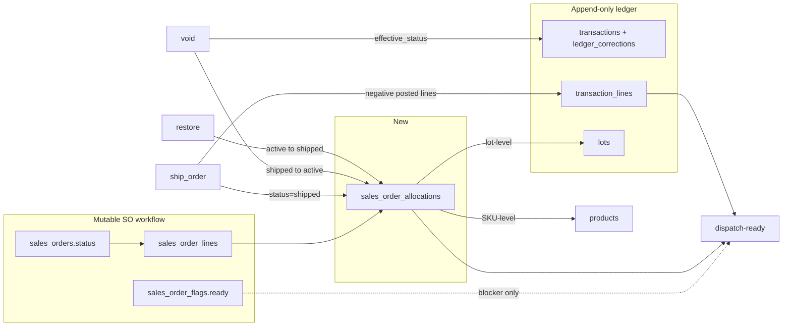

# FR-4 / FR-7 / FR-8 — Allocation and Order-Readiness Model

| Field | Value |
|---|---|
| **Author** | Factory Ledger design (plan-only pass) |
| **Date** | 2026-08-19 |
| **Status** | Draft |
| **Scope** | What "ready to ship" means, and how finished-goods inventory is reserved against sales orders |
| **Workspace** | `/Users/cns/Documents/Codex/2026-08-19/allocation-design` |
| **Constraint** | Plan only. No migrations, endpoints, or tests created. Live DB not queried (no `DATABASE_URL` / `.env` in this checkout). Schema claims are from `tests/schema/schema.sql` (prod dump including migration 043). |

FR-4 / FR-7 / FR-8 are **not named anywhere in this repo** (grep over `*.md`, `*.py`, `*.yaml`, `*.sql` returned no matches). **Decided mapping:** FR-4 = storage + create/release (PRs 1 and 3 writes); FR-7 = readiness formulas (PR 2); FR-8 = dispatch blockers + `PATCH /lots/{id}/received-at` + PR 6 chips.

---

## Overview

Factory Ledger today can tell you how many pounds of a SKU exist (effective posted ledger) and how many pounds an order still *claims* to need (`quantity_lb - quantity_shipped_lb`). It cannot tell you whether those pounds are **reserved for that order**, whether two open orders are double-counting the same stock, or whether a staged lot is actually allowed to leave the building.

Three unrelated "ready" signals already exist and disagree:

1. `sales_orders.status = 'ready'` — workflow state, set by hand via `update_order_status` (`main.py` 6942–6962, 7926–7977).
2. `sales_order_flags.ready` — dashboard-only Factory Ready checkbox (`migrations/037_sales_order_flags.sql` 1–8; `set_sales_order_ready_flag` at `main.py` 7558–7601). No inventory math.
3. `GET /sales/orders/fulfillment-check` — per-line `on_hand >= remaining` against **global** stock (`main.py` 7604–7748). Non-reserving. Not called by `dashboard/dashboard.js`. Includes service lines.

Nothing in the schema is an allocation (`tests/schema/schema.sql` has no `allocation` table). Informal staging exists only as lot-code convention (`STAGED-FEESERS-67476` created by `scripts/inv_recon_post_2026_08_17.py` 504–509) and as count-sheet notes ("Graham 31012 reserved for Clark", `docs/audits/physical-count-2026-08-14.md` 50).

This design introduces a persisted **hybrid SKU/lot allocation** table, a single readiness formula that is void-aware on the *inventory and remaining* sides, automatic release rules implemented in application code (not DB triggers), and a dispatch-queue blocker taxonomy. Consume-on-ship always runs once allocate writes exist; `ALLOCATIONS_ENFORCED` only blocks stealing another order's reserved pounds. Expected receipts are **warn-only inbound cover** — they never satisfy on-hand or inventory-ready. Office GPT stays at **30 operations**. Floor GPT stays at **22**. New writes are dashboard-scoped, like supplies.

---

## Background & Motivation

### Why this change is needed

`FACTORY_LEDGER_SYSTEM_KNOWLEDGE.md` already names the gap:

- Gap 19: "Order readiness is not allocation" — fulfillment check compares each line independently to the same global stock and can include services (`FACTORY_LEDGER_SYSTEM_KNOWLEDGE.md` 1604–1606).
- Missing safeguard: "reservations/allocation across competing orders" (`FACTORY_LEDGER_SYSTEM_KNOWLEDGE.md` 1509).
- "The UI has two different readiness concepts… Neither reserves inventory." (`FACTORY_LEDGER_SYSTEM_KNOWLEDGE.md` 915).

Live operational evidence that informal reservation is already happening off-schema:

- 80 cs of SKU 67476 sit on lot `STAGED-FEESERS-67476` "for Feesers order — actual lot dates to be recorded before ship posts (trace requirement)" (`scripts/inv_recon_post_2026_08_17.py` 504–509; `docs/audits/inventory-variance-execution-2026-08-17.md` 15, 91).
- Physical count flagged Graham 31012 as "280 unstamped, reserved for Clark" with no SO/lot link (`docs/audits/physical-count-2026-08-14.md` 50).
- Open SOs `SO-260629-003` / `SO-260814-002` / `SO-260817-001` were deliberately left unshipped during recon (`docs/audits/inventory-variance-execution-2026-08-17.md` 18).

Without exclusive reservation, `fulfillment_check` will report all three as fulfillable against the same pounds.

### Current-state pain

| Pain | Evidence |
|---|---|
| Multiple orders share one on-hand figure | `fulfillment_check` queries product on-hand independently per line (`main.py` 7681–7691) |
| "Factory Ready" is a checkbox, not a fact | `sales_order_flags` has no FK and no inventory columns (`migrations/037_sales_order_flags.sql` 1–8) |
| Dashboard never computes readiness | `dashboard/dashboard.js` posts `/sales-orders/{so}/ready` (2149–2154) and never calls `fulfillment-check` |
| Shipped qty is a mutable counter, not a ledger projection | `ship_order` increments `quantity_shipped_lb` (`main.py` 8460–8472); `void_transaction` does not touch it (`main.py` 5043–5080) |
| Staged lots are a naming convention | `lots` has no `customer_id`, no `sales_order_id` (`tests/schema/schema.sql` 1132–1150) |
| Standalone `/ship` can consume stock that an SO still needs | `check_open_orders_for_ship` only 409s unless `force_standalone` (`main.py` 3896–3903); it does not look at allocations (there are none) |

---

## Goals & Non-Goals

### Goals

- Define exclusive reservation of finished-goods pounds against open SO lines.
- Define exact per-line and per-order readiness formulas, including which statuses count and how voids are treated.
- Make "ready to ship" a **computed** property with an explicit blocker list, distinct from `sales_orders.status` and from Factory Ready.
- Give staged-for-customer lots a first-class lot-level allocation instead of a `STAGED-*` lot-code prefix.
- Keep ship/pack/standalone-ship from consuming pounds another open order has reserved.
- Stay inside the 30-operation office GPT cap and the 22-operation Floor GPT cap.

### Non-Goals

- Full shipment-void unwind of `quantity_shipped_lb` / line status / order header (known gap; this design isolates readiness from it and adds a **narrow** allocation restore on void).
- Allocating ingredients, batch/WIP, packaging, or consumables.
- Counting expected receipts as on-hand, coverable, allocated, or inventory-ready (`expected_receipts` is inbound intent; they are a **warn** chip only).
- Replacing the production scheduler's `_simulated_allocation` (`main.py` 11334–11398) — that is a planning simulation, not a reservation.
- Making Factory Ready disappear. It stays as a human floor gate.
- Odoo sync, BOL/signature capture, or pallet-staging warehouse locations.
- Changing Permanent Rules 1–10 (`FACTORY_LEDGER_CHANGELOG.md` 99–112).

---

## Current-state map

Every claim below is from this checkout. Live Postgres was **not** queried: this workspace has no `.env` and no `DATABASE_URL`. Schema is `tests/schema/schema.sql` (includes migrations 037–043). `AGENTS.md` is **absent** from the project root; pgbouncer/read-only rules live in `CLAUDE.md` 72 and `scripts/psql_ro.sh` 1–40.

### 1. Sales orders, lines, fulfillment tracking

**Headers** (`tests/schema/schema.sql` 1357–1370):

- `sales_orders(id, order_number UNIQUE, customer_id, order_date, requested_ship_date, status, notes, notes_es, created_at, updated_at, created_at_source)`
- Status CHECK: `new | confirmed | in_production | ready | shipped | partial_ship | invoiced | cancelled`

**Lines** (`tests/schema/schema.sql` 1335–1350):

- `sales_order_lines(id, sales_order_id, product_id, quantity_lb, quantity_shipped_lb DEFAULT 0, unit_price, line_status, notes, notes_es, created_at, created_at_source)`
- Line status CHECK: `pending | partial | fulfilled | cancelled`
- No `allocated_lb` column. No lot FK.

**How shipped quantity is derived today:** it is **not** derived. It is a mutable running counter written by `ship_order` commit:

```8460:8472:main.py
cur.execute("UPDATE sales_order_lines SET quantity_shipped_lb = quantity_shipped_lb + %s WHERE id = %s RETURNING quantity_lb, quantity_shipped_lb", (actual_ship, item["line_id"]))
...
if new_shipped >= ordered:
    new_line_status = 'fulfilled'
elif new_shipped > 0:
    new_line_status = 'partial'
```

Service lines auto-fulfill with no inventory move (`main.py` 8406–8422). Remaining everywhere is `quantity_lb - quantity_shipped_lb` (list: 7529; detail: 7867; ship preview: 8310; fulfillment-check: 7677; planner: 11347).

**Two maps exist.** `VALID_TRANSITIONS` (`main.py` 6942–6951) is the full graph; `MANUAL_TRANSITIONS` (`main.py` 6954–6962) is what `update_order_status` enforces. `shipped` / `partial_ship` are auto-only via `ship_order` (`main.py` 7932–7936).

```
VALID_TRANSITIONS (6942–6951)
  new            → confirmed | cancelled
  confirmed      → in_production | cancelled
  in_production  → ready | cancelled
  ready          → in_production | shipped | partial_ship | cancelled
  partial_ship   → shipped | cancelled
  shipped        → invoiced
  invoiced, cancelled → (terminal)

MANUAL_TRANSITIONS (6954–6962) — shipped/partial_ship stripped
  new            → confirmed | cancelled
  confirmed      → in_production | cancelled
  in_production  → ready | cancelled
  ready          → in_production | cancelled
  partial_ship   → cancelled
  shipped        → invoiced
```

Create starts at `confirmed` (`main.py` 6978–6979), so `new` is legacy. `ready` here means "operator marked the *order workflow* Ready to Ship" (`CONTEXT.md` 131), not "inventory is reserved."

`ship_all=false` can set `order_status='shipped'` while unattempted pending lines remain: `all_fully_shipped` only inspects `lines_to_ship` (`main.py` 8401, 8513). **Out of scope** for allocation; tracked as a separate follow-up, not silently fixed here.

**Line edit/cancel:**

- `update_order_line` (`main.py` 8220–8273) can set `quantity_lb` on any non-fulfilled/non-cancelled line. **There is no `quantity_lb >= quantity_shipped_lb` guard.**
- `cancel_order_line` (`main.py` 8197–8211) sets `line_status='cancelled'` only. It does not touch `quantity_shipped_lb` and would not release reservations (none exist).
- There is no dedicated cancel-order endpoint; header cancel is `PATCH /sales/orders/{id}/status` → `cancelled`.

**List/detail joins** (`list_sales_orders` 7447–7477):

- `sales_orders` ⋈ `customers` ⋈ `sales_order_lines` ⋈ `products` ⟕ `sales_order_flags` ON `sof.so_number = so.order_number` ⟕ `customer_aliases`
- Weight totals exclude `products.is_service` (7453–7456)
- Pallet subselect does **not** exclude services (7457–7472)
- Response includes `ready`, `ready_at`, `ready_by`, `note` from the flags table (7534–7537)

**Detail shipment history is void-aware; the counter is not.** `get_sales_order` joins `sales_order_shipments` to `ledger_current_transactions` and keeps only `effective_status = 'posted'` (`main.py` 7882–7891). After a ship void, the history row disappears but `quantity_shipped_lb` stays high. Confirmed in `FACTORY_LEDGER_SYSTEM_KNOWLEDGE.md` 803 and 1480–1482.

### 2. `sales_order_flags` (Factory Ready)

```1:8:migrations/037_sales_order_flags.sql
CREATE TABLE IF NOT EXISTS sales_order_flags (
    so_number  text PRIMARY KEY,
    ready      bool NOT NULL DEFAULT false,
    ready_at   timestamptz,
    ready_by   text DEFAULT 'floor',
    note       text NULL,
    updated_at timestamptz DEFAULT now()
);
```

- No FK to `sales_orders`. Orphan flags survive order-number typos.
- `POST /sales-orders/{so_number}/ready` (`main.py` 7558–7601) upserts the annotation after checking the SO exists and is not `shipped|invoiced|cancelled`.
- Dashboard checkbox is optimistic (`dashboard/dashboard.js` 2074, 2149–2220).
- Changelog row 34 (`FACTORY_LEDGER_CHANGELOG.md` 87) states this is "UI-only" and "modeled on `POST /dashboard/api/notes`."

This is a **human floor gate**, not readiness math.

### 3. Finished-goods on-hand

**Canonical write-path / API inventory** uses `POSTED_LINES` (`main.py` 293–304):

```293:304:main.py
# Only lines whose parent transaction has status='posted' count toward any
# on-hand / balance / availability figure.
POSTED_LINES = (
    "(SELECT tl.* FROM ledger_current_transaction_lines tl"
    " JOIN transactions _pt ON _pt.id = tl.transaction_id"
    " JOIN ledger_current_transactions _ct ON _ct.id = _pt.id"
    " WHERE _ct.effective_status = 'posted')"
)
```

`effective_status` is computed by `ledger_current_transactions` (`tests/schema/schema.sql` 960–965): latest `ledger_corrections` event `void` → `voided`, `restore` → `posted`.

Used by:

| Path | File:lines | Effective? |
|---|---|---|
| `lot_on_hand` / `fifo_lot_balances` | `main.py` 307–352 | Yes |
| `/inventory/current`, `/inventory/lookup` | `main.py` 2159–2181 | Yes |
| `fulfillment_check` on-hand | `main.py` 7681–7688 | Yes |
| `ship` / `ship_order` / `pack` / `make` FIFO | `main.py` 3803–3811, 8424–8427, 8742–8751 | Yes |
| Dashboard FG/batches/ingredients | `main.py` 9347–9354 | Yes |
| Supplies inventory | `main.py` 3449–3456 | Yes |
| Planner `_load_finished_inventory` | `main.py` 11251–11262 | Yes |
| Legacy `inventory_summary` / `lot_balances` | `tests/schema/schema.sql` 3203–3231 | **No — raw `transaction_lines`** |
| `/dashboard/inventory` | `main.py` 1928–1933 | **No — reads `inventory_summary`** |

**Trace endpoints do *not* currently inherit the Aug 2026 "raw status" bug for relationship edges.** Batch/ingredient/supplier traces join `ledger_current_transactions` and require `effective_status='posted'` (`main.py` 5158–5166, 5196–5207; `FACTORY_LEDGER_SYSTEM_KNOWLEDGE.md` 809–813). On-hand scalars go through `POSTED_LINES`.

**Readiness math would inherit a *different* confirmed bug if it used `quantity_shipped_lb`:** void restores inventory and hides the ship from history/packing-slip, but does not decrement the SO counter (`void_transaction` 5043–5080 writes only a correction; `FACTORY_LEDGER_SYSTEM_KNOWLEDGE.md` 722, 1548–1550). Fulfillment remaining would go to 0 while stock is back. Changelog Known Root Causes (`FACTORY_LEDGER_CHANGELOG.md` 91–97) and Permanent Rule 6 (ship validates SO line quantities) do not cover this unwind.

Dashboard FG additionally filters `COALESCE(l.status, 'active') = 'active'` (`main.py` 9352). `ship_order` FIFO does **not** filter lot status (`main.py` 8424–8427). `fifo_lot_balances` also does not (`main.py` 337–349). Merged lots can still be shipped if they have a posted balance.

### 4. Lots, lot↔product↔SO, staged lots

`lots` (`tests/schema/schema.sql` 1132–1150):

| Column | Notes |
|---|---|
| `id` PK | |
| `product_id` | FK to products; unique with `lot_code` (2527) |
| `lot_code` | Free text. Permanent Rule 2 wants `YY-MM-DD-XXXX-NNN`; not enforced |
| `created_at` | Naive timestamp |
| `received_at` | Timestamptz, nullable — FIFO key via `COALESCE(received_at, created_at)` (`main.py` 324) |
| `supplier_lot_code` | Nullable |
| `lot_type` | Comment in code: `single_supplier` or `commingled` (`main.py` 1143, 2856–2857). No CHECK |
| `status` | Default `'active'`; merge columns exist. **No CHECK constraint** |
| `entry_source` | `varchar(30)` default `'received'` (`schema.sql` 1137). Canonical **writes**: `'received'` (receive 2859), `'found_inventory'` (found 6488), `'production_output'` (make 4278), `'pack_output'` (pack 4706). Enum `inventory_entry_source` also lists `'adjustment'` (`schema.sql` 33–41) but `lots.entry_source` is **not** that enum. `adjust()` never creates lots (4858–4861). Code comment alias `'adjusted'` in `INGREDIENT_ENTRY_SOURCES` (`main.py` 5120) is **not** a written value. |
| `customer_id` / `sales_order_id` | **Do not exist** |

Lot↔product is `lots.product_id`. Lot↔SO is only via shipment after the fact:

```
sales_order_shipments.sales_order_line_id → sales_order_lines
sales_order_shipments.transaction_id → transactions
transaction_lines.lot_id → lots
```

(`tests/schema/schema.sql` 1693–1702, 864–872)

**Staged lots are informal.** The Feesers example is an `adjust+` onto a new lot_code `STAGED-FEESERS-67476` with `entry_source='found_inventory'` (`scripts/inv_recon_post_2026_08_17.py` 504–509). There is no row linking that lot to a Feesers sales order. FIFO `ship_order` will consume it for **any** customer as soon as older lots of 67476 are empty, because it only filters `product_id` + positive posted balance (`main.py` 8424–8427).

Packing-slip "allocation" (`main.py` 8644–8774) is a **preview**, not a reservation: either actual posted `shipment_lines` lots, or a FIFO walk of current on-hand. It is discarded after the PDF is built.

### 5. Existing shipment postings

**Order ship** (`ship_order` commit, `main.py` 8346–8518):

1. Lock/re-read order; reject `new` / `invoiced` / `cancelled`.
2. Build remaining physical + service lines.
3. Insert `shipments` header (`sales_order_id`, `shipped_at`, `customer_id`) — 8394–8398.
4. Per physical line: FIFO lots by `COALESCE(received_at, created_at)` (inlined, **not** via `fifo_lot_balances`), `FOR UPDATE` lots, insert `transactions(type='ship')` + negative `transaction_lines`, increment `quantity_shipped_lb`, set `line_status`, insert `sales_order_shipments` and `shipment_lines`.
5. Service lines: increment shipped + `fulfilled`, no txn.
6. Rollback the shipment header if no physical pounds moved (8496–8511).
7. Set order `shipped` iff every attempted line fully shipped, else `partial_ship` (8513–8514). **Does not re-read cancelled/unattempted lines** — `all_fully_shipped` can be true while other pending lines remain if they were not in `lines_to_ship`. Out of scope (see state-machine note above).

**Standalone `/ship`** (`main.py` 3780–4030): same ledger decrement (negative posted lines) + `shipments`/`shipment_lines`, **no** `sales_order_id`, **no** `quantity_shipped_lb` update. `check_open_orders_for_ship` (3717–3735) 409s if the customer has remaining open lines, unless `force_standalone`. Inventory recon 2026-08-17 used this path ("All ship txns are standalone (`sales_orders` not updated)", `docs/audits/inventory-variance-execution-2026-08-17.md` 53).

### 6. Partial-allocation / staging behavior today

| Behavior | Formal? | What it actually does |
|---|---|---|
| Pack/ship `lot_allocations` request field | Formal, **ephemeral** | Preview/commit split for that one write (`main.py` 1239, 4588–4605). Not stored against an SO |
| Packing-slip FIFO preview | Informal | Read-only pick list (`main.py` 8719–8774) |
| Scheduler `_simulated_allocation` | Formal, **ephemeral** | Walks demand by ship date, mutates an in-memory copy of FG on-hand (`main.py` 11334–11368). Never writes reservations |
| Factory Ready flag | Formal annotation | Human checkbox |
| `STAGED-*` lot codes | Informal data | Separate lot; no SO FK |
| Count-sheet "reserved for Clark" | Informal | Not in DB |

There is **no** partial-allocation entity.

### 7. Void / correction interaction (readiness would inherit this)

```5043:5080:main.py
def void_transaction(...):
    event = _append_transaction_correction(cur, transaction_id, "void", ...)
    # no sales_order_lines update
    # no sales_order_shipments delete
    # no shipments void
```

`POST /records/transactions/{id}/corrections` (`main.py` 5089–5105) accepts `event_type` in `{amend, void, restore}`. Restore of a voided txn sets `effective_status='posted'` again (`schema.sql` 960–965; `_append_transaction_correction` 4958–4976). Header `amend` cannot change line qty: `_TRANSACTION_AMENDABLE_FIELDS` is occurred_at / business_date / notes / BOL / shipper / cases_received / case_size_lb / customer_name / order_reference / adjust_reason (`main.py` 4924–4928). Line-level quantity corrections exist via `ledger_corrections` on `transaction_lines` but have no SO-allocation hook today.

Consequences if readiness used today's remaining:

- Void: `on_hand` goes **up**; `remaining = quantity_lb - quantity_shipped_lb` stays **0**; order stays `shipped` / `partial_ship`; `fulfillment_check` skips fulfilled lines (`main.py` 7663).
- Restore of that void: `on_hand` drops again; recorded shipped still high. Allocations (once they exist) must flip `shipped` ↔ `active` with the correction, not only on void.

Packing-slip and order shipment history already hide the voided txn (`main.py` 8648–8656, 7888–7890). The mutable aggregates do not.

### 8. Three competing day-key systems

Documented as gap 17 (`FACTORY_LEDGER_SYSTEM_KNOWLEDGE.md` 1596–1598, 248, 408, 1958):

| Key | Column | Meaning | Used by |
|---|---|---|---|
| Legacy event | `transactions.timestamp` naive | Historical event clock | Production calendar (`main.py` 9257–9266) |
| Aware event | `transactions.occurred_at` timestamptz | Phase 1 operational time | Written at post; many reads still ignore amendments in `effective_record` |
| Plant day | `transactions.business_date` date | Intended cutoff/group key | Daily Entries `date_mode=event` (`main.py` 9764); recon audits |
| Entry time (fourth, not a day-key but collides) | `created_at` + `created_at_source` | DB receipt; backfill 039 is not historical | Daily Entries `date_mode=entered` |

Allocation rows must **not** invent a fifth day-key. Reservations use `timestamptz` `created_at` / `released_at` / optional `expires_at` only.

### 9. Changelog guards for this area

From `FACTORY_LEDGER_CHANGELOG.md`:

- **Breaks If Reverted / row 30:** `POSTED_LINES` is the only legal balance source. Readiness/on-hand **must** use it.
- **Row 51 / Phase 1:** voids are append-only corrections; originals stay. Do not mutate `transactions.status` as the readiness filter — use `effective_status`.
- **Row 34:** Factory Ready is annotation-only. Do not overload it into reservation.
- **Row 62:** dashboard key allowlist is the only way the UI may call new writes.
- **Row 66:** do not void recon txns 1950–2026 / do not treat `STAGED-FEESERS-67476` as disposable.
- **Row 69:** office GPT is **exactly 30 ops**. Counted in this pass: 30 `operationId`s in `openapi-gpt-v3.yaml` (searchProducts … shipOrder). Floor schema has 22 (`gpt-configs/schemas/openapi-floor.yaml`).
- **Permanent Rule 4:** exclude service/charge lines from weight totals.
- **Permanent Rule 6:** ship validates SO line quantities before commit.
- **Known Root Cause — 6543 pooler:** never `set_session(readonly=True)` against port 6543 (`FACTORY_LEDGER_CHANGELOG.md` 97; `scripts/psql_ro.sh` 12–16).

---

## Design questions

### Q1. Reservation storage

#### Alternatives

| Option | How | Pros | Cons |
|---|---|---|---|
| **A. New `sales_order_allocations` table** | One row per reserved slice (SKU-level or lot-level) | Exclusive; auditable; supports partial lots and multi-lot splits; can mark `shipped` without deleting history; does not overload `sales_order_lines` | Extra table; must be locked with lots at write time |
| **B. Columns on `sales_order_lines`** | e.g. `allocated_lb`, `allocated_lot_id` | Simple | Cannot represent multi-lot or two reservations on one line; no audit of release; lot-level XOR SKU-level only |
| **C. Derived-only** | Compute FIFO preview at read time (today's packing-slip / fulfillment-check) | No writes, no drift | **Does not reserve.** Re-creates Gap 19. Cannot express staged-for-Feesers |

#### Recommendation: **A — persisted allocations table**

Derived-only is the status quo and is why this work exists. Line columns cannot model the Feesers 80 cs slice of a larger SKU on-hand, nor a 200 lb line split across two lots.

#### Proposed DDL (migration **044** — latest on disk is `migrations/043_supplies.sql`)

Written out only; **not created**.

```sql
-- migrations/044_sales_order_allocations.sql
-- Idempotent (Permanent Rule 10).

CREATE TABLE IF NOT EXISTS sales_order_allocations (
    id                       bigint GENERATED BY DEFAULT AS IDENTITY PRIMARY KEY,
    sales_order_id           integer NOT NULL REFERENCES sales_orders(id),
    sales_order_line_id      integer NOT NULL REFERENCES sales_order_lines(id),
    product_id               integer NOT NULL REFERENCES products(id),
    lot_id                   integer REFERENCES lots(id),          -- NULL = SKU-level
    quantity_lb              numeric(14,4) NOT NULL
                             CHECK (quantity_lb > 0),
    status                   text NOT NULL DEFAULT 'active'
                             CHECK (status IN ('active', 'released', 'shipped', 'superseded')),
    source                   text NOT NULL
                             CHECK (source IN ('manual', 'auto_fifo', 'staged_lot')),
    ship_transaction_id      integer REFERENCES transactions(id),  -- set iff status='shipped'
    last_ship_transaction_id integer REFERENCES transactions(id),  -- retained across void/restore
    split_from_id            bigint REFERENCES sales_order_allocations(id), -- original row of a split_on_ship
    created_at               timestamptz NOT NULL DEFAULT clock_timestamp(),
    created_at_source        text NOT NULL DEFAULT 'database',
    created_by               text NOT NULL DEFAULT 'legacy-shared-key',
    released_at              timestamptz,
    released_by              text,
    release_reason           text,
    expires_at               timestamptz,                          -- NULL = no TTL; auto_fifo only
    note                     text,
    CONSTRAINT allocations_shipped_has_txn
        CHECK ((status = 'shipped') = (ship_transaction_id IS NOT NULL)),
    CONSTRAINT allocations_released_has_time
        CHECK ((status <> 'released') OR (released_at IS NOT NULL))
);

-- Duplicate-row races: one live SKU-level slice per line; one live pin per (line, lot).
-- Allocate upserts. Partial ship splits (leftover stays the sole live row). Void of a
-- partial ship **coalesces** onto that leftover — it must not INSERT a second live row
-- (see Q2/Q4). Keep these indexes; do not drop them.
CREATE UNIQUE INDEX IF NOT EXISTS soa_active_sku_uniq
    ON sales_order_allocations (sales_order_line_id)
    WHERE status = 'active' AND lot_id IS NULL;

CREATE UNIQUE INDEX IF NOT EXISTS soa_active_lot_uniq
    ON sales_order_allocations (sales_order_line_id, lot_id)
    WHERE status = 'active' AND lot_id IS NOT NULL;

CREATE INDEX IF NOT EXISTS soa_active_product_idx
    ON sales_order_allocations (product_id)
    WHERE status = 'active';

CREATE INDEX IF NOT EXISTS soa_active_lot_idx
    ON sales_order_allocations (lot_id)
    WHERE status = 'active' AND lot_id IS NOT NULL;

CREATE INDEX IF NOT EXISTS soa_order_idx
    ON sales_order_allocations (sales_order_id);

CREATE INDEX IF NOT EXISTS soa_ship_txn_idx
    ON sales_order_allocations (ship_transaction_id)
    WHERE ship_transaction_id IS NOT NULL;

-- Over-allocation vs POSTED_LINES cannot be a CHECK (the ledger is a view over
-- corrections). Product-match (soa.product_id = sol.product_id, and if lot_id
-- set then lots.product_id = soa.product_id) is enforced in the allocate
-- handler, not here — no composite FK exists on (lots.id, lots.product_id)
-- that we would want to add in this migration.

COMMENT ON TABLE sales_order_allocations IS
  'Exclusive FG reservation against an SO line. lot_id NULL = SKU-level.';
```

No `business_date` column. No session-level GUCs. `source` is never overwritten to a restore tag; void/restore only flips `status` and `ship_transaction_id`.

### Q2. SKU-level vs lot-level

#### Alternatives

| Option | Pros | Cons |
|---|---|---|
| SKU-only | Matches how `fulfillment_check` and remaining demand work today | Cannot pin Feesers 80 cs; FIFO at ship time can take the wrong lot; cannot block a lot that is missing dates |
| Lot-only | Perfect for trace/recall and staged lots | Forces a lot pick before pack finishes; starving later lots; operators do not always know the lot at order entry |
| **Hybrid** | SKU-level for ordinary demand; lot-level when the floor has physically staged or when a lot is not ship-legal | More states to explain; over-allocation must sum both kinds |

#### Recommendation: **hybrid, with explicit when-each-applies**

| Situation | Level | `source` |
|---|---|---|
| Planner/dashboard "allocate this line" with no lot | SKU-level (`lot_id` NULL) | `manual` |
| Optional "allocate open demand FIFO across unallocated lots" job | Lot-level rows totaling the SKU request | `auto_fifo` |
| Operator (or recon) stages a specific lot for a customer | Lot-level | `staged_lot` |
| `line_requires_lot_pin` (FIFO-available `STAGED-*` / found-inventory stub) | Lot-level **required** to clear `unstaged`; SKU-level is not enough. `missing_lot_dates` stays until `received_at` is set | `staged_lot` or `manual` |
| Partial lot (80 cs of 317) | Lot-level for the staged slice; remaining SKU on-hand stays unallocated or SKU-allocated to others | `staged_lot` |
| Recall / hold | Out of scope as a hold table; if we must keep product in the building, allocate the lot to a synthetic internal order **or** leave it unallocated and add a future hold entity. Do not pretend a hold is an SO allocation | — |

**FIFO + consume helper (normative; replaces today's inlined ship SQL).**

`ship_order` today inlines FIFO as `ORDER BY COALESCE(l.received_at, l.created_at) ASC` with **no** `l.id` ASC and **no** `lots.status` filter (`main.py` 8424–8427). `fifo_lot_balances()` uses `FIFO_LOT_ORDER_SQL = COALESCE(l.received_at, l.created_at) ASC, l.id ASC` (`main.py` 324–349). Adopting `fifo_lot_balances()` + `id ASC` on the ship path is an **intentional unification** in the helper PR (changelog-safe; deterministic ties). It is not "leave the inlined query untouched."

One helper, used by allocate, ship preview, ship commit, standalone `/ship` preview/commit, and pack-source checks:

```
available_lots_for_product(cur, product_id, so_line_id=None) ->
  [{lot_id, lot_code, on_hand, reserved_others_lot, takeable_unpinned, takeable}]
```

Definitions (active = `status='active' AND (expires_at IS NULL OR expires_at > now())`):

```
on_hand(lot)            = lot_on_hand()                          # POSTED_LINES
reserved_others_lot     = SUM(active lot-level SOA on this lot
                              WHERE sales_order_line_id IS DISTINCT FROM so_line_id)
takeable_unpinned(lot)  = max(0, on_hand(lot) - SUM(active lot-level SOA
                              on this lot, ALL lines))
foreign_sku             = SUM(active SKU-level SOA on this product
                              WHERE sales_order_line_id IS DISTINCT FROM so_line_id)
```

Foreign SKU-level reservations are a claim on the **unpinned pool**, not on a named lot. Shadow-consume `foreign_sku` from `takeable_unpinned` in `FIFO_LOT_ORDER_SQL` order; whatever remains on each lot is `takeable` for this line (or for standalone ship when `so_line_id` is None).

**Lock order** (every write that reads these numbers):

1. `SELECT id FROM lots WHERE product_id = %s ORDER BY id ASC FOR UPDATE`
2. `SELECT id FROM sales_order_allocations WHERE product_id = %s AND status = 'active' FOR UPDATE`

**Consume-on-ship** (`ship_order` commit, **always**, even when `ALLOCATIONS_ENFORCED` is off):

Walk **this line's** live lot-level rows by `created_at ASC, id ASC`, then FIFO-walk `takeable` lots via `FIFO_LOT_ORDER_SQL` for any remainder (unreserved pounds, KD 11). SKU-level live row (at most one per unique index) is split the same way against the FIFO take.

For each live row `A` of qty `Q` from which we take `T` (`0 < T ≤ Q`):

| Case | Rows after |
|---|---|
| `T = Q` (full consume) | `A`: `status='shipped'`, `ship_transaction_id=txn`, `last_ship_transaction_id=txn`. Unique key is free. |
| `T < Q` (partial) | `A`: `status='superseded'`, `release_reason='split_on_ship'`, `quantity_lb=Q`. Insert leftover `L`: `active`, qty `Q-T`, same line/lot/source/expires_at, `split_from_id=A.id`. Insert shipped `S`: qty `T`, `status='shipped'`, `ship_transaction_id=txn`, `last_ship_transaction_id=txn`, `split_from_id=A.id`, same line/lot/source. **Only `L` is live** — unique index holds. |

Standalone `/ship` never matches an SO line, so it never converts rows; it only subtracts `takeable` (and 409s `STOCK_ALLOCATED` when the flag is on).

**Void / restore vs the unique index (coalesce, do not drop the indexes):**

Void of `txn` — for each `S` with `ship_transaction_id=txn` and `status='shipped'`, under the same `FOR UPDATE` as Q2:

1. Look up live leftover `L` on the same `sales_order_line_id` and same `lot_id` (NULL-safe SKU match).
2. **If `L` exists (partial-ship case):** `L.quantity_lb += S.quantity_lb`; `L.last_ship_transaction_id = txn`. `S.status='superseded'`, `S.release_reason='void_coalesced'`, `S.ship_transaction_id=NULL`, `S.last_ship_transaction_id=txn`. Do **not** set `S` to `active` (unique violation).
3. **If `L` does not exist (full-consume case):** `S.status='active'`, `S.ship_transaction_id=NULL`, `S.last_ship_transaction_id=txn`. Unique key is free.

Restore of `txn`:

1. For each `S` with `last_ship_transaction_id=txn` and `release_reason='void_coalesced'` and `status='superseded'`: find live `L` on the same line+lot; if `L.quantity_lb + ε < S.quantity_lb` → 409 `RESTORE_SPLIT_MISSING` (leftover was released or re-shipped; do not guess). Else `L.quantity_lb -= S.quantity_lb`; if `L.quantity_lb ≤ ε` then `L` → `superseded` / `restore_split_consumed`. `S.status='shipped'`, `S.ship_transaction_id=txn`. Result: leftover 60 active + 40 shipped.
2. For each `S` with `last_ship_transaction_id=txn` and `status='active'` (full-consume void): `S.status='shipped'`, `S.ship_transaction_id=txn`.

Worked example (required test): allocate 100 lot-level → one live 100. Ship 40 → leftover 60 active + 40 shipped + original superseded. Void → **one live 100** (coalesced), shipped row `void_coalesced`, no unique violation. Restore → 60 active + 40 shipped.

**Partial lots:** allowed **across lines**. Unique is per `(line, lot)` / per line SKU. Two orders may both pin the same lot. Same line never has two live slices of the same key.

**Trace GPT:** lot-level rows give `/trace/batch` a *future* customer exposure edge before the ship posts. Phase 1 does **not** add a new trace operation (30-op cap). Trace may later read allocations as "staged for SO-…" in an existing response object (additive field on `traceBatch`). That is a follow-up, not required to ship allocation.

### Q3. Readiness math

All **weight** totals exclude `products.is_service` only (Permanent Rule 4; `list_sales_orders` already does this at 7453–7454; `fulfillment_check` currently does **not** — 7657–7664 — and that is a bug this design fixes). `is_non_weight` is **not** a column; `get_sales_order` derives it from name keywords (`main.py` 7840–7844) for display. Keyword heuristic stays display-only. Do not fork a second exclusion predicate. Known charge SKUs missing `is_service=true` are a catalog backfill, not a readiness rule.

Let `ε = BALANCE_EPSILON = 0.0001` (`main.py` 291).

#### Which transactions count

| Quantity | Definition | Status filter |
|---|---|---|
| `on_hand(product)` | `SUM(quantity_lb)` of `POSTED_LINES` joined to `lots` for that `product_id` | `ledger_current_transactions.effective_status = 'posted'` only |
| `on_hand(lot)` | `lot_on_hand(cur, lot_id)` (`main.py` 307–313) | same |
| `shipped_recorded` | `sales_order_lines.quantity_shipped_lb` | **none** — mutable, void-blind. Diagnostic only |
| `shipped_effective` | `SUM(ABS(tl.quantity_lb))` of `ledger_current_transaction_lines` whose parent is an effective-posted `type='ship'` joined through `sales_order_shipments.transaction_id` **and** `tl.product_id = sales_order_lines.product_id`. **Do not** sum `sales_order_shipments.quantity_lb` (`numeric(12,2)`, `schema.sql` 1697) — a 10.3333 lb ship would leave 0.0033 remaining (`> ε`). `transaction_lines.quantity_lb` is `numeric(14,4)` (`schema.sql` 869), matching the line. | posted-effective. Readiness numerator |
| `allocated` | `SUM(quantity_lb)` of allocations that are **live**: `status='active' AND (expires_at IS NULL OR expires_at > now())` | allocation status + TTL; not ledger status |
| `allocated_sku` / `allocated_lot` | same, partitioned by `lot_id IS NULL` vs not | |

Voids: a voided ship **drops out of `shipped_effective` and `on_hand` restores**. It does **not** change `shipped_recorded` until the separate unwind PR. Readiness **must ignore `shipped_recorded`**. Restore of that void brings `shipped_effective` back.

Raw `transactions.status` is never used. Legacy `inventory_summary` is never used. Header amend of a ship cannot change qty (`_TRANSACTION_AMENDABLE_FIELDS`, `main.py` 4924–4928). A line-quantity correction that makes `ABS(tl)` disagree with `quantity_shipped_lb` is surfaced as `fulfillment_diverged`; no allocation rewrite on amend.

#### Per-line formulas (physical lines only)

```
ordered_lb        = sales_order_lines.quantity_lb
shipped_lb        = shipped_effective(line)          -- NOT quantity_shipped_lb
remaining_lb      = max(0, ordered_lb - shipped_lb)
on_hand_lb        = on_hand(product)
allocated_lb      = SUM(active allocations for this line)
allocated_others  = SUM(active allocations for this product
                        WHERE sales_order_line_id <> this line)
                    -- includes sibling lines of the SAME sales_order_id
available_lb      = on_hand_lb - SUM(all active allocations for this product)
                    -- unallocated on-hand, factory-wide
coverable_lb      = max(0, on_hand_lb - allocated_others)
                    -- what this line could still reserve
shortage_lb       = max(0, remaining_lb - coverable_lb)
unallocated_need  = max(0, remaining_lb - allocated_lb)
inbound_open_lb   = SUM of pounds on expected_receipts
                    WHERE product_id = this product
                      AND status = 'open'
                    -- status CHECK: open|closed|cancelled (tests/schema/schema.sql 723);
                    -- closed/cancelled rows do not count. Use the table's quantity-lb column.
```

`on_hand`, `coverable_lb`, `allocated_*`, `shortage_lb`, and **inventory-ready** use posted ledger only. `inbound_open_lb` is display + warn input. It is **never** added to `on_hand` or `coverable_lb`.

Eligible to allocate: any physical (`NOT is_service`) product with posted on-hand, including `no_production` / resale SKUs (migration 038). Ingredients, batch/WIP, packaging, and consumables stay out of scope.

A line is **inventory-ready** iff

```
remaining_lb ≤ ε
OR (allocated_lb + ε >= remaining_lb AND shortage_lb ≤ ε)
```

i.e. remaining demand is fully reserved **and** those reservations are still covered by posted on-hand after everyone else's reservations.

**Service lines** (`products.is_service = true`): omit the readiness object on the line, or force `inventory_ready=true`, `blockers=[]`, `fulfillment_diverged=false`. They **do not contribute** to order-level `shipped_recorded_lb`, `shipped_effective_lb`, or `fulfillment_diverged`. They auto-fulfill with **no** `sales_order_shipments` row (`main.py` 8406–8422), so comparing recorded vs effective on them is always a false positive.

Cancelled lines: excluded.

#### Per-order formulas

```
ordered_lb     = SUM(line.ordered_lb)     over physical non-cancelled
shipped_lb     = SUM(line.shipped_lb)
remaining_lb   = SUM(line.remaining_lb)
allocated_lb   = SUM(line.allocated_lb)
shortage_lb    = SUM(line.shortage_lb)
available_lb   = not summed (it is a factory-wide stock figure, not additive)
```

Order **inventory-ready** iff every included line is inventory-ready and `remaining_lb > ε` is allowed (partially shipped orders can still be inventory-ready for what is left).

Order **dispatch-ready** iff inventory-ready **and** no element of `blockers` has `severity='block'` (see Q5). Warn/info codes (`no_ship_date`, `service_only`) may sit in `blockers` without clearing the flag. `FACTORY_READY_REQUIRED` (default true) still controls whether `not_floor_ready` is `block` or `warn`.

#### Divergence field (required while void-unwind is open)

Computed **only over physical (`NOT is_service`) lines**:

```
shipped_recorded_lb     = quantity_shipped_lb          # diagnostic
shipped_effective_lb    = SUM(ABS(posted ship lines))  # Q3 definition
fulfillment_diverged    = abs(shipped_recorded_lb - shipped_effective_lb) > ε
```

Order-level `fulfillment_diverged` is the OR of physical lines (equivalently, compare the two order sums after dropping services). If true, the dispatch view surfaces blocker `fulfillment_diverged` so operators do not trust the SO status pill.

### Q4. Automatic release

#### Events

**Normative: consume-on-ship always runs.** `ALLOCATIONS_ENFORCED` only gates *stealing others' stock* (`STOCK_ALLOCATED` / refuse foreign `takeable` reduction). Converting this order's covering rows to `shipped` is **not** behind the flag. Allocate writes and consume-on-ship ship in the same deploy (PR 3).

| Event | What happens to allocations | Mechanism |
|---|---|---|
| `ship_order` commit posts a ship txn for `qty` | Always convert covering live rows (algorithm in Q2). Flag-irrelevant. | Application, inside the existing `ship_order` transaction (`main.py` 8348) |
| Standalone `/ship` of a product | Does **not** attach to an SO; never converts SOA. Available := `takeable` from `available_lots_for_product(..., so_line_id=None)`. 409 `STOCK_ALLOCATED` **only when `ALLOCATIONS_ENFORCED`**. Preview uses the same helper (additive `reserved_others_lb` + owning SO numbers). | Application, in `ship()` preview **and** commit (`main.py` 3780 / 3882) |
| SO header → `cancelled` | All live rows for the order → `released`, `release_reason='order_cancelled'` | Application, in `update_order_status` (`main.py` 7926) |
| Line cancel | Live rows for that line → `released`, `release_reason='line_cancelled'` | Application, in `cancel_order_line` (`main.py` 8198) |
| Line qty reduced | If live `allocated_lb > new remaining_lb`, release excess (newest `created_at` first). If `new quantity_lb < shipped_effective` → 422. | Application, in `update_order_line` (`main.py` 8220) — **also add the missing shipped guard** |
| Line qty increased | Do **not** auto-allocate the delta. | No write |
| Void of a **ship** txn (`POST /void/{id}` or `correct_transaction` `event_type='void'`) | **Coalesce** onto the leftover live row of the same line+lot/SKU if one exists (partial ship); otherwise flip the full consumed row to `active`. Never INSERT a second live row. `source` unchanged. Does not fix `quantity_shipped_lb`. Exact steps in Q2. | Application, inside `_append_transaction_correction` callers **before** return (`main.py` 5043, 5089) |
| Restore of that voided ship (`event_type='restore'`, `main.py` 4958–4976) | Reverse coalesce: subtract the `void_coalesced` qty from leftover and set that slice `shipped` again; full-consume actives flip back to `shipped`. 409 `RESTORE_SPLIT_MISSING` if leftover is gone. | Same correction path |
| Amend of ship **qty** | Out of scope. Header amend cannot change qty (`main.py` 4924–4928). Line-qty correction → `fulfillment_diverged` only; no SOA rewrite. | — |
| Void / restore of a **receive/make/pack/adjust** that drops on-hand below live reservations | Shrink from least-urgent first: `requested_ship_date DESC **NULLS LAST**`, then largest order `id`. (NULLS FIRST would drop Feesers-style undated staging first.) `release_reason='inventory_voided'`. | Same void/restore path |
| Lot merge (`POST /admin/lots/merge`, `main.py` 10643) | **Coalesce live pins**, same unique-index rule as void. Under the Q2 product `FOR UPDATE` lock, for each live SOA on the source lot: if this line already has a live pin on the survivor, `survivor.quantity_lb += source.quantity_lb` and source → `superseded` / `release_reason='lot_merged'`; else `UPDATE lot_id` to survivor. Shipped/superseded rows only rewrite `lot_id` (unique index is `status='active'`). SKU-level rows (`lot_id` NULL) are untouched. Never INSERT a second live `(line, survivor)` pin. | Application, in `merge_lots` |
| Expiry / staleness | Only `source='auto_fifo'` with `expires_at < now()`. **Reads treat them as not live** (`WHERE expires_at IS NULL OR expires_at > now()`). Persist `status='released'` / `release_reason='expired'` only on the next allocate / ship / release **write** that locks that product — never from GET list/detail/fulfillment-check. Manual and `staged_lot` never expire. Default TTL for auto_fifo: **48 hours**. | Write-path only |
| Factory Ready toggled off | **No** allocation release. | — |

#### DB trigger vs application logic

**Recommendation: application logic only.**

Reasons:

1. `ship_order` and `void_transaction` already own multi-table side effects in Python. A trigger cannot return the GPT error envelope (`error_code`, `suggestions`).
2. Over-allocation needs `lot_on_hand()` which is a view over `ledger_corrections` — a CHECK trigger would serialize every ship behind a custom function and is easy to get wrong under pgbouncer transaction pooling.
3. Changelog row 51 made the ledger append-only via triggers; mixing reservation mutations into those triggers risks the Phase 1 invariants.
4. Existing pattern for SO aggregates is application-side (`quantity_shipped_lb` update at 8460).
5. Tests can exercise the same functions as the endpoints (`tests/test_void_semantics.py` pattern).

Locking protocol: see Q2 (lots `id ASC FOR UPDATE`, then active SOA). Never `SET SESSION CHARACTERISTICS` / `set_session(readonly=True)` on 6543.

### Q5. Dispatch-queue blockers

The dispatch view is the evolution of `GET /sales/orders/fulfillment-check` (`main.py` 7604–7748), which the dashboard does not call today.

**Breaking change of the open set.** Today `fulfillment_check` uses `OPEN_STATUSES = ('confirmed', 'in_production', 'ready')` only (`main.py` 7615) — **not** `partial_ship`. New open set:

```
status IN ('confirmed', 'in_production', 'ready', 'partial_ship')
OR physical fulfillment_diverged
```

The second clause re-lists a voided-but-still-marked-`shipped`/`invoiced` order. Call this out in the `fulfillment-check` description. Drop `order_not_open`: create starts at `confirmed` (`main.py` 6978–6979); `new` is legacy and is not in the open set.

`dispatch_ready` is a **view**, not a ship gate in Phase 1 (Key Decision 11). Floor may still `commitShipOrder` an order that is not dispatch-ready.

#### Blocker taxonomy (stable `code` values)

| `code` | Severity | Predicate |
|---|---|---|
| `shortage` | block | any physical line `shortage_lb > ε` |
| `unallocated` | block | any physical line `allocated_lb ≤ ε AND remaining_lb > ε` |
| `partial_allocation` | block | any physical line `ε < allocated_lb < remaining_lb - ε` |
| `unstaged` | block | `line_requires_lot_pin(line)` and the line has no active lot-level row for the incomplete lot |
| `missing_lot_dates` | block | the line **has** an active lot-level allocation on a lot where `lot_is_incomplete(lot)` |
| `not_floor_ready` | block (configurable, **default on**) | `NOT COALESCE(sales_order_flags.ready, false)`. Env `FACTORY_READY_REQUIRED` (default true) may demote to warn |
| `fulfillment_diverged` | block | physical-only `abs(shipped_recorded - shipped_effective) > ε` |
| `no_ship_date` | warn | `requested_ship_date IS NULL` (already a list warning at `main.py` 7510–7511) |
| `inbound_cover` | warn | `remaining_lb > ε` AND `inbound_open_lb > ε` for that product. Fires **even when inventory-ready**. Never clears `shortage` / `unallocated` / `inventory_ready`. |
| `service_only` | info | no physical remaining lines |

#### `lot_is_incomplete(lot)` and `line_requires_lot_pin(line)`

Do **not** treat “any legacy lot with `received_at IS NULL`” as a per-order block. Integrity already reports a global `lots_missing_received_at` count (`main.py` 12063–12070). Recon lots named `AUG 05 2026`, `BB081027`, `608101` (`docs/audits/inventory-variance-execution-2026-08-17.md` 51–68) fail Permanent Rule 2 and often have null `received_at`; blocking every 67476 order on those would make `dispatch_ready` unreachable.

**Named complete-rule: date-only clear.** A STAGED / found-inventory stub is incomplete until it has a `received_at`. Rename is **not** required. `PATCH /lots/{lot_id}/received-at` is sufficient.

```
lot_is_incomplete(lot) :=
    (lot.lot_code ILIKE 'STAGED-%' OR lot.entry_source = 'found_inventory')
    AND lot.received_at IS NULL
```

Written `entry_source` values are `received` / `found_inventory` / `production_output` / `pack_output` (`main.py` 2859, 4278, 4706, 6488). Do not test `'adjusted'` (not written; `adjust()` does not create lots, 4858–4861).

```
line_requires_lot_pin(line) :=
    among lots with takeable_unpinned > 0 for this product,
    walking FIFO_LOT_ORDER_SQL until remaining_lb is hypothetically covered
    after subtracting this line's existing lot-level pins,
    some covering lot satisfies lot_is_incomplete(lot)
    AND this line has no live lot-level SOA on that lot.id
```

That is the Feesers case: 80 cs on `STAGED-FEESERS-67476` sits in the FIFO-available pool, so **every** 67476 line that would take that slice must pin it. The 140+97 cs on dated lots are not incomplete and do not force a pin.

`unstaged` clears when the incomplete lot is lot-allocated to the line. `missing_lot_dates` then remains until `received_at` is set. After PATCH, a lot still named `STAGED-FEESERS-67476` is **complete**.

**Clearing `missing_lot_dates`:** existing `PATCH /lots/{lot_code}/supplier-lot` writes only `supplier_lot_code` (`main.py` 2589–2591). `PATCH /lots/{lot_id}/rename` writes only `lot_code` (`main.py` 2617–2622). `received_at` is set at receive-commit via `COALESCE(received_at, now)` (`main.py` 2863) and **nowhere else**. Found-inventory / recon lots keep `received_at` NULL. Phase 1 adds dashboard-only `PATCH /lots/{lot_id}/received-at` (not a GPT op). Rename off `STAGED-%` is optional hygiene; it does **not** complete the lot if `received_at` is still NULL and `entry_source='found_inventory'`. Do not claim rename/supplier endpoints set `received_at`.

**Invariant:** a physical line with `remaining_lb > ε` that is not inventory-ready always has at least one of `{unallocated, partial_allocation, shortage}`. `dispatch_ready=false` with zero `severity='block'` codes is a bug. Warn/info in `blockers` does **not** imply not dispatch-ready.

**`dispatch_ready` (single rule):**

```
dispatch_ready = inventory_ready
                 AND not any(b.severity == 'block' for b in blockers)
```

`no_ship_date` and `inbound_cover` are `warn`; `service_only` is `info`. An inventory-ready, floor-ready order with `requested_ship_date IS NULL` is `dispatch_ready=true` with `blockers=[{code: no_ship_date, severity: warn}]`. An inventory-ready line that also has open expected receipts is still `dispatch_ready=true` (if no blocks) with `inbound_cover` warn. A short line with open expected receipts stays `shortage` **and** `inbound_cover` — inbound does not fill the hole.

#### Query shape (read-only, `BEGIN` + `SET TRANSACTION READ ONLY` if ever run ad hoc)

```sql
WITH posted AS (
  SELECT tl.lot_id, tl.product_id, tl.quantity_lb
  FROM ledger_current_transaction_lines tl
  JOIN ledger_current_transactions ct ON ct.id = tl.transaction_id
  WHERE ct.effective_status = 'posted'
),
on_hand_sku AS (
  SELECT l.product_id, SUM(p.quantity_lb) AS on_hand
  FROM lots l JOIN posted p ON p.lot_id = l.id
  GROUP BY l.product_id
),
shipped_eff AS (
  SELECT sos.sales_order_line_id,
         SUM(ABS(tl.quantity_lb)) AS shipped_lb
  FROM sales_order_shipments sos
  JOIN sales_order_lines sol ON sol.id = sos.sales_order_line_id
  JOIN ledger_current_transactions ct ON ct.id = sos.transaction_id
  JOIN ledger_current_transaction_lines tl ON tl.transaction_id = sos.transaction_id
  WHERE ct.effective_status = 'posted'
    AND ct.type = 'ship'
    AND tl.product_id = sol.product_id
  GROUP BY sos.sales_order_line_id
),
alloc AS (
  SELECT sales_order_line_id, product_id,
         SUM(quantity_lb) AS allocated_lb,
         SUM(quantity_lb) FILTER (WHERE lot_id IS NULL) AS allocated_sku_lb,
         SUM(quantity_lb) FILTER (WHERE lot_id IS NOT NULL) AS allocated_lot_lb
  FROM sales_order_allocations
  WHERE status = 'active'
    AND (expires_at IS NULL OR expires_at > now())
  GROUP BY sales_order_line_id, product_id
)
SELECT so.id, so.order_number, so.status, so.requested_ship_date,
       COALESCE(sof.ready, false) AS floor_ready,
       sol.id AS line_id, p.name, p.odoo_code,
       sol.quantity_lb AS ordered_lb,
       sol.quantity_shipped_lb AS shipped_recorded_lb,
       COALESCE(se.shipped_lb, 0) AS shipped_effective_lb,
       GREATEST(sol.quantity_lb - COALESCE(se.shipped_lb, 0), 0) AS remaining_lb,
       COALESCE(oh.on_hand, 0) AS on_hand_lb,
       COALESCE(a.allocated_lb, 0) AS allocated_lb
FROM sales_orders so
JOIN sales_order_lines sol ON sol.sales_order_id = so.id
JOIN products p ON p.id = sol.product_id
LEFT JOIN sales_order_flags sof ON sof.so_number = so.order_number
LEFT JOIN shipped_eff se ON se.sales_order_line_id = sol.id
LEFT JOIN on_hand_sku oh ON oh.product_id = p.id
LEFT JOIN alloc a ON a.sales_order_line_id = sol.id
WHERE NOT COALESCE(p.is_service, false)
  AND sol.line_status <> 'cancelled';
```

Blocker codes are applied in Python (same place `fulfillment_check` currently loops, `main.py` 7676–7710) so the lot-completeness regex and per-lot joins stay testable.

---

## Proposed design

### Conceptual model



### Sequence: allocate then ship

```mermaid
sequenceDiagram
  participant UI as Dashboard
  participant API as FastAPI
  participant DB as Postgres
  UI->>API: POST /sales/orders/{id}/allocations
  API->>DB: BEGIN; lock lots + active SOA; POSTED_LINES on_hand
  alt coverable >= request
    API->>DB: INSERT SOA status=active
    API-->>UI: 200 allocation_id, readiness
  else
    API-->>UI: 409 OVER_ALLOCATION
  end
  UI->>API: POST /sales/orders/{id}/ship/preview
  Note over API: same takeable helper as commit; reserved_others_lb in body
  UI->>API: POST /sales/orders/{id}/ship/commit
  API->>DB: consume this order's SOA (always) then FIFO takeable
  API->>DB: INSERT ship txn + lines; SOA status=shipped
  API->>DB: increment quantity_shipped_lb (existing)
  API-->>UI: shipment_id, order_status
```

### Sequence: void then restore of a ship that had allocations

```mermaid
sequenceDiagram
  participant Floor as Floor GPT / admin
  participant API as void_transaction / correct_transaction
  participant DB as Postgres
  Floor->>API: POST /void/{ship_txn}
  API->>DB: append ledger_corrections void
  Note over DB: POSTED_LINES drops the ship; on_hand rises
  API->>DB: coalesce shipped qty onto leftover live row (or flip full-consume to active)
  Note over API: unique live index holds; quantity_shipped_lb NOT decremented
  API-->>Floor: correction_id, allocations_restored[], fulfillment_diverged=true
  Floor->>API: POST /records/transactions/{id}/corrections event_type=restore
  API->>DB: append restore; effective_status=posted; on_hand drops
  API->>DB: reverse coalesce → leftover active + shipped slice
  API-->>Floor: allocations_reshipped[]
```

### What "ready to ship" means (normative)

An order is **dispatch-ready** iff all of the following are true:

1. Status ∈ {`confirmed`,`in_production`,`ready`,`partial_ship`} **or** it is listed only because of `fulfillment_diverged`.
2. Every physical remaining line is inventory-ready (Q3).
3. No blocker with `severity='block'`. The block set is `{shortage, unallocated, partial_allocation, unstaged, missing_lot_dates, not_floor_ready, fulfillment_diverged}` when `FACTORY_READY_REQUIRED` is on (`not_floor_ready` demotes to warn when that env is false). Warn/info (`no_ship_date`, `inbound_cover`, `service_only`) may remain in `blockers`. Equivalent: `dispatch_ready = inventory_ready AND no severity=block` (Q5).

`sales_orders.status='ready'` alone is **not** ready to ship. `sales_order_flags.ready` alone is **not** ready to ship. **Phase 1 `ship_order` does not require `dispatch_ready`.** Reservation is exclusive *once created*; unreserved pounds remain FIFO first-come.

---

## API / Interface Changes

### OpenAPI operation counts (verified this pass)

| Schema | File | `operationId` count |
|---|---|---|
| Office GPT | `openapi-gpt-v3.yaml` 3.5.0 | **30** (lines 357–956: searchProducts … shipOrder) |
| Floor GPT | `gpt-configs/schemas/openapi-floor.yaml` 4.1.0 | **22** |

**Hard rule:** do not add an office operation. Do not add a Floor operation in Phase 1.

`fulfillment-check` is **not** in either GPT schema. It is a backend route (`main.py` 7604) on `DASHBOARD_KEY_ALLOWLIST` (`main.py` 920).

### Endpoints that change (no new GPT ops)

| Endpoint | Change |
|---|---|
| `GET /sales/orders` (`listOrders`) | Additive **order-summary** fields only (below). One CTE. Description stays ≤300 chars. **No writes.** |
| `GET /sales/orders/{id}` (`getOrder`) | Additive line + order readiness. Service lines omit / force-ready. **No writes.** |
| `GET /sales/orders/fulfillment-check` | Dispatch queue. Open-set expansion (`+partial_ship` + diverged shipped). Services excluded. `shipped_effective` from posted ship **lines**. Still **not** a GPT op. **No writes.** |
| `POST /sales/orders/{id}/ship` preview **and** commit; `/ship/commit` | Preview and commit share `available_lots_for_product`. Preview body gains `reserved_others_lb` + owning `order_number`s (additive; no new `operationId`). Commit **always** consumes this order's SOA. Refuse foreign reserved pounds only when `ALLOCATIONS_ENFORCED`. |
| `POST /ship` preview **and** commit | Same takeable helper. Additive `reserved_others_lb`. 409 `STOCK_ALLOCATED` only when the flag is on. |
| `POST /void/{id}` and `POST /records/transactions/{id}/corrections` | Void: coalesce onto leftover or flip full-consume to active (Q2). Restore: reverse coalesce. Additive `allocations_restored` / `allocations_reshipped`. Floor `voidTransaction` stays one op. |
| `PATCH .../lines/{id}/update` | Reject `quantity_lb < shipped_effective`; shrink allocations. |
| `PATCH .../lines/{id}/cancel` and status→cancelled | Release allocations. |
| `POST /pack` (and make) | Subtract allocations **only when the pack/make source product or lot has active SOA** (FG→FG repack). Creating FG (`target_product`) must **not** 409 because a customer reserved that SKU. `lot_allocations` on the pack request remains an ephemeral pick list (`main.py` 1239, 4588–4605), not SOA. |

### New endpoints (dashboard / master key only — **not** added to `openapi-gpt-v3.yaml`)

Pattern matches supplies (`main.py` 3438–3439: "Not in openapi-gpt-v3.yaml on purpose").

| Method | Path | Purpose |
|---|---|---|
| `POST` | `/sales/orders/{order_id}/allocations` | Create SKU- or lot-level allocation (upsert on unique live key) |
| `POST` | `/sales/orders/{order_id}/allocations/auto` | FIFO-allocate remaining need; optional `expires_at` |
| `POST` | `/sales/orders/{order_id}/allocations/{allocation_id}/release` | Manual release |
| `GET` | `/sales/orders/{order_id}/allocations` | List rows + line readiness. **No writes** (expired rows still look released in the formula) |
| `PATCH` | `/lots/{lot_id}/received-at` | Set `lots.received_at` so `missing_lot_dates` can clear. Not a GPT op |

Add these tuples to `DASHBOARD_KEY_ALLOWLIST` (`main.py` 886–953), including `("PATCH", "/lots/{lot_id}/received-at")`. Do **not** add them to the office or Floor Action schemas.

#### `PATCH /lots/{lot_id}/received-at` contract

Dashboard / master key only. Floor GPT has no operation.

Request (JSON, required body):

```json
{ "received_at": "2026-08-14T12:00:00-04:00" }
```

| Rule | Behavior |
|---|---|
| Field | `received_at` required ISO-8601 timestamptz (offset or `Z`). Naive timestamps → 422 `INVALID_RECEIVED_AT`. |
| Null | Reject (`received_at` missing, JSON null, or `""`) → 422 `RECEIVED_AT_REQUIRED`. Clearing a date is not this route. |
| Future | If `received_at > clock_timestamp()` → 422 `RECEIVED_AT_IN_FUTURE`. |
| Overwrite | Allowed. Unlike receive-commit `COALESCE(received_at, now)` (`main.py` 2863), this route **sets** the column so a recon stub can be dated. |
| 404 | Lot id not found → `LOT_NOT_FOUND`. |
| 200 | `{ "lot_id", "lot_code", "product_id", "received_at", "lot_is_incomplete": false/true }` recomputed with the date-only rule. |

Does not rename the lot, does not set `supplier_lot_code`, does not write ledger lines. After a successful PATCH on `STAGED-FEESERS-67476`, `lot_is_incomplete` is false even though the code still starts with `STAGED-`.

If a later phase needs GPT-driven allocate, **replace** an existing office op (the 2026-08-18 `listProducts` → `createExpectedReceipt` precedent, changelog row 69) — never go to 31.

### Exact new response fields (readiness)

**List (`GET /sales/orders`, GPT `listOrders`, default 50 / max 200):** order-summary only, one CTE, no per-line objects (the current list is already one grouped query at `main.py` 7447–7498):

```json
{
  "inventory_ready": false,
  "dispatch_ready": false,
  "fulfillment_diverged": false,
  "shortage_lb": 0.0,
  "allocated_lb": 0.0,
  "remaining_effective_lb": 0.0,
  "blockers": [{"code": "shortage", "severity": "block"}]
}
```

**Line objects** only on `getOrder`, `fulfillment-check`, and `GET .../allocations`. Physical lines:

```json
{
  "ordered_lb": 0.0,
  "shipped_recorded_lb": 0.0,
  "shipped_effective_lb": 0.0,
  "remaining_lb": 0.0,
  "on_hand_lb": 0.0,
  "allocated_lb": 0.0,
  "allocated_sku_lb": 0.0,
  "allocated_lot_lb": 0.0,
  "available_lb": 0.0,
  "coverable_lb": 0.0,
  "shortage_lb": 0.0,
  "unallocated_need_lb": 0.0,
  "inventory_ready": false,
  "fulfillment_diverged": false,
  "blockers": [{"code": "shortage", "severity": "block", "detail": "..."}]
}
```

Service lines on those payloads: no readiness object, or `{inventory_ready: true, fulfillment_diverged: false, blockers: []}`. They do not feed order shipped totals.

**Order object** on detail / fulfillment-check (physical sums only):

```json
{
  "ordered_lb": 0.0,
  "shipped_recorded_lb": 0.0,
  "shipped_effective_lb": 0.0,
  "remaining_effective_lb": 0.0,
  "allocated_lb": 0.0,
  "shortage_lb": 0.0,
  "inventory_ready": false,
  "dispatch_ready": false,
  "floor_ready": false,
  "fulfillment_diverged": false,
  "blockers": []
}
```

**Ship preview** (order and standalone; additive): `reserved_others_lb`, `reserved_by_orders: [{order_number, quantity_lb}]`, `can_ship_lb` computed from `takeable` not raw `on_hand`.

Existing fields (`ready`, `ready_at`, `ready_by`, `quantity_shipped_lb`, list `remaining_lb` as recorded-based at `main.py` 7529) stay. Add `remaining_effective_lb`; do not silently redefine `remaining_lb`. Dashboard PR switches the UI.

### Create-allocation request

```json
{
  "line_id": 123,
  "quantity_lb": 800.0,
  "lot_id": 456,
  "source": "staged_lot",
  "note": "Feesers 80 cs on STAGED-FEESERS-67476",
  "expires_at": null
}
```

`lot_id` omitted → SKU-level. Over-allocation → 409:

```json
{
  "error_code": "OVER_ALLOCATION",
  "message": "67476: requested 800 lb, coverable 200 lb",
  "on_hand_lb": 3170.0,
  "allocated_others_lb": 2970.0,
  "coverable_lb": 200.0,
  "requested_lb": 800.0
}
```

---

## Data Model Changes

Covered in Q1 DDL. Additional notes:

- `sales_order_flags` is **unchanged**.
- `sales_order_lines` is **unchanged** (no `allocated_lb` column).
- `lots` columns are **unchanged**. Completeness is a query predicate. A dashboard-only `PATCH /lots/{lot_id}/received-at` writes the existing nullable column (`main.py` 2863 is today the only writer). A later `received_at` backfill for `STAGED-*` is data work.
- `tests/schema/schema.sql` must be re-dumped after 044 is applied (precedent: changelog row 72).

### Migration strategy

1. Apply 044 idempotently. Zero rows. No backfill required for correctness.
2. Optional data backfill (separate PR, operator-approved): insert `staged_lot` allocation for `STAGED-FEESERS-67476` 800 lb onto the matching Feesers SO line **if** one exists. Do not guess the SO — `SO-260629-003` is 70073, not 67476 (`docs/audits/inventory-variance-execution-2026-08-17.md` 92). If no Feesers SO is on file, leave the lot unallocated. It remains a FIFO landmine (`unstaged` on any 67476 line whose covering walk would take it) until pinned; it does **not** raise `missing_lot_dates` until a lot-level row exists. KD 11: ship is not gated on dispatch-ready.
3. Do not auto-allocate the rest of open demand. That would freeze current overpromise into exclusive claims in ship-date-unspecified order.

---

## Alternatives Considered

### 1. Soft allocation (warning only, no exclusive rows)

Used by today's `fulfillment_check` and packing-slip FIFO. Cheap, and it is what produced Gap 19. Rejected as the primary model. Soft warnings remain as `no_ship_date`.

### 2. Always-on auto-FIFO at order create

Every new SO line immediately reserves FIFO lots. Attractive for "the system just works," but:

- Create often happens days before pack (`create_sales_order` starts `confirmed`, `main.py` 6978).
- Would starve earlier-dated orders entered later.
- Feesers-style staging would fight the auto-picker.

Rejected for Phase 1. `POST .../allocations/auto` exists for operators who want it, with 48h TTL.

### 3. Warehouse locations / staging bins

A `location_id` on lots would model "on the Feesers pallet" better than an allocation. There is no location table (`tests/schema/schema.sql` 1132–1150). Building WMS is out of scope. Lot-level allocation is the smallest exclusive primitive that unblocks dispatch.

---

## Security & Privacy Considerations

| Threat | Mitigation |
|---|---|
| Dashboard key allocating / releasing stock | New routes on `DASHBOARD_KEY_ALLOWLIST` only; master key unchanged. Same pattern as SO line edits (`main.py` 917–926) |
| GPT silently allocating (consequential) | Not in either Action schema. Floor already requires preview→explicit commit for ship (`docs/incidents/2026-08-05-gpt-actions-dispatch.md` 45) |
| Over-allocation race | `FOR UPDATE` on lots + active SOA rows in one transaction |
| Shared API key / no operator identity | `created_by` / `released_by` default `legacy-shared-key` via `_operator_id` (existing). Not solved here (gap 1, `FACTORY_LEDGER_SYSTEM_KNOWLEDGE.md` 1532–1534) |
| Public dashboard GETs leaking customer+allocation | New GETs are keyed (allowlist), not under unauthenticated `/dashboard/api/*` |
| Read-only probe poisoning 6543 | No session-level readonly. Ad-hoc SQL via `scripts/psql_ro.sh` (5432) + `BEGIN TRANSACTION READ ONLY` |

---

## Observability

| Signal | How |
|---|---|
| Allocation create/release/ship/restore | `logger.info` with `order_number`, `line_id`, `lot_id`, `quantity_lb`, `source`, `reason` (same style as `main.py` 8515, 5065) |
| `OVER_ALLOCATION` / `STOCK_ALLOCATED` | Already flow through `write_response_envelope` (`FACTORY_LEDGER_CHANGELOG.md` row 31) |
| Metric (log-count initially) | `allocation_active_lb{sku}`, `dispatch_blocked_orders{code}`, `fulfillment_diverged_orders` |
| Alert | `fulfillment_diverged_orders > 0` for >15 min after a void — means the narrow restore ran but SO counter is still wrong |
| Integrity | Add a check to unauthenticated `GET /audit/integrity` (`main.py` 11994–11996): `SUM(live SOA.quantity_lb) > on_hand` per **product/lot** only — payload `{product_id, sku, on_hand, allocated_lb}`. **No** SO numbers or customer names on this public route. SO-level detail stays on the keyed dispatch endpoint |

No new GPT history operation.

---

## Rollout Plan

`ALLOCATIONS_ENFORCED` is a **steal switch only** (default off in prod, on in tests). It does **not** gate consume-on-ship.

| Stage | What is live | What is not |
|---|---|---|
| After PR 1 | Table exists, zero rows | No HTTP change |
| After PR 2 | Readiness fields + rewritten fulfillment-check | No allocate writes |
| After PR 3 | Allocate/release + **consume-on-ship always** + void/restore/cancel/line-edit hooks + `PATCH received-at` | No 409 on foreign reserved pounds |
| After PR 4 | `/ship` and `/pack` subtract takeable; previews show `reserved_others_lb` | Flag still off |
| After PR 5 | Flag may be flipped per env; 409 `STOCK_ALLOCATED` + Floor preview warnings | Dashboard UI may still be old |
| After PR 6 | Dashboard blockers + allocate UI + remaining_effective | Optional Feesers backfill only after operator match |

Rollback of 044: `DROP TABLE sales_order_allocations` is safe; no other table is altered. Do not revert `POSTED_LINES` or Phase 1 views (changelog row 30 / 51 Breaks If Reverted). Flag-off rollback after PR 5 stops 409s but consume-on-ship stays (otherwise ghost `active` rows return).

Ordered PRs are in **## PR Plan** at the bottom. Do not ship allocate UI (PR 6) before consume-on-ship (PR 3).

---

## Test plan

New module `tests/test_sales_order_allocations.py`, same savepoint-proxy as `tests/test_void_semantics.py` and `tests/test_ship_order_service_line.py`. Local `TEST_DATABASE_URL` only (`conftest` refuses prod).

### Allocation create / release

- SKU-level allocate 100 of 150 on-hand → 200, `allocated_lb=100`, `available_lb=50`.
- Lot-level allocate 80 cs on a named lot; second order cannot take that 80.
- Release returns row to `released`; available returns.
- Auto-FIFO splits across two lots in `fifo_lot_balances` order; `source='auto_fifo'`; `expires_at` set.
- Expired `auto_fifo` is **not live** on GET (formula) but stays `status='active'` until the next allocate/ship/release write persists `released`. GET must not UPDATE.
- Duplicate allocate on the same live `(line, lot)` or SKU-level line upserts, does not insert a second row (unique indexes).
- Service line allocate → 422.
- Cancelled / fulfilled / invoiced order allocate → 409.

### Over-allocation rejection

- Request `on_hand + ε` → 409 `OVER_ALLOCATION` with `coverable_lb`.
- Two concurrent transactions: second waits on `FOR UPDATE` and then 409s.
- SKU-level 100 + lot-level 60 on same 150 on-hand → 409 on the 60 if 100 already reserved (sum both kinds).
- Line allocate `> remaining_effective` → 409 even if factory on-hand is huge.

### Readiness math with voids

- Ship 50 of 100 (full consume of a 50 allocation, or full consume of remaining), void the ship txn:
  - `on_hand` restored (existing `test_void_semantics` invariant).
  - `shipped_effective=0`, `shipped_recorded=50`, `fulfillment_diverged=true`.
  - Full-consume allocation is `active` again; `source` still `manual`/`staged_lot`/`auto_fifo`.
  - Order reappears on dispatch queue with `fulfillment_diverged`.
- Allocate 100 lot-level, ship 40, void: **one** live 100 (coalesced leftover), shipped row `void_coalesced`, unique index holds. Restore: leftover 60 active + 40 shipped. Second restore/void still no unique violation.
- Line pins 40 on lot A and 60 on lot B; merge A→B → **one** live 100 on B, A's pin `superseded` / `lot_merged`, unique `(line, B)` holds. Merge when the line has no pin on B → `UPDATE lot_id` only.
- Restore of a full-consume void: allocation returns to `shipped`; `shipped_effective` matches `ABS(tl)`; `on_hand` drops; no double-reserve on a second ship.
- Ship SO with one FG line + one pallet (`is_service`) charge, no void → `fulfillment_diverged=false` (services excluded from both sides).
- Ship 10.3333 lb: `shipped_effective` is 10.3333 (from `transaction_lines`), not 10.33 from `sales_order_shipments`.
- Void of an unrelated receive that drops on-hand below reservations: excess released from latest **dated** ship-date first (`NULLS LAST`); readiness shows `shortage`.
- Double void still no-ops (`test_double_void_fails_cleanly_and_changes_nothing` must keep passing).
- Header amend of notes on a ship txn does not touch SOA.

### Blocker derivation

| Case | Expected codes |
|---|---|
| Remaining 100, on_hand 40, nothing reserved | `shortage` |
| Remaining 100, allocated 40, coverable 100 | `partial_allocation` (not `unallocated`) |
| Remaining 100, allocated 0, coverable 100 | `unallocated` only (`shortage_lb=0`). `blockers` must not be empty |
| Remaining 100, allocated 100 SKU-level, FIFO-available pool includes `STAGED-FEESERS-67476` (`found_inventory`, `received_at` NULL) | `unstaged` until that lot is pinned to **this** line; dated sibling lots of the same SKU do **not** force a pin |
| After lot-level allocate of that STAGED lot | `unstaged` gone; `missing_lot_dates` until `PATCH received-at` |
| Same STAGED lot after `PATCH received-at` (code still `STAGED-FEESERS-67476`) | `lot_is_incomplete=false`; `missing_lot_dates` gone. Rename is not required |
| SKU-level allocate against only dated lots (`BB081027`, `received_at` NULL, not STAGED, not `found_inventory`) | **no** `unstaged` / **no** `missing_lot_dates` |
| All inventory-ready, `sales_order_flags.ready=false` | `not_floor_ready` (`block` by default) |
| Same as above, flag true, ship date set | `dispatch_ready=true`; no `severity=block` codes |
| Inventory-ready + floor-ready + `requested_ship_date` NULL | `dispatch_ready=true`, `blockers=[{code: no_ship_date, severity: warn}]` |
| Remaining 100, allocated 100, coverable 100, open expected receipt 50 | `inventory_ready=true`, `inbound_cover` warn; **not** shortage |
| Remaining 100, allocated 0, on_hand 0, open expected receipt 100 | `shortage` + `unallocated` **and** `inbound_cover` warn; `inventory_ready=false`. Inbound does not fill the hole |
| Two lines same SO same SKU, 80 + 80 remaining, on_hand 100; first line allocates 80 | Line 2 `coverable_lb=20` (`allocated_others` includes sibling); `shortage` 60 |
| `no_production` FG with posted on-hand | Same allocate/readiness rules as manufactured FG |
| Two orders, 100 lb, each remaining 100, **neither allocated** | both `unallocated` for *dispatch-ready*; **both can still ship** (opt-in reservation; Gap 19 remains until someone allocates) |
| Two orders, first allocates 100 | order A dispatch-ready (if other blockers clear); order B `shortage`; B's ship 409s `STOCK_ALLOCATED` only when flag on |
| Service-only remaining | `service_only`, not `shortage` (fixes `fulfillment_check` 7657–7664) |
| Voided ship, recorded shipped | `fulfillment_diverged` |

### Ship / pack interaction

- `ship_order` uses this line's lot-level rows (`created_at ASC`) before `FIFO_LOT_ORDER_SQL` takeable.
- Consume-on-ship runs with the flag **off**; leftover `active` qty is split, not left ghost.
- Allocate 100 lot-level, ship 40, void → **one** live 100 (coalesced), no unique violation; restore → 60 active + 40 shipped.
- Line pins 40 on A and 60 on B; merge A→B → one live 100 on B.
- `PATCH /lots/{id}/received-at` with a past ISO timestamptz on a STAGED found-inventory lot → 200, `lot_is_incomplete=false`. Null or future stamp → 422. Missing lot → 404.
- Preview `can_ship_lb` equals commit takeable (includes `reserved_others_lb`).
- `/ship` without `force_standalone` still 409s on open SOs (existing). With `force_standalone` and flag on, 409 `STOCK_ALLOCATED` if it would steal reserved pounds.
- Pack 90002→70013 **succeeds** even if 70013 is allocated (creates FG).
- Pack that **consumes** an allocated 31012 lot (FG→FG source) 409s when the flag is on; when the flag is off, it still shrinks/consumes SOA on that source lot if we treated it as a deduction — Phase 1: only 409 when flag on; do not convert SOA on pack (pack is not `ship_order`). When flag off, pack of an allocated source lot is allowed and may make `SUM(active) > on_hand` until the next inventory-void shrink — document as a known observe-mode hole, closed by PR 5.

### Regression guards

- `openapi-gpt-v3.yaml` still has exactly 30 `operationId`s.
- Floor schema still 22.
- Permanent Rules 1–10 still present in `gpt-instructions-v3.md`.
- `tests/test_readonly_tripwire.py` still passes (no session readonly).
- Existing ship service-line tests still pass.

---

## Open Questions / Risks

### Open questions (do not guess)

1. ~~Factory Ready hard block vs warn~~ — **decided:** configurable hard blocker, default on (`FACTORY_READY_REQUIRED=true`). Owner may flip to warn without a schema change.
2. ~~Should order-create auto-allocate?~~ — **decided: no** (Key Decision 7). `POST .../allocations/auto` remains an explicit operator action with 48h TTL.
3. ~~48h TTL on `auto_fifo` only~~ — **decided:** 48 hours. Manual and `staged_lot` never expire. Reads treat `expires_at < now()` as not live; persist `released` only on the next product-locking write.
4. ~~Lot-completeness three-clause rule~~ — **decided: date-only clear.** `lot_is_incomplete := (STAGED-% OR found_inventory) AND received_at IS NULL`. PATCH `received_at` completes a lot still named `STAGED-*`. Rename is not required.
5. **`ship_all=false` / `all_fully_shipped`** (`main.py` 8401, 8513) is a **separate follow-up**, not this design.
6. **Which Feesers SO (if any) owns `STAGED-FEESERS-67476`?** Operator-data. Do not backfill without an operator match. Do not guess.
7. ~~Allocate `no_production` / resale SKUs the same as manufactured FG?~~ — **decided: yes.** Any physical non-service product with posted on-hand can be reserved. `no_production` is a scheduling flag (migration 038), not a ship/allocate exclusion.
8. ~~Expected receipts as inbound cover?~~ — **decided: soft cover, warn only** (KD 18). Code `inbound_cover`. Never count toward `on_hand`, `coverable_lb`, `allocated`, or `inventory_ready`.
9. ~~Same SKU on two lines of one order~~ — **decided: sibling lines compete.** `allocated_others` includes other lines of the same `sales_order_id`.
10. ~~FR-4 vs FR-7 vs FR-8 split~~ — **decided:** FR-4 = storage + create/release (PRs 1 + 3 writes); FR-7 = readiness formulas (PR 2); FR-8 = dispatch blockers + `PATCH received-at` + PR 6 chips.

### Risks

| Risk | Severity | Mitigation |
|---|---|---|
| Void-unwind gap: `quantity_shipped_lb` and order status stay shipped after void | **High** | Readiness uses `shipped_effective`; void restores allocations; surface `fulfillment_diverged`. Full unwind remains a **prerequisite follow-up** before operators will trust SO status pills |
| Standalone `/ship` and recon-style QB dumps bypass SOs | **High** | Enforcement 409 when reserved pounds would move; recon remains possible on *unallocated* stock |
| Three day-key systems | **Med** | Allocations use only `timestamptz`. Do not add `business_date` to SOA. Ship still writes all three txn keys via existing `get_plant_now()` path |
| `fulfillment_check` includes services today | **Med** | Fixed in the replacement query (Permanent Rule 4) |
| Legacy `inventory_summary` is raw | **Med** | Readiness never reads it. Do not teach new code that path |
| `ship_order` FIFO inlined, ignores `lots.status`, ignores `fifo_lot_balances()` | **Med** | Intentional unification onto `fifo_lot_balances()` + `id ASC` + takeable subtraction (Q2). Not claimed as "unchanged SQL." |
| Restore of a voided ship without SOA flip | **High** | PR 3 hooks `correct_transaction(restore)` as well as `void` |
| Observe-mode pack of an allocated FG source | **Med** | Closed when `ALLOCATIONS_ENFORCED` is on (PR 5); consume-on-ship is the SO path |
| 30-op GPT cap | **Med** | Zero new GPT ops. Additive fields only. `PATCH received-at` is dashboard-only |
| Shared checkout / concurrent sessions | **Low** | This pass writes no repo files. Implementation PRs must `git add -p` (`CLAUDE.md`) |
| Overload of Factory Ready meaning | **Med** | Keep the column; `not_floor_ready` is a configurable hard blocker, default on |
| Allocation vs scheduler `_simulated_allocation` disagreement | **Low** | Scheduler stays a simulation |
| `STAGED-*` lots remain FIFO-eligible until allocated | **High** until someone pins | `line_requires_lot_pin` + `unstaged` on the dispatch view; steal 409 only after PR 5 |
| Unallocated dual-promise (Gap 19 residual) | **Med** | Accepted Phase 1: reservation is opt-in (KD 11). Dispatch-ready shows the lie; ship does not yet require a pin |

---

## Key Decisions

1. **Persisted hybrid allocations, not derived-only and not line columns.** Exclusive reservation is the product. Feesers/Clark staging cannot be expressed as a single `allocated_lb` on the line.
2. **"Ready to ship" is computed `dispatch_ready`, not `sales_orders.status` and not Factory Ready.** Three current signals collapse to: workflow state, human floor gate, computed blockers.
3. **Remaining for readiness is `shipped_effective` from posted `transaction_lines`, not `quantity_shipped_lb` and not `sales_order_shipments.quantity_lb`.** Avoids void-unwind and `numeric(12,2)` truncation. Physical lines only; services never set `fulfillment_diverged`.
4. **Application-side release, no DB triggers.** Matches existing SO side effects and keeps pgbouncer/Phase 1 trigger surface unchanged.
5. **No new GPT operations.** Office stays 30, Floor stays 22. Writes are dashboard-allowlisted, same as supplies / Factory Ready. `PATCH /lots/{id}/received-at` is dashboard-only.
6. **SKU-level default; lot-level when `line_requires_lot_pin`.** Ship consumption uses one helper: this line's lot pins (`created_at ASC`), then `fifo_lot_balances()` / `FIFO_LOT_ORDER_SQL` (including `id ASC`). Adopting that helper on `ship_order` is an intentional unification of today's inlined query (`main.py` 8424–8427 vs 324–349), not "SQL unchanged."
7. **Do not auto-allocate at SO create.** Avoids locking weeks-ahead demand in insert order.
8. **Allocations table has no `business_date`.** Do not grow the day-key problem (gap 17).
9. **`ALLOCATIONS_ENFORCED` is a steal switch only.** Consume-on-ship, void/restore flips, cancel, and line-edit shrink **always run** once allocate writes exist. The flag only 409s taking someone else's reserved pounds.
10. **Narrow void *and restore* of allocations is in scope; full SO unwind is not.** `source` is never overwritten; `last_ship_transaction_id` remembers the txn. Header amend-of-qty is impossible and out of scope.
11. **Phase 1 reservations are exclusive *once created*.** Ship of unreserved pounds remains FIFO first-come. `dispatch_ready` is a view, not a `ship_order` gate. A later flag extension could 409 `NOT_ALLOCATED` when `unallocated_need > ε`; Phase 1 does not.
12. **Factory Ready is a configurable hard blocker, default on** (`FACTORY_READY_REQUIRED=true`). It is not a reservation. Owner may demote to warn without a migration.
13. **Void of a partial ship coalesces onto the leftover live row.** Unique live indexes stay. Do not flip a shipped slice to `active` beside a leftover.
14. **Date-only lot completeness.** `PATCH received-at` clears `missing_lot_dates` on `STAGED-*` / `found_inventory` stubs. Rename is optional.
15. **Zero reservation is `unallocated`, not silent.** Physical remaining demand with `allocated_lb=0` always has a blocker code.
16. **`merge_lots` coalesces live pins** the same way void coalesces leftover+shipped. Unique `(line, survivor)` is never double-inserted.
17. **`dispatch_ready = inventory_ready AND no severity=block`.** Warn/info (`no_ship_date`, `inbound_cover`, `service_only`) stay in `blockers` without clearing the flag.
18. **Expected receipts are warn-only inbound cover (`inbound_cover`).** `SUM(open expected_receipts for product) > ε AND remaining_lb > ε` adds a warn chip even when inventory-ready. They never satisfy `on_hand`, `coverable_lb`, `allocated`, `shortage`, `unallocated`, or `inventory_ready`.
19. **`no_production` / resale SKUs use the same allocation rules as manufactured FG** when they are physical non-service products with posted on-hand.
20. **Sibling lines compete.** `allocated_others` includes other `sales_order_lines` of the same `sales_order_id` and product.

---

## References

- `FACTORY_LEDGER_CHANGELOG.md` — rows 30, 34, 51, 62, 66, 69; Known Root Causes; Permanent Rules
- `FACTORY_LEDGER_SYSTEM_KNOWLEDGE.md` — §§ Sales-order entry, Canonical balance, Order/readiness reads, Gaps 5 / 17 / 19
- `VOID_SEMANTICS_RUNBOOK.md`
- `docs/audits/inventory-variance-execution-2026-08-17.md`
- `docs/audits/physical-count-2026-08-14.md`
- `docs/incidents/2026-08-05-gpt-actions-dispatch.md`
- `migrations/037_sales_order_flags.sql`, `migrations/043_supplies.sql`
- `tests/schema/schema.sql`
- `openapi-gpt-v3.yaml` (30 ops), `gpt-configs/schemas/openapi-floor.yaml` (22 ops)
- `scripts/psql_ro.sh`, `CLAUDE.md` pgbouncer rule
- `IDEMPOTENCY_KEY_PLAN.md` (unimplemented; ship replay still not idempotent)

---

## PR Plan

Incremental, independently reviewable. No PR merges to `main` without per-action approval in the implementing session (`CLAUDE.md`). Shared checkout: `git add -p` / HEAD-based staged blobs only.

Full SO-counter void unwind (`quantity_shipped_lb` / line status / header) is **not** one of these six; it remains a named follow-up after PR 5 so `fulfillment_diverged` can eventually go away.

### PR 1 — Schema only (FR-4)

- **Title:** `feat(allocations): migration 044 sales_order_allocations`
- **Files:** `migrations/044_sales_order_allocations.sql`; `tests/schema/schema.sql` re-dump; `tests/test_sales_order_allocations.py` (DDL/uniqueness/check constraints only); `FACTORY_LEDGER_CHANGELOG.md` row
- **Depends on:** none
- **Changes:** Table, unique live indexes, FKs. **Zero behavior.** No `main.py` routes, no FIFO change, no helpers that ship calls.

### PR 2 — Read-only readiness (FR-7; blocker derivation including `inbound_cover` for FR-8)

- **Title:** `feat(readiness): shipped_effective + dispatch blockers on GET`
- **Files:** `main.py` (`line_shipped_effective()`, `fulfillment_check`, `get_sales_order`, `list_sales_orders`); `openapi-gpt-v3.yaml` descriptions only (still **30** ops); tests for physical-only divergence, service exclusion, `numeric(14,4)` vs `(12,2)`, open-set `+partial_ship`
- **Depends on:** PR 1 (table may be empty; allocated_* = 0)
- **Changes:** Additive GET fields. `fulfillment-check` rewritten. Includes `inbound_cover` warn from open `expected_receipts` (FR-8 derivation, FR-7 formulas). **No allocate writes. No ship-path change. GET must not UPDATE SOA.**

### PR 3 — Allocate writes **and** consume/release hooks (FR-4 writes; FR-8 `PATCH received-at`)

- **Title:** `feat(allocations): CRUD + consume-on-ship + void/restore/cancel/line-edit`
- **Files:** `main.py` (`available_lots_for_product`, allocate/auto/release/list routes, `PATCH /lots/{lot_id}/received-at`, `DASHBOARD_KEY_ALLOWLIST`, `ship_order` consume/split, `update_order_status`, `cancel_order_line`, `update_order_line`, `void_transaction`, `correct_transaction` restore, `merge_lots`); `tests/test_sales_order_allocations.py`; `tests/test_ship_order_service_line.py` stays green; `FACTORY_LEDGER_CHANGELOG.md`; **not** `openapi-gpt-v3.yaml`
- **Depends on:** PR 1, PR 2
- **Changes:** Exclusive writes with `FOR UPDATE`. 409 `OVER_ALLOCATION` on allocate. **Consume-on-ship always on** (flag still off for steal-409s). Allocate UI must not go live without this PR. Unifies `ship_order` FIFO onto `fifo_lot_balances()` + `id ASC`.
- **Internal landing order (same PR, do not split consume out):**
  1. `available_lots_for_product` + consume/split/void-coalesce/restore tests (allocate 100, ship 40, void → one live 100; restore → 60 active + 40 shipped) **and** merge-coalesce tests (pins 40 on A + 60 on B; merge A→B → one live 100 on B). Wire `ship_order` and `merge_lots` here so Floor dispatch cannot orphan live rows.
  2. Then HTTP allocate/auto/release/list + allowlist + `PATCH /lots/{lot_id}/received-at`.
- **Changelog:** the FIFO tie-break (`id ASC` for equal `COALESCE(received_at, created_at)`) is a behavior change vs today's inlined `ship_order` (`main.py` 8424–8427). Record it in `FACTORY_LEDGER_CHANGELOG.md` **Breaks If Reverted**: reverting PR 3 restores non-deterministic tied-lot picks and ghost `active` rows after void of a partial ship.

### PR 4 — Standalone ship + pack takeable; previews

- **Title:** `feat(allocations): subtract reservations on /ship and /pack preview+commit`
- **Files:** `main.py` (`ship` preview/commit, `pack` source-lot check); Floor/office ship descriptions (additive fields, still 22 / 30 ops); tests for `reserved_others_lb` on preview
- **Depends on:** PR 3
- **Changes:** Preview payloads include `reserved_others_lb` + owning SO numbers. Flag still **off**: no `STOCK_ALLOCATED` 409 yet. Pack 90002→70013 still succeeds when 70013 is allocated.

### PR 5 — Steal enforcement flag

- **Title:** `feat(allocations): ALLOCATIONS_ENFORCED steal 409s`
- **Files:** `main.py` env flag (default **off** in prod, **on** in tests); 409 `STOCK_ALLOCATED` on `ship_order` / `/ship` / pack-source; Floor preview warnings when `reserved_others_lb > 0`; tests
- **Depends on:** PR 4
- **Changes:** Flip-able steal switch. Consume-on-ship already ran from PR 3. Rollback = flag off (409s stop; consume stays).

### PR 6 — Dashboard UI (FR-8 chips)

- **Title:** `feat(dashboard): dispatch blockers, allocate UI, remaining_effective`
- **Files:** `dashboard/dashboard.js`, `dashboard/dashboard.css`, `dashboard/index.html` cache-busters; optional allocate controls calling PR 3 routes
- **Depends on:** PR 2 (reads), PR 3 (writes; required if the UI can allocate)
- **Changes:** Blocker chips, `dispatch_ready`, switch displayed remaining to `remaining_effective_lb`. Factory Ready checkbox remains. Optional Feesers `staged_lot` backfill **only** after operator names the SO — not in this PR by default.

---

*End of design document.*
