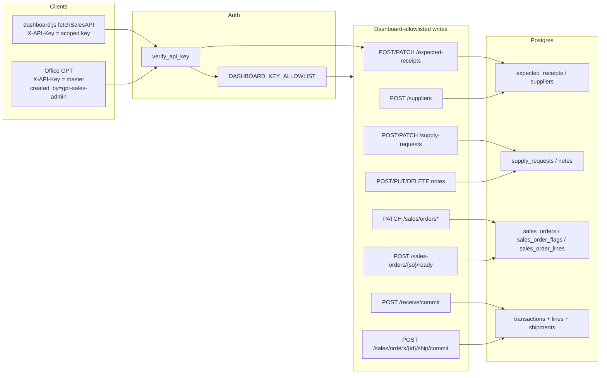
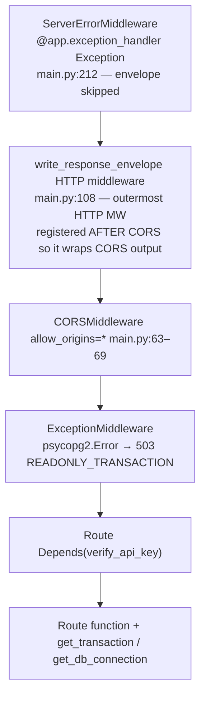

# P-3 / P-4 — Dashboard Write Foundation (Attribution, Audit Fields, Idempotency)

| Field | Value |
|---|---|
| **Title** | Factory Ledger Write Foundation (P-3 / P-4) |
| **Author** | (architectural auditor — plan only) |
| **Date** | 2026-08-19 |
| **Status** | Approved (reviewer approved; user locked remaining OQs 2026-08-19) |
| **Scope** | Write-foundation (attribution, audit columns, idempotency) for existing dashboard writes plus the unused receive/ship-order **commit** routes. **Not** FR-12 Recent Entries (`GET /ledger/recent`). **Not** a receiving/shipping screen. **Not** FR-15 (full user auth). |
| **Repo** | `/Users/cns/Documents/factory-ledger` |
| **Constraint** | `openapi-gpt-v3.yaml` stays at **30 operations** (counted: 30 `operationId`s). No new GPT operations. |
| **Constraint** | Never `SET SESSION` / session-level GUCs against the port-6543 pooler. Attribution GUC must be `SELECT set_config('app.operator_id', %s, true)` (`is_local=true` ≡ `SET LOCAL`). `SET` does not accept bind parameters. |
| **Latest migration** | `migrations/043_supplies.sql` (applied to prod 2026-08-18). Next free number: **044**. |

---

## Overview

Dashboard-originated writes already exist (expected receipts, notes, sales-order edits, ready flags, supply requests) and more are coming (receive/commit and ship-order/commit, which are already on `DASHBOARD_KEY_ALLOWLIST` but unused by `dashboard.js`). Those writes cannot be attributed to a person: `_operator_id()` always records `legacy-shared-key`, `caller_source_tag()` stores a *source* tag (`dashboard` / `gpt-sales-admin`) not a human, and there is no idempotency key anywhere in production (`IDEMPOTENCY_KEY_PLAN.md` is unimplemented).

This design adds a **write-foundation layer** for the dashboard writes that already exist (notes, expected receipts, SO edits, ready flags, **supply requests**) and for the unused receive/ship-order commit aliases: (1) a three-person chrome `X-Actor` header (`meir|luz|arturo`), (2) audit columns plus reuse of the unused `app.operator_id` trigger path, and (3) a client `Idempotency-Key` table that makes retries after 503/timeout safe. It does **not** add a login system, does **not** close the 11 unauthenticated dashboard GET routes, does **not** change FR-12 Recent Entries, does **not** add a receiving/shipping screen, and does **not** add GPT operations.

---

## Background & Motivation

### Current state, in one sentence

Authorization is a shared secret; identity is a boolean; retries are unsafe.

`verify_api_key` (`main.py:975–976`) returns `True`. Every void/correction/certification then calls `_operator_id(_)` (`main.py:4916–4922`, used at `5063`, `5104`, `5734`, `5790`, `6401`, `10704`) which sees a `bool` and writes `legacy-shared-key`. Migration 039 already fills `transactions.operator_id` from `current_setting('app.operator_id')` (`tests/schema/schema.sql:145–147`); **Python never sets that GUC**.

FR-2 expected receipts store `created_by` via `caller_source_tag()` (`main.py:3008–3019`). That function is an interim **source** tag, not a user id — the dashboard key forces `'dashboard'` and ignores a spoofed body (`tests/test_expected_receipts.py:522–528`). Comments call this “until FR-15”. P-3/P-4 is the layer FR-15 would sit on; it is not FR-15.

`IDEMPOTENCY_KEY_PLAN.md` (status: “Design artifact — not yet implemented”) covers `/ship/commit`, `/make/commit`, `/pack/commit`, `/adjust/commit`, `/sales/orders/{order_id}/ship/commit`. `FACTORY_LEDGER_SYSTEM_KNOWLEDGE.md` §18 confirms there is still no general idempotency key. `run_idempotent_write_with_readonly_retry` (`main.py:838–846`) is a **server-side one-retry** for poisoned connections, wired only to `PATCH /customers/{customer_id}` (`main.py:6927`). It is not a client idempotency key.

### Pain points this layer must remove

1. After a `READONLY_TRANSACTION` 503 (`main.py:173–193`), the client cannot tell whether the write landed. Retrying `/sales/orders/{id}/ship/commit` can double-ship (the natural `quantity_shipped_lb` guard is timing-dependent — `IDEMPOTENCY_KEY_PLAN.md` lines 152–153).
2. Three humans will share one scoped dashboard key (`dashboard.js:1856`, `SALES_API_KEY`). Without an actor field, Meir/Luz/Arturo are indistinguishable in the DB.
3. Dashboard write tables are inconsistent: `expected_receipts` has `created_by` + `updated_at` but no `updated_by`; `notes` has timestamps only; `supply_requests` has free-text `requested_by`; `sales_order_flags.ready_by` defaults to `'floor'`.

### Why this is independent of FR-12 (Recent Entries) and of any receiving/shipping screen

**FR-12 in this repo is Recent Entries**, an authenticated read-only audit feed — not receiving/shipping UI. Grep hits: allowlist comment `main.py:908–909` (`GET /ledger/recent`), handler `main.py:6060` (`Depends(verify_api_key)`), `dashboard/dashboard.js:510` / fetch `585`, `dashboard/dashboard.css:285`, `dashboard/index.html:49` / `:110`, `tests/test_recent_ledger.py`, changelog rows 75–76. It stays read-only and out of this series.

There is **no** receiving/shipping dashboard screen in tree (`dashboard.js` has no POST to `/receive` or `/ship`). The backend commit routes a future screen would call (`POST /receive/commit`, `POST /sales/orders/{order_id}/ship/commit`) are already allowlisted (`main.py:937–940`) and must be foundation-ready *before* any UI submits them. This document maps those paths; it does not design that screen. Do not label that future UI “FR-12.”

---

## Goals & Non-Goals

### Goals

- Attribute every **dashboard-key** mutating request to exactly one of `{meir, luz, arturo}`.
- Persist `source` (`dashboard` | `gpt` | `api` | `system`) separately from `actor`.
- Fill `transactions.operator_id` / `ledger_corrections.operator_id` from that actor via **transaction-scoped** `set_config('app.operator_id', actor, true)`. Dashboard-key writes get this in PR 4/6; master-key `_operator_id(_)` paths (void, corrections) in PR 6b.
- Make dashboard write submissions idempotent under retry (503, timeout, double-click) using an **intent-scoped** key held until HTTP 2xx, not a new UUID per HTTP call.
- Adopt and extend `IDEMPOTENCY_KEY_PLAN.md` without exceeding the GPT 30-operation cap.
- Leave a testable seam for later inventory commits from the dashboard (receive/ship-order).

### Non-goals

- Full auth (passwords, sessions, OAuth, per-user API keys, RBAC). That is FR-15.
- Closing the 11 unauthenticated `GET /dashboard/api/*` routes (flagged below; out of write-foundation scope).
- Adding GPT Action operations, or requiring the GPT to send `Idempotency-Key` / `X-Actor` in this iteration (optional for master key).
- FR-12 Recent Entries (`GET /ledger/recent`, changelog rows 75–76) — read-only; do not add writes or change the feed.
- A receiving/shipping dashboard screen (not in tree; not FR-12).
- Changing void-reopens-order behavior (`FACTORY_LEDGER_SYSTEM_KNOWLEDGE.md` §5). Foundation must not make that worse; it must not pretend to fix it.
- Natural-key uniqueness on expected receipts or supply requests (same product/supplier/qty can legitimately repeat).
- Rewriting `caller_source_tag()` semantics for GPT `created_by` (keep GPT body default `gpt-sales-admin` in `openapi-gpt-v3.yaml:114–117`).

---

## Key Decisions

1. **Actor is a header, not a body field and not a session token.** `X-Actor: meir|luz|arturo` is validated by a FastAPI dependency after API-key auth. Body fields are already ignored for the dashboard key (`created_by` spoof test). Sessions do not exist. Attachment is **not** “one change to `fetchSalesAPI`”: that helper (`dashboard.js:1868–1870`) covers sales/ER/SO/supplies. Notes create/update/delete/toggle (`dashboard.js:1719–1812`) use raw `fetch(API_BASE + '/notes/…')` with only `X-API-Key` (changelog row 32: those four fetches are the entire notes caller set). PR 5 must route those four through the write helper (or duplicate the headers). Matrix export (`dashboard.js:2070`) is GET and stays raw.

2. **Source and actor are create-time; last writer is `updated_by` / `updated_source`.** Today `expected_receipts.created_by` conflates them (`'dashboard'` vs `'gpt-sales-admin'`). After this work: `actor` = who created the row; `source` = how that create was authenticated; `updated_by` / `updated_source` = last writer. Do **not** overwrite `source` on PATCH. Do **not** copy body `created_by` into `actor`. `created_by` on expected receipts is **kept** as the GPT-facing source tag for 30-op compatibility; it is not the person field.

3. **Dashboard-key writes require actor + idempotency key; master-key writes do not.** GPT Actions and scripts stay backward compatible. Env `WRITE_FOUNDATION_ENFORCE` (default `0`) controls only **422 vs WOULD_REJECT for missing** actor/key. **A present `Idempotency-Key` is always begun/completed; a present valid `X-Actor` is always stored** (dashboard or master), even while the flag is 0. If the key header is omitted, `idempotent_write` must **not touch** `idempotency_keys` (NULL PK would 500 GPT `createExpectedReceipt` after PR 4).

4. **Idempotency lives in a dedicated `idempotency_keys` table, looked up inside the writer’s DB transaction — not in HTTP middleware.** HTTP middleware in this app has no cursor (`write_response_envelope` at `main.py:108–151` only rewrites JSON). A lookup outside the write transaction races. This **incorporates** `IDEMPOTENCY_KEY_PLAN.md` and **supersedes** its “middleware” wording and its “insert after success” protocol: FastAPI **dependency** for header validation + a single **`idempotent_write` wrapper** that BEGIN / `set_config`; if a key is present, `begin_idempotent` / work / `complete_idempotent` only on 2xx; if the key is omitted, `work` only. Rolls back on `HTTPException`, `JSONResponse` status ≥400, or any exception so an `in_progress` row never commits. Concurrent same-key writers **wait then replay** (`INSERT ON CONFLICT DO NOTHING` blocks); 409 is only for a **committed leftover** `in_progress` poison row. The client key is **intent-scoped** (held until HTTP 2xx), not minted per HTTP call. `work(cur)` is the existing commit **body only** — no nested `get_db_connection` / `get_transaction`.

5. **Reuse migration 039’s `app.operator_id` GUC via `set_config(..., is_local=true)` only.** Do not add a second identity column on `transactions`. Do not `SET SESSION`. Do not `cur.execute("SET LOCAL app.operator_id = %s", …)` — PostgreSQL `SET` does not accept bind parameters (psycopg2 emits `$1` → syntax error). Use `SELECT set_config('app.operator_id', %s, true)`. Same class of pooler poison as the 6543 readonly incident if anyone uses SESSION.

6. **No new OpenAPI operations.** Count today: **30** (`operationId` lines in `openapi-gpt-v3.yaml`). Floor schema: **22**. P-3/P-4 adds headers on backend routes only; GPT schema is not pasted. If a later PR documents the optional `Idempotency-Key` on existing GPT ops, that is a parameter on an existing operation, not a 31st op — still do not do it in the foundation PRs.

7. **Client key is primary; natural-key guards are defense-in-depth only.** Matches the ship_order analysis in `IDEMPOTENCY_KEY_PLAN.md` and `docs/audits/inventory-variance-txn-history.md` (SO fulfillment *does* write negative lines; a naive replay is still unsafe).

8. **Void stays append-only and does not reopen sales orders.** Foundation records *who* voided. It does not add SO-status reversal. Idempotent replay of a ship key after a later void returns the original stored success and does **not** re-ship.

9. **`X-Actor` and `requested_by` stay split.** Chrome enum is `meir|luz|arturo`. Supplies `requested_by` stays free-text including `"MG"`. No MG→meir mapping. Chrome labels may say “Meir” later without a DB change. (**Resolved user 2026-08-19.**)

10. **Picker UX:** persist last chrome actor in `localStorage`; show it on **every** save button (`Saving as Luz`). Not silent persist, not pick-every-write. (**Resolved user 2026-08-19.**)

11. **Idempotency TTL is 24 hours.** (`expires_at` default `now() + interval '24 hours'`.) (**Resolved user 2026-08-19.**)

12. **This series wires commit aliases only.** Helpers on `POST /receive/commit` and `POST /sales/orders/{id}/ship/commit`. Do **not** attach `write_context` / `idempotent_write` to `POST /receive` or `POST /sales/orders/{id}/ship`. GPT keys stay optional. PR 6 is not deferred. (**Resolved user 2026-08-19.**)

---

## Current-state map

### Auth model (two keys, one boolean)

| Key | Env | Accepted on | Identity returned |
|---|---|---|---|
| Master `API_KEY` | required at startup (`main.py:391–392`) | every `Depends(verify_api_key)` route | `True` |
| Scoped `DASHBOARD_API_KEY` | required at startup (`main.py:393–394`) | only `(METHOD, route.path)` in `DASHBOARD_KEY_ALLOWLIST` (`main.py:886–951`); else 403 | `True` |
| Missing | — | 401 `"API key required"` | — |
| Wrong | — | 403 `"Invalid API key"` (header) / 401 (packing-slip `?key=`) | — |

`DASHBOARD_KEY_ALLOWLIST` is keyed on the **route template**, not the raw URL (`main.py:878–880`, `954–958`). Tests: `tests/test_dashboard_api_key.py`.

The dashboard ships the scoped key in JS (`dashboard.js:1856`, `SALES_API_KEY = 'dashboard-key-2026'`) via `fetchSalesAPI` (`1868–1870`) for sales/ER/SO/supplies. Notes writes (`1719–1812`) send the same key on raw `fetch` to `API_BASE` (`dashboard.js:5`, `…/dashboard/api`). Unauthenticated `fetchAPI` (`485–486`) hits `/dashboard/api/*` with no key.

Line numbers below were re-grepped from this checkout on 2026-08-19. Prefer function names + unique strings (`ORDER_ALREADY_FULFILLED`, `INSERT INTO shipments (sales_order_id`) if `main.py` grows again.

### The 11 unauthenticated dashboard GET routes (Aug 2026 gap)

No file titled “Aug 2026 dashboard auth audit” was found under `docs/audits/` or `audits/`. The gap **is** documented as SYSTEM_KNOWLEDGE §24 (`FACTORY_LEDGER_SYSTEM_KNOWLEDGE.md:1624–1626`) and by the section comment at `main.py:9183–9184` (`WEB DASHBOARD API (no auth — read-only, same-origin)`). Counting `@app.get("/dashboard/api/...")` handlers **without** `Depends(verify_api_key)` yields exactly **11**:

| # | Route | Lines | Auth |
|---|---|---|---|
| 1 | `GET /dashboard/api/production` | `main.py:9237` | none |
| 2 | `GET /dashboard/api/inventory/finished-goods` | `main.py:9329` | none |
| 3 | `GET /dashboard/api/inventory/batches` | `main.py:9431` | none |
| 4 | `GET /dashboard/api/inventory/ingredients` | `main.py:9530` | none |
| 5 | `GET /dashboard/api/activity/shipments` | `main.py:9626` | none |
| 6 | `GET /dashboard/api/activity/receipts` | `main.py:9694` | none |
| 7 | `GET /dashboard/api/activity/daily-entries` | `main.py:9757` | none |
| 8 | `GET /dashboard/api/lot/{lot_code}` | `main.py:9841` | none |
| 9 | `GET /dashboard/api/product/{product_id}/lots` | `main.py:9959` | none |
| 10 | `GET /dashboard/api/search` | `main.py:10012` | none |
| 11 | `GET /dashboard/api/notes` | `main.py:10101` docstring “NO AUTH” | none |

Also unauthenticated (not in the 11, still public): `GET /` (`1984`), `GET /health` (`1994`), `GET /audit/integrity` (`12119`, “No auth required”).

**Not in the 11:** `GET /ledger/recent` (`main.py:6060`, allowlisted `908–909`) is FR-12 Recent Entries and **does** use `Depends(verify_api_key)`.

**Write routes do not share this gap.** June 10 2026 (`FACTORY_LEDGER_CHANGELOG.md` row 32, `tests/test_notes_auth.py:1–8`) closed the last unauthenticated **writes** (the four notes mutations). Every `@app.post/put/patch/delete` located in this audit uses `Depends(verify_api_key)` except nothing — packing-slip is GET. Confirmed by grep of mutating decorators vs `Depends(verify_api_key)`.

P-3/P-4 does **not** authenticate the 11 GETs. Flag only.

### Dashboard-originated write paths (frontend → endpoint → DB)



#### A. Expected receipts (FR-2) — live dashboard write

| Step | Where |
|---|---|
| UI create | `dashboard.js:3042–3069` `saveEr()` → `POST /expected-receipts` body `{product_id, supplier_name, expected_qty, expected_date, reference_number, notes}` — **no `created_by`** |
| UI edit | `dashboard.js:3052–3056` `PATCH` qty/date/reference/notes |
| UI close/cancel | `dashboard.js:2950–2954` `PATCH {status}` |
| Auth | `Depends(verify_api_key)`; allowlisted `main.py:942–947` |
| Validate | `create_expected_receipt` `main.py:3252–3287`: qty > 0, product resolve, `require_supplier` (no auto-create; 422 `SUPPLIER_NOT_FOUND` / `SUPPLIER_INACTIVE`) |
| Insert | `expected_receipts` with `created_by = caller_source_tag(request, req.created_by)` |
| Receive auto-link | `receive()` commit `main.py:2867–2876` FIFO `find_open_expected_receipt` FOR UPDATE; link set at `transactions` INSERT (`2878–2882`); `settle_expected_receipt` (`3145–3174`) auto-closes when posted SUM ≥ expected |
| Tests | `tests/test_expected_receipts.py` (incl. dashboard-key spoof at 522–528) |
| Schema | `migrations/041_expected_receipts.sql:79–92`; `tests/schema/schema.sql:710–724` |

GPT path: `openapi-gpt-v3.yaml` `createExpectedReceipt` (`operationId` at line 497) with `created_by` default `gpt-sales-admin`. **This is 1 of 30 ops.** Do not add another.

#### B. Supplies — API **and dashboard JS live** (changelog row 73)

| Step | Where |
|---|---|
| Create | `POST /supply-requests` `main.py:3610` (`status_code=201`); XOR `product_id`/`item_text`; `requested_by` required free text |
| Done | `PATCH /supply-requests/{id}` `main.py:3686` open→done only, sets `done_at` |
| Auth | writes allowlisted `main.py:952–953` (`POST /supply-requests`, `PATCH /supply-requests/{supply_request_id}`). Reads `948–951`. |
| Tests | `tests/test_supplies.py` (requested_by `"Maria"` / `"Jose"` / `"dash"`) |
| Schema | `migrations/043_supplies.sql:47–68`; applied prod 2026-08-18 |
| UI create | `submitSupplyRequest` `dashboard.js:3474–3526` → `POST /supply-requests`; submit button disabled while in flight (`3522–3524`) |
| UI done | `markSupplyRequestDone` `dashboard.js:3419–3428` → `PATCH`; button disabled (`3421`) |
| Requester control | `dashboard/index.html:367–374` `<select id="supply-request-requested-by">` **Arturo / Luz / MG / Other** (+ free-text name when Other). Body field `requested_by` is that display string, **not** `X-Actor`. |

**Implementable default (this design, not a later product call):** keep `requested_by` as the existing free-text domain field (who asked for the supply — Arturo, Luz, MG, Other/name, tests’ Maria). `X-Actor` is a **separate** chrome enum `meir|luz|arturo` for who is operating the dashboard. Do **not** silently map `MG`→`meir`. Do **not** overwrite `requested_by` from `X-Actor` (unlike `ready_by`, which is a stale `'floor'` default). Whether MG is Meir is an open naming question only.

#### C. Notes / todos / reminders

| Step | Where |
|---|---|
| UI | `dashboard.js:1719–1812` PUT toggle / DELETE / PUT / POST with `X-API-Key` only — **raw `fetch`, not `fetchSalesAPI`**. `saveNote` (`1783`) does not disable the save button. |
| Create | `POST /dashboard/api/notes` `main.py:10146–10168` INSERT `(category, title, body, priority, due_date, entity_type, entity_id)` — **no actor**. Domain errors `return JSONResponse` from **inside** `with get_transaction()` (`10164`, `10181`, `10204`; `get_db_connection` commits on clean yield, `main.py:732–736`). |
| List | `GET /dashboard/api/notes` **unauthenticated** (`10101`) |
| Schema | `notes` `tests/schema/schema.sql:1188–1203`: `created_at`, `updated_at` only |

#### D. Sales-order dashboard edits (not inventory)

| Call | JS | Handler | Table |
|---|---|---|---|
| Ready flag | `dashboard.js:2231–2234` `{ready, by:'floor', note}` | `POST /sales-orders/{so_number}/ready` `main.py:7559–7576` | `sales_order_flags` (`ready_by` default `'floor'`) |
| Header | `dashboard.js:2533` | `PATCH /sales/orders/{order_id}` `main.py:7987` | `sales_orders` |
| Lines | `dashboard.js:2594` query-string `quantity_lb` / `unit_price`, **no JSON body** | `PATCH .../lines/{line_id}/update` `main.py:8221–8226` (`Query` params) | `sales_order_lines` |
| Status | `dashboard.js:2627` | `PATCH .../status` `main.py:7927` | `sales_orders.status` via `MANUAL_TRANSITIONS` (`6955`) |

Allowlisted: `main.py:921–924`. Create-order (`POST /sales/orders` `6966`) is **master-only** (dashboard key 403 — `tests/test_dashboard_api_key.py:142`).

#### E. Inventory commits the dashboard is **allowed** to call but **does not call**

Allowlisted (`main.py:937–940`):

- `POST /receive/preview`, `POST /receive/commit` (`8534–8542`) → `receive()` (`2778–2779`)
- `POST /sales/orders/{order_id}/ship/preview`, `POST /sales/orders/{order_id}/ship/commit` (`8584–8599`) → `ship_order()` (`8287–8288`)

**Not** allowlisted (dashboard key 403 — `test_dashboard_api_key.py:128–140`): `/ship`, `/ship/commit`, `/receive`, `/make`, `/pack`, `/adjust`, `/void/*`, `/schedule`, `/admin/*`.

`dashboard.js` grep for `/receive` or `/ship` as writes: **none** (only `GET .../activity/shipments`). These commit routes are the P-3/P-4 seam for a **future receiving/shipping screen** (not FR-12).

`ship_order` commit writes (`ship_order` at `main.py:8287–8288`; commit branch `with get_db_connection()` at `8349`; `ORDER_ALREADY_FULFILLED` at `8390`; `INSERT INTO shipments (sales_order_id` at `8396`; audit `docs/audits/inventory-variance-txn-history.md:748–772` describes the same path but its embedded `main.py` line numbers 7136/7244/… have **drifted**): `shipments`, per physical line `transactions`+`transaction_lines` (negative lb), `sales_order_lines.quantity_shipped_lb`, `sales_order_shipments`, `shipment_lines`, then order `status` → `shipped`/`partial_ship`. Service lines fulfill with no ledger move. Zero physical ship rolls back. Aliases at `main.py:8534–8599` currently `return receive(req, _)` / `return ship_order(order_id, commit_req, _)` with `_` the auth **bool**.

`receive` commit writes (`receive` at `2778–2779`; commit `with get_db_connection()` at `2844`): `lots` find-or-create, `transactions` type=`receive` + `expected_receipt_id`, `transaction_lines` positive, `settle_expected_receipt` (`3148`).

### All mutating endpoints (complete inventory)

All of the following use `Depends(verify_api_key)` unless noted. Previews are POST but read-only.

| Method | Path | Lines | Allowlisted? | Tables written |
|---|---|---|---|---|
| POST | `/products/resolve` | 2059 | no | none (resolve) |
| PATCH | `/lots/{lot_code}/supplier-lot` | 2548 | no | `lots` / `lot_supplier_codes` |
| PATCH | `/lots/{lot_id}/rename` | 2614 | no | `lots` |
| POST | `/receive` | 2778 | **no** (commit alias is) | `transactions`, `transaction_lines`, `lots`, `expected_receipts.status` |
| POST | `/suppliers` | 3219 | yes | `suppliers` |
| POST | `/expected-receipts` | 3252 | yes | `expected_receipts` |
| PATCH | `/expected-receipts/{id}` | 3383 | yes | `expected_receipts` |
| POST | `/supply-requests` | 3610 | yes | `supply_requests` |
| PATCH | `/supply-requests/{id}` | 3686 | yes | `supply_requests` |
| POST | `/ship` | 3781 | no | `transactions`, `transaction_lines`, `shipments`, `shipment_lines` |
| POST | `/make` | 4084 | no | `transactions`, `transaction_lines`, `lots` |
| POST | `/pack` | 4565 | no | `transactions`, `transaction_lines`, `lots` |
| POST | `/adjust` | 4808 | no | `transactions`, `transaction_lines` |
| POST | `/void/{transaction_id}` | 5043 | no | `ledger_corrections` only (append-only; `reversal_transaction_id` always null) |
| POST | `/records/transactions/{id}/corrections` | 5090 | no | `ledger_corrections` |
| POST | `/records/certifications` | 5720 | no | `certifications` |
| POST | `/records/certifications/{id}/corrections` | 5757 | no | `certifications` |
| POST | `/products/quick-create` | 6215 | no | `products` |
| POST | `/products/quick-create-batch` | 6267 | no | `products` |
| POST | `/lots/{id}/reassign` | 6316 | no | `lot_reassignments`, `lots` |
| POST | `/inventory/found` | 6453 | no | `transactions`, `lots` |
| POST | `/inventory/found-with-new-product` | 6538 | no | `products`, `transactions`, `lots` |
| POST | `/products/{id}/verify` | 6642 | no | `products`, `product_verification_history` |
| POST | `/customers` | 6850 | no | `customers` |
| PATCH | `/customers/{id}` | 6874 | no | `customers`, `customer_aliases` (readonly-retry helper) |
| POST | `/sales/orders` | 6966 | no | `sales_orders`, `sales_order_lines` |
| POST | `/sales-orders/{so_number}/ready` | 7559 | yes | `sales_order_flags` |
| PATCH | `/sales/orders/{id}/status` | 7927 | yes | `sales_orders` |
| PATCH | `/sales/orders/{id}` | 7987 | yes | `sales_orders` |
| POST | `/sales/orders/{id}/lines` | 8097 | no | `sales_order_lines` |
| PATCH | `/sales/orders/{id}/lines/{id}/cancel` | 8198 | no | `sales_order_lines` |
| PATCH | `/sales/orders/{id}/lines/{id}/update` | 8221 | yes | `sales_order_lines` |
| POST | `/sales/orders/{id}/ship` | 8287 | no (commit alias is) | see E above |
| POST | `/{receive,ship,make,pack,adjust}/{preview,commit}` | 8534–8582 | receive preview/commit yes; others no | delegate |
| POST | `/sales/orders/{id}/ship/{preview,commit}` | 8584–8599 | yes | `ship_order` |
| POST | `/dashboard/api/notes` | 10146 | yes | `notes` |
| PUT | `/dashboard/api/notes/{id}` | 10171 | yes | `notes` |
| DELETE | `/dashboard/api/notes/{id}` | 10214 | yes | `notes` |
| PUT | `/dashboard/api/notes/{id}/toggle` | 10230 | yes | `notes` |
| PUT | `/admin/products/{id}` | 10263 | no | `products` |
| POST | `/admin/bom/{id}/lines` | 10382 | no | `bom_lines` |
| PUT | `/admin/bom/lines/{id}` | 10417 | no | `bom_lines` |
| DELETE | `/admin/bom/lines/{id}` | 10463 | no | `bom_lines` |
| POST | `/admin/product-bom` | 10534 | no | `product_bom` |
| DELETE | `/admin/product-bom/{id}` | 10566 | no | `product_bom` |
| POST | `/admin/lots/merge` | 10644 | no | `lots`, ILC |
| POST | `/schedule` | 12082 | no | `production_schedule` on `action=confirm` |

There is **no** `APIRouter` split; everything is on `app` in `main.py`.

### Existing middleware (what already wraps writes)



`write_response_envelope` is the outermost **HTTP** middleware (`main.py:77–79`: registered AFTER CORSMiddleware, so it wraps CORS + route output). `ServerErrorMiddleware` (bare `Exception` handler) is outside the envelope. Foundation hooks **after** auth (a dependency), **inside** the DB transaction (the `idempotent_write` wrapper). Putting replay lookup in HTTP middleware would run before `verify_api_key` and without a writer cursor.

---

## Audit fields today vs needed

Legend: ✓ present and used as intended; ~ present but wrong semantics / unused; ✗ missing.

| Table | created_at | created_by / operator | updated_at | updated_by | source | actor | Notes |
|---|---|---|---|---|---|---|---|
| `expected_receipts` | ✓ `clock_timestamp()` | ~ `created_by` **source tag** | ✓ | ✗ | ✗ (stuffed into created_by) | ✗ | `schema.sql:710–724` |
| `suppliers` | ✓ | ✗ | ✗ | ✗ | ✗ | ✗ | `schema.sql:1831–1836` |
| `supply_requests` | ✓ | ~ `requested_by` free text NOT NULL | ✗ (`done_at` only) | ✗ | ✗ | ✗ | `schema.sql:1857–1872` |
| `notes` | ✓ | ✗ | ✓ | ✗ | ✗ | ✗ | `schema.sql:1188–1203` |
| `sales_order_flags` | ~ `ready_at` / `updated_at` | ~ `ready_by` default `'floor'` | ✓ | ✗ | ✗ | ✗ | `schema.sql:1659–1666` |
| `sales_orders` | ✓ + `created_at_source` | ✗ | ✓ | ✗ | ✗ | ✗ | `schema.sql:1357–1370` |
| `sales_order_lines` | ✓ + `created_at_source` | ✗ | ✗ | ✗ | ✗ | ✗ | `schema.sql:1335–1350` |
| `transactions` | ✓ + `created_at_source` | ~ `operator_id` default `legacy-shared-key`; trigger would honor `app.operator_id` but app never sets it | n/a (append-only) | n/a | ✗ | via operator_id | `schema.sql:912–933`; function `145–147`; table trigger `trg_transactions_business_time` at `3446` |
| `transaction_lines` | ✓ + `created_at_source` | ✗ | n/a | n/a | ✗ | n/a | inherit from txn |
| `ledger_corrections` | ✓ | ~ `operator_id` always `legacy-shared-key` because `_operator_id(True)` | n/a | n/a | ✗ | via operator_id | `schema.sql:841–857`; `main.py:5063` |
| `certifications` | ✓ | ~ `operator_id` same bug; `source_type` is `manual\|whatsapp_export` | n/a | n/a | different meaning | via operator_id | `schema.sql:599–612` — master-key; out of 045 / PR 6b optional |
| `shipments` | ✓ + `created_at_source` | ✗ | ✗ | ✗ | ✗ | ✗ | `schema.sql:1796–1804` — out of 045 (child of txn) |
| `shipment_lines` | ✓ + `created_at_source` | ✗ | ✗ | ✗ | ✗ | ✗ | `schema.sql:1760–1768` — out of 045 (child of txn) |
| `sales_order_shipments` | ✓ + `created_at_source` | ✗ | ✗ | ✗ | ✗ | ✗ | `schema.sql:1693–1702` — out of 045 |
| `lots` | ✓ + `created_at_source` | ✗ (`entry_source` is lot-origin) | ✗ | ✗ | ✗ | ✗ | `schema.sql:1132–1150` — out of 045 |
| `production_schedule` | ✓ + `created_at_source` | ✗ | `confirmed_at` | ✗ | ✗ | ✗ | master-key only; out of P-3 dashboard scope |
| `customers` | ✓ | ✗ | ✓ | ✗ | ✗ | ✗ | `schema.sql:671–683` — master-key only; out of 045 |
| `idempotency_keys` | n/a | n/a | n/a | n/a | n/a | n/a | **does not exist** |

`lots.entry_source` (`received` etc., `schema.sql:1137`) is lot-origin, not API caller — do not overload it.

**Out of 045 (explicit cut):** `lots`, `transaction_lines`, `shipments`, `shipment_lines`, `sales_order_shipments`, `customers`, `certifications`, `production_schedule`. Attribution for inventory children is `transactions.operator_id` via `set_config`. `settle_expected_receipt` (`main.py:3145–3174`) today updates `status`/`updated_at` only; when receive/commit is wired (PR 6) it must also set `updated_by` / `updated_source` to the **receiving actor/source** (the auto-close is a side effect of that receive, not `system`).

---

## Proposed Design

### Lightweight attribution (Meir / Luz / Arturo)

#### Evaluation

| Mechanism | Pros | Cons | Verdict |
|---|---|---|---|
| Request body field (`actor` / `created_by`) | Visible in OpenAPI | Dashboard key **already ignores** body `created_by` (`caller_source_tag` + test 522–528); must add to every Pydantic model; GPT schema churn | Reject as the *enforced* channel. Keep GPT `created_by` as source tag only. |
| Header `X-Actor` | Not in GPT 30-op surface; cannot be confused with FR-2 `created_by`; one helper can attach it | Spoofable (shared key is in JS); notes currently bypass `fetchSalesAPI` (`dashboard.js:1719–1812`) | **Adopt**, with PR 5 covering **all** mutating `fetch(` sites |
| Session / cookie token | Would be real auth | No session store, no login, CORS `*` + `allow_credentials=True` is a trap (`main.py:63–69`); FR-15 territory | Reject |

Spoofability is accepted: this is **attribution**, not authentication. Anyone with the published dashboard key can send `X-Actor: meir`. The point is honest operators on a trusted LAN/dashboard, plus a CHECK constraint so logs are enumerable. SYSTEM_KNOWLEDGE §1 remains true until FR-15.

#### Contract

```
X-Actor: meir | luz | arturo
```

- **Dashboard key + mutating + non-preview** (`route.path.endswith("/preview")` only — **not** `req.mode`; `POST /receive` with `mode=preview` is not allowlisted today): header **required** (422) only when `WRITE_FOUNDATION_ENFORCE=1`. Missing → 422 `ACTOR_REQUIRED`. Body `created_by` / `requested_by` / `by` are **not** substitutes. When the flag is `0`, **missing** actor logs `WRITE_FOUNDATION_WOULD_REJECT` and the write proceeds with `actor=NULL`. **A present valid `X-Actor` is always stored**, flag or not.
- **`INVALID_ACTOR` is always 422** if `X-Actor` is present and not in `ACTOR_VALUES` (flag-independent). Sending garbage is never “optional missing.” Flag only relaxes *absent* required fields. Do not persist an invalid actor (domain CHECK).
- **Master key:** header optional. If present and in `ACTOR_VALUES`, store it as `actor`. If absent, `actor` is **NULL**. Never copy body `created_by` (`gpt-sales-admin`) into `actor`.
- Canonicalize: `strip().lower()`. Display names (“Meir”) map to `meir`.
- Persist `actor` / `source` **at INSERT only**. PATCH sets `updated_by` / `updated_source` (and `updated_at`); it does not rewrite create-time `actor`/`source`. A present valid actor is persisted even when `WRITE_FOUNDATION_ENFORCE=0`.
- For ledger tables, `SELECT set_config('app.operator_id', %s, true)` in the same transaction **before** INSERT so triggers at `schema.sql:145–147` (function) / `3446` (trigger) and `163` / `3348` (`ledger_corrections`) fill `operator_id`.

Roster CHECK (DB domain `write_actor`):

```text
meir | luz | arturo | gpt-sales-admin | gpt-floor | system | legacy-unattributed
```

Humans are the only values the dashboard key may send. GPT personas exist so a later optional header from Floor/Office GPTs can land without a second migration. `legacy-unattributed` is the backfill for existing rows.

`source` CHECK (domain `write_source`):

```text
dashboard | gpt | api | system
```

Derived **only** from the authenticated key / optional `X-Client`, **never** from the body:

- scoped dashboard key → `dashboard` (same as today’s `caller_source_tag`)
- master key → `api` always in P-3. `X-Client: gpt` is **not** implemented in this series (optional later; default remains `'api'`).
- migrations / SQL → `system`

Keep writing expected-receipts `created_by` via existing `caller_source_tag()` so GPT rows stay `'gpt-sales-admin'` in **that** column. Frozen A4 triple: master key, no `X-Actor`, body `created_by=gpt-sales-admin` → `created_by='gpt-sales-admin'`, `actor=NULL`, `source='api'`.

#### Where it is validated

FastAPI dependency `write_context` (see Middleware). Not in HTTP middleware. Not in Pydantic models for the dashboard-key path.

#### How it flows to rows

```mermaid
sequenceDiagram
  participant JS as dashboard.js
  participant Dep as write_context + verify_api_key
  participant H as Handler
  participant Tx as get_transaction
  participant DB as Postgres
  JS->>Dep: X-API-Key (scoped) + X-Actor: luz + Idempotency-Key
  Dep->>Dep: compare_digest dashboard key, actor in enum, key non-blank
  Dep->>H: WriteContext(actor=luz, source=dashboard, key=...)
  H->>Tx: idempotent_write wrapper BEGIN
  Tx->>DB: SELECT set_config('app.operator_id', 'luz', true)
  Tx->>DB: begin_idempotent (DELETE expired; INSERT ON CONFLICT DO NOTHING; SELECT FOR UPDATE)
  alt replay
    DB-->>H: stored response_json
    H-->>JS: 200 + Idempotency-Replayed: true
  else fresh
    Tx->>DB: domain INSERT with actor, source, created_by/operator_id
    Tx->>DB: UPDATE idempotency_keys SET response_json, status=completed
    H-->>JS: 201/200 domain body
  end
```

### Idempotency

Incorporates `IDEMPOTENCY_KEY_PLAN.md` (table shape, header name, 200-replay / 422-reuse, 24h TTL, do-not-key previews, client-retry-on-503). Supersedes: (a) “middleware” as the replay engine; (b) inventory-only scope; (c) insert-after-success without an in-flight row (concurrent double POST).

#### Client key vs natural key vs both

| Approach | Fit |
|---|---|
| Natural key only | **Insufficient.** Expected receipts have no natural uniqueness (same product/supplier/qty/day is a reorder). Notes titles collide. SO ship can partial-ship twice legitimately. Adjust +50 twice is +100. Documented in the existing plan. |
| Client `Idempotency-Key` only | **Sufficient** if stored with request hash and consulted inside the write transaction. |
| Both | Use client key as the **gate**. Keep existing domain guards (`ORDER_ALREADY_FULFILLED` `main.py:8390`, `LINE_ALREADY_FULFILLED` `8384`, `EXPECTED_RECEIPT_NOT_OPEN` `3402`, `SUPPLY_REQUEST_NOT_OPEN` `3696`, `test_double_void_fails_cleanly` in `tests/test_void_semantics.py`) as **defense-in-depth**, never as the retry mechanism. |

#### Key rules

- Header: `Idempotency-Key: <string>` (1–128 chars, printable, trimmed).
- Dashboard-key mutating non-preview (`route.path.endswith("/preview")` only): **required** (422 `IDEMPOTENCY_KEY_REQUIRED`) only when `WRITE_FOUNDATION_ENFORCE=1`. When the flag is `0`, **missing** key logs `WRITE_FOUNDATION_WOULD_REJECT` and the write proceeds. **If a key is present, it is always begun/completed** (flag does not gate persistence). **If the key is omitted, `idempotent_write` does not INSERT into `idempotency_keys`** (NULL PK would 500).
- Master key: optional; omitted → today’s behavior (plan’s backward-compat clause).
- **Intent-scoped client key (this is the 503 contract):**
  1. Mint `crypto.randomUUID()` when the user **starts** a write (first click / form submit), and store it on the form/button (`data-idempotency-key`) until HTTP **2xx**.
  2. `fetchWriteAPI` (shared helper used by `fetchSalesAPI` **and** the four notes fetches) sends that same header on every attempt of that intent.
  3. On HTTP 503 with `retryable: true`, retry **once** after ~2s with the **same** key.
  4. On HTTP 409 `IDEMPOTENCY_IN_FLIGHT` (poison leftover row only — see concurrent protocol), retry after 250–500ms with the **same** key, once or twice. Double-click does **not** produce 409.
  5. A second click before 2xx **reuses** the in-flight key (do not mint a new UUID). Disable the save button while in flight (notes `saveNote` currently does not — `dashboard.js:1783`). Supplies already disables (`submitSupplyRequest` `3522`, `markSupplyRequestDone` `3421`) but still need intent-scoped keys on those clicks.
  6. HTTP 2xx **releases** the key so a later genuine second save is a new intent (new UUID).
  7. HTTP 4xx validation (not 409 in-flight / not 422 key-reuse) **keeps** the key so the operator can fix the body and retry the same intent. 422 `IDEMPOTENCY_KEY_REUSED` means the client minted poorly — mint a new key only after that.
- GPT later: `{endpoint}-{natural_id}-{yyyyMMddHHmm}` as the plan suggested (optional; not this series).
- Request hash: SHA-256 of canonical UTF-8 of:
  - HTTP method
  - route template (`request.scope["route"].path`)
  - path params (sorted)
  - **canonical query string** (sorted `key=value` pairs; required because `PATCH .../lines/{id}/update` puts `quantity_lb` / `unit_price` in the query and has **no JSON body** — `main.py:8225–8226`, `dashboard.js:2594`)
  - canonical JSON body (sorted keys; empty object if no body)
  Headers other than the key itself are excluded so `X-Actor` spoof on a replay is still a replay of the original actor stored in `response_json` / row.
- TTL: 24 hours (`expires_at`). Cleanup: `DELETE FROM idempotency_keys WHERE expires_at < now()` on startup (next to existing startup ALTERs) and a no-op if zero rows. Not a cron (no job framework — SYSTEM_KNOWLEDGE: no queue/worker). **Expired-key reuse in `begin_idempotent` must DELETE-or-upsert in the same transaction** (startup cleanup is not a 24h guarantee).
- Duplicate semantics:
  - **No `Idempotency-Key` header** → do not read or write `idempotency_keys`. Domain write proceeds (GPT / master / flag=0 without JS).
  - same key, same hash, `status=completed` → **HTTP 200** with stored `response_json` **even on routes declared `status_code=201`** (`POST /expected-receipts` `main.py:3252`, `POST /supply-requests` `3610`). Replay return type is **only**:
    `JSONResponse(payload, status_code=200, headers={"Idempotency-Replayed": "true"})`.
    Returning a plain dict from a 201 route would send 201 and break C1.
  - **Concurrent same key (two in-flight transactions):** `INSERT … ON CONFLICT DO NOTHING` **waits** on the first uncommitted inserter of that PK. After the first commits `completed`, waiters’ INSERTs skip; they `SELECT … FOR UPDATE` (**no NOWAIT**) on the completed row and 200-replay. If the first rolls back, a waiter’s INSERT succeeds → **fresh**.
  - **Committed leftover `in_progress`** (poison: a bug committed the claim row without `response_json`) → **409** `IDEMPOTENCY_IN_FLIGHT` **iff** `status='in_progress'` after the blocking `SELECT FOR UPDATE`. Do **not** map SQLSTATE `55P03` to 409 (a second waiter on a **completed** row would 409 incorrectly). JS 409 retry is poison recovery only.
  - same key, different hash, unexpired completed or in_progress → **422** `IDEMPOTENCY_KEY_REUSED`.
  - expired row: treat as miss — see SQL below.

Store **successful** responses only. 4xx/5xx must **not** occupy the key. Handlers that `return JSONResponse(status_code=4xx)` from inside `with get_transaction()` (`notes` `main.py:10164`, `10181`, `10204`; ready `7574–7576`) currently **commit** on clean yield (`get_db_connection` `main.py:732–736`). The `idempotent_write` wrapper must treat that return as failure and **roll back**, otherwise an `in_progress` row with `response_json` NULL sits for 24h and every retry 409s. A validation failure must allow the client to fix the body and retry with the same key.

#### Interaction with `run_idempotent_write_with_readonly_retry`

Keep the existing recommendation in `IDEMPOTENCY_KEY_PLAN.md` lines 190–191: **do not** auto-retry ship/make/pack/adjust/receive/ship_order on the server. Those stay fail-loud 503. The client retries with the same key. Notes / expected receipts / supply requests / ready flags **may** later be wired to the one-retry helper because they are low-risk; not required for P-3.

#### Void and SO-fulfillment

- `POST /void/{id}` is master-key only. Double-void already 400 and changes nothing (`VOID_SEMANTICS_RUNBOOK.md:53–57`, `tests/test_void_semantics.py`). Optional key is enough; required key not needed until the dashboard can void.
- Void does **not** reopen the sales order or decrement `quantity_shipped_lb` (SYSTEM_KNOWLEDGE §5, `FACTORY_LEDGER_SYSTEM_KNOWLEDGE.md:1548–1550`). An idempotent **replay** of a ship key after a later void must return the **original** ship response and must **not** insert a second shipment. That is correct: the key represents the first attempt, not “make the order shipped again”.
- A **new** ship after void needs a **new** key and will currently over-ship relative to remaining because remaining was never restored. That is a pre-existing semantic hole; P-3/P-4 must not hide it behind replay. Call it out in Open Questions.
- `docs/audits/inventory-variance-txn-history.md` confirms `ship_order` **does** write negative `transaction_lines` (230/230 window rows matched). Foundation should not change allocation/FIFO.

### Middleware / dependency hook

New module-level helpers in `main.py` (no new package; match existing style).

```python
DASHBOARD_ACTORS = frozenset({"meir", "luz", "arturo"})
ACTOR_VALUES = DASHBOARD_ACTORS | {"gpt-sales-admin", "gpt-floor", "system", "legacy-unattributed"}
SOURCE_VALUES = frozenset({"dashboard", "gpt", "api", "system"})

_WRITE_METHODS = {"POST", "PUT", "PATCH", "DELETE"}
_PREVIEW_PATH_SUFFIXES = ("/preview",)  # route.path endswith

@dataclass(frozen=True)
class WriteContext:
    actor: Optional[str]
    source: str                    # dashboard|gpt|api
    idempotency_key: Optional[str]
    key_kind: str                  # dashboard|master
    enforce: bool                  # True iff dashboard key AND mutating AND not path.endswith("/preview") AND WRITE_FOUNDATION_ENFORCE=1
```

**Dependency** (composed with existing auth):

```python
def verify_api_key(...):  # unchanged return True
    return _authorize_api_key(...)

def write_context(
    request: Request,
    _: bool = Depends(verify_api_key),
    x_actor: Optional[str] = Header(None, alias="X-Actor"),
    idempotency_key: Optional[str] = Header(None, alias="Idempotency-Key"),
) -> WriteContext:
    ...
```

Plug-in: replace `_: bool = Depends(verify_api_key)` with `ctx: WriteContext = Depends(write_context)` on **dashboard-allowlisted mutating routes first**, then inventory commits. `write_context` itself `Depends(verify_api_key)`, so 401/403 still fire first (notes-auth invariant: auth before domain 404).

Enforcement inside `write_context`:

1. Determine `key_kind` by `compare_digest` against `DASHBOARD_API_KEY` / `API_KEY` (same as `caller_source_tag`).
2. `flag = os.getenv("WRITE_FOUNDATION_ENFORCE", "0") in {"1", "true", "TRUE"}`.
3. `enforce = flag and key_kind == "dashboard" and method in _WRITE_METHODS and not path.endswith("/preview")`. Preview detection is **path suffix only**, not `req.mode`.
4. If actor **present** and not in `ACTOR_VALUES` → **422 `INVALID_ACTOR` always** (flag does not apply).
5. If would-enforce-except-flag (dashboard + mutating + non-preview + **missing** actor or **missing** key) **and not flag**: log `WRITE_FOUNDATION_WOULD_REJECT` and continue. Persist any present *valid* actor; honor any present key in the wrapper.
6. If `enforce` and actor missing → 422 `ACTOR_REQUIRED`.
7. If `enforce` and idempotency key missing/empty → 422 `IDEMPOTENCY_KEY_REQUIRED`.
8. `request.state.write_context = ctx`; return `ctx`.

**Do not** add another `@app.middleware("http")` for this. A second HTTP middleware would sit next to `write_response_envelope` and could not open `get_transaction()` without stealing a pool connection from the handler’s transaction.

`POST /receive` with `mode=preview` is not on the dashboard allowlist; if a later PR hangs `write_context` on `/receive` itself, preview mode must still not require a key (`req.mode` is **not** consulted).

**In-transaction helpers** — required wrapper, not optional. PR 4’s dozen handlers must not copy-paste begin/complete (they will forget rollback on `JSONResponse`).

```python
def apply_operator_guc(cur, actor: Optional[str]) -> None:
    # Transaction-scoped ONLY. Never SET SESSION. Never SET LOCAL … = %s
    # (Postgres SET does not take bind parameters).
    cur.execute(
        "SELECT set_config('app.operator_id', %s, true)",
        (actor or "legacy-shared-key",),
    )

def begin_idempotent(cur, ctx: WriteContext, endpoint: str, request_hash: str):
    """Call only when ctx.idempotency_key is non-blank. First statement after
    set_config. Returns ('replay', payload) | ('fresh', None).
    Raises HTTPException 409 (poison leftover in_progress only) or 422.
    Must run BEFORE any domain INSERT/UPDATE (unique strings:
    ORDER_ALREADY_FULFILLED, INSERT INTO shipments (sales_order_id).
    Current pins: ship_order 8287, commit get_db_connection 8349,
    ORDER_ALREADY_FULFILLED 8390, shipments INSERT 8396)."""

def complete_idempotent(cur, ctx, endpoint, request_hash, response: dict, transaction_id=None):
    """UPDATE response_json, status=completed, transaction_id (first physical txn or NULL)."""

def idempotent_write(ctx: WriteContext, endpoint: str, request: Request, work):
    """One pool checkout. work(cur) is the existing commit BODY ONLY —
    it must NOT call get_db_connection() or get_transaction() (those would
    be a second connection; begin/complete on A would not protect INSERTs on B).

    BEGIN via get_db_connection (or an explicit transaction on a passed conn);
    apply_operator_guc;
    if not ctx.idempotency_key:
        return work(cur)   # GPT/master/flag=0 without JS — no idempotency_keys row
    begin_idempotent;
    if replay: return JSONResponse(payload, status_code=200,
        headers={"Idempotency-Replayed": "true"})
        # never a plain dict — FastAPI would emit 201 on POST /expected-receipts
        # and POST /supply-requests (status_code=201 on the route).
    else run work(cur) -> dict or JSONResponse;
    complete_idempotent only if the result is a 2xx dict;
    if work raises, returns JSONResponse status>=400, or any exception:
        rollback so the in_progress row never commits, then re-raise / return.
    Convert notes/ready JSONResponse errors to HTTPException in PR 4
    (preferred) OR inspect the returned object here and rollback."""
```

`begin_idempotent` SQL (same transaction, in order; **only if key is non-blank**):

```sql
-- 1. Free the PK if this key expired (startup DELETE is not a 24h guarantee).
DELETE FROM idempotency_keys
 WHERE key = %s AND expires_at < now();

-- 2. Claim the key. A second session inserting the same PK BLOCKS here
--    until the first transaction commits or rolls back
--    (ON CONFLICT DO NOTHING waits on the uncommitted first INSERT).
INSERT INTO idempotency_keys
    (key, endpoint, request_hash, status, actor, source)
VALUES (%s, %s, %s, 'in_progress', %s, %s)
ON CONFLICT (key) DO NOTHING
RETURNING key;

-- 3. If INSERT returned a row → ('fresh', None). First writer proceeds.
-- 4. If INSERT returned no row, the first writer has COMMITTED a row
--    (completed success, or leftover in_progress poison). Then wait for
--    the row lock — **no NOWAIT** — so two waiters on a completed row
--    both replay instead of the second getting 55P03→409:
SELECT key, endpoint, request_hash, status, response_json, expires_at
  FROM idempotency_keys
 WHERE key = %s
   FOR UPDATE;
--    status='completed' and hash matches → ('replay', response_json)
--    request_hash <> our hash → 422 IDEMPOTENCY_KEY_REUSED
--    status='in_progress' → 409 IDEMPOTENCY_IN_FLIGHT (poison leftover only)
--    Do not classify SQLSTATE 55P03 as 409.
```

Do **not** `SELECT` then `INSERT` (races). Do **not** look up before opening the writer transaction (`IDEMPOTENCY_KEY_PLAN.md` original; superseded). Do **not** document live double-click as 409 — Postgres will not show the first writer’s uncommitted `in_progress` to the second session.

`get_transaction()` (`main.py:750–753`) stays as-is for **reads**. Writers go through `idempotent_write` and use **only** the wrapper cursor. Never `SET SESSION`. Never `set_session(...)`.

#### Handler template (receive / ship_order / **commit aliases only**)

**This series wires `write_context` + `idempotent_write` only on `receive_commit` (`8539`) and `commit_ship_order` (`8591`).** `POST /receive` (`2778`) and `POST /sales/orders/{id}/ship` (`8287`) keep `Depends(verify_api_key)` and are **not** given `write_context` here. Inner `receive()` / `ship_order()` may take an optional `ctx` so the commit aliases can pass it; non-commit callers pass no key (wrapper skip-when-blank, or they never enter `idempotent_write`). GPT keys stay optional.

```python
@app.post("/receive/commit", include_in_schema=False)
def receive_commit(req: ReceiveRequest, ctx: WriteContext = Depends(write_context)):
    req.mode = "commit"
    return receive(req, ctx)

@app.post("/sales/orders/{order_id}/ship/commit", operation_id="commitShipOrder")
def commit_ship_order(req: CommitShipOrderRequest, order_id: int = Depends(resolve_order_id),
                      ctx: WriteContext = Depends(write_context)):
    return ship_order(order_id, ShipOrderRequest(mode="commit", ship_all=req.ship_all, lines=req.lines), ctx)
```

**`work(cur)` is the existing commit body only.** Strip the inner `with get_db_connection() as conn:` / `with get_transaction() as cur:` from that body (today: `receive` commit at `2844`, `ship_order` commit at `8349`). Preview branches keep their own `get_transaction()`. Any `pg_advisory_xact_lock` stays on the **wrapper** cursor.

The wrapper runs `begin_idempotent` (when a key is present) **before** the domain body, so it runs before unique strings `ORDER_ALREADY_FULFILLED` (currently `8390`) and `INSERT INTO shipments (sales_order_id` (currently `8396`). Do not place `begin` after those statements.

```python
return idempotent_write(ctx, "ship_order", request, _work)
```

`complete_idempotent(..., transaction_id=first_physical_txn_id)` — nullable FK stores the first physical `transactions.id`; full id list + `shipment_id` stay in `response_json`. Same shape for `receive()`: body starts at `find_or_create_lot` / `INSERT INTO transactions`. A 503 retry must hit replay, not `ORDER_ALREADY_FULFILLED` / a second lot.

PR 4 dashboard handlers (`notes`, ER, suppliers, supplies, SO edits, ready) **must** use the same wrapper so a `JSONResponse(400)` from notes cannot commit `in_progress`. Prefer converting those `JSONResponse` errors to `HTTPException` **and** still wrapping so replay/complete cannot be forgotten. Their `work(cur)` likewise has no inner `get_transaction()`.

---

## API / Interface Changes

No new routes. No OpenAPI operation added or removed (stays 30). Floor stays 22.

### Headers (all mutating dashboard-allowlisted routes + later inventory commits)

| Header | Dashboard key | Master key | Validated by |
|---|---|---|---|
| `X-API-Key` | required (existing) | required (existing) | `verify_api_key` |
| `X-Actor` | **required iff `WRITE_FOUNDATION_ENFORCE=1`** (`meir\|luz\|arturo`). Present valid value always stored. Present invalid → 422 always. Missing + flag=0 → WOULD_REJECT, `actor=NULL`. | optional (valid → store; missing → NULL; invalid → 422) | `write_context` |
| `Idempotency-Key` | **required iff `WRITE_FOUNDATION_ENFORCE=1`** (non-preview). Present key always begun/completed. Missing → no `idempotency_keys` row. | optional (same: omit → skip table; present → honor) | `write_context` + wrapper |

Response headers on replay: `Idempotency-Replayed: true`. Body unchanged (additive envelope still adds `success: true`).

### Per-endpoint request-field additions

**Do not add body fields** on GPT-facing models (`ExpectedReceiptCreate`, `ReceiveRequest`, `ShipRequest`, `CommitShipOrderRequest`, etc.) so `openapi-gpt-v3.yaml` does not need a paste.

Dashboard-only models may grow optional `actor` as a **deprecated alias** that is ignored when the header is present; **do not** implement the alias in v1 (body ignore is already the FR-2 lesson).

| Endpoint | New required inputs (dashboard key, when enforce=1) | DB columns set |
|---|---|---|
| `POST /expected-receipts` | `X-Actor`, `Idempotency-Key` | create-time `actor`, `source`; `created_by` still via `caller_source_tag` |
| `PATCH /expected-receipts/{id}` | same | `actor`/`source` **unchanged**; `updated_by`, `updated_source`, `updated_at` |
| `POST /suppliers` | same | create-time `actor`, `source` |
| `POST /supply-requests` | same; keep `requested_by` required free text (do not overwrite from `X-Actor`) | create-time `actor`, `source`; `requested_by` unchanged |
| `PATCH /supply-requests/{id}` | same | `done_by` = actor (`write_actor`); create-time `source` unchanged |
| `POST /dashboard/api/notes` | same | create-time `actor`, `source` |
| `PUT /dashboard/api/notes/{id}` and `/toggle` | same | `updated_by`, `updated_source` |
| `DELETE /dashboard/api/notes/{id}` | same | no row left; idempotency row stores `{deleted:true,id}` |
| `POST /sales-orders/{so}/ready` | same; body `by` **overwritten** from actor (stop trusting `'floor'`) | `ready_by` = actor (column stays unconstrained text because `'floor'` must remain legal on historical rows) |
| `PATCH /sales/orders/{id}` | same | `updated_by`, `updated_source`, `updated_at` |
| `PATCH /sales/orders/{id}/status` | same | `updated_by`, `updated_source` |
| `PATCH .../lines/{id}/update` | same; hash **includes query string** (`quantity_lb`, `unit_price`) | `updated_by`, `updated_source`, `updated_at` |
| `POST /receive/commit` | same (when dashboard key) | `set_config` → `transactions.operator_id`; `settle_expected_receipt` sets ER `updated_by`/`updated_source` to receiving actor |
| `POST /sales/orders/{id}/ship/commit` | same (when dashboard key) | `set_config` → `operator_id` on each txn |

**JS write helper** (`fetchWriteAPI`, used by `fetchSalesAPI` and the four notes `fetch` sites):

- Attach `X-Actor` from `localStorage.dashboardActor` (last choice persisted). **Every** save/submit/done button shows the current actor (`Saving as Luz`). Not silent persist, not pick-every-write.
- Attach intent-scoped `Idempotency-Key` as specified under Key rules (mint on first click, hold until 2xx, retry 503 once with the same key, second click reuses). 409 retry is poison-row recovery only.
- Preview POSTs omit the idempotency key.
- PR 5 checklist: every mutating `fetch(` in `dashboard.js` besides this helper (today: notes at `1719–1812`; sales/ER/supplies via `fetchSalesAPI` at `1868`). Matrix GET at `2070` stays raw.

A chrome `X-Actor` picker (`meir|luz|arturo`) is in scope: last choice in `localStorage`, **shown on every save button** (`Saving as Luz`). It is **not** the Supplies modal “Requested by” control (`index.html:367–374` Arturo/Luz/MG/Other), which continues to fill free-text `requested_by`. No MG→meir map. Chrome labels may say “Meir” later without a DB change. Do not add a receiving/shipping screen. Do not change FR-12 Recent Entries.

### GPT

`openapi-gpt-v3.yaml` **untouched**. `gpt-instructions-v3.md` **untouched** (8,000 cap; Permanent Rules 1–10 must survive any later edit). Optional later instruction: “on 503 retryable, retry once with the same Idempotency-Key” — not this PR series.

---

## Data Model Changes

Latest applied migration: **043**. Propose **044** (idempotency + shared enum) and **045** (per-table audit columns) so each is independently reviewable. Both written here; **not created in the repo**.

Permanent Rule 10: idempotent (`IF NOT EXISTS`, `DROP CONSTRAINT IF EXISTS` then add). Wrapped in `BEGIN;` / `COMMIT;`. No session GUCs.

### Migration 044 — `idempotency_keys` + shared domain types

```sql
-- migrations/044_write_foundation_idempotency.sql
-- P-3/P-4 write foundation: idempotency_keys + shared actor/source domains.
-- Forward-safe / re-runnable. Does not change existing table columns
-- (those are 045) so a 044-only deploy is behavior-neutral until handlers land.

BEGIN;

DO $$
BEGIN
    IF NOT EXISTS (SELECT 1 FROM pg_type WHERE typname = 'write_actor') THEN
        CREATE DOMAIN public.write_actor AS text
            CHECK (VALUE IN (
                'meir', 'luz', 'arturo',
                'gpt-sales-admin', 'gpt-floor',
                'system', 'legacy-unattributed'
            ));
    END IF;
    IF NOT EXISTS (SELECT 1 FROM pg_type WHERE typname = 'write_source') THEN
        CREATE DOMAIN public.write_source AS text
            CHECK (VALUE IN ('dashboard', 'gpt', 'api', 'system'));
    END IF;
END$$;

CREATE TABLE IF NOT EXISTS public.idempotency_keys (
    key              text PRIMARY KEY,
    endpoint         text        NOT NULL,
    request_hash     text        NOT NULL,
    status           text        NOT NULL DEFAULT 'in_progress'
                     CHECK (status IN ('in_progress', 'completed')),
    transaction_id   integer     REFERENCES public.transactions(id),
    response_json    jsonb,
    actor            public.write_actor,
    source           public.write_source,
    created_at       timestamptz NOT NULL DEFAULT clock_timestamp(),
    expires_at       timestamptz NOT NULL DEFAULT clock_timestamp() + INTERVAL '24 hours',
    CONSTRAINT idempotency_keys_completed_has_response
        CHECK ((status = 'completed') = (response_json IS NOT NULL))
);

CREATE INDEX IF NOT EXISTS idx_idempotency_keys_expires
    ON public.idempotency_keys (expires_at);

COMMENT ON TABLE public.idempotency_keys IS
    'Client Idempotency-Key replay store. Lookup and insert must run in the writer transaction.';

COMMIT;
```

`transaction_id` is nullable: notes/expected-receipts/supply-requests have no txn. Inventory commits fill it (plan’s original column).

### Migration 045 — audit columns on dashboard write tables

```sql
-- migrations/045_write_foundation_audit_columns.sql
-- Additive audit columns typed as 044 domains (single roster — no duplicated CHECKs).
-- actor/source = CREATE-TIME. Last writer = updated_by / updated_source / done_by.
-- Does NOT rewrite expected_receipts.created_by (GPT source tag, keep).
-- Requires 044 (write_actor / write_source).

BEGIN;

-- expected_receipts: created_at/created_by/updated_at already exist (041)
ALTER TABLE public.expected_receipts
    ADD COLUMN IF NOT EXISTS actor public.write_actor,
    ADD COLUMN IF NOT EXISTS source public.write_source,
    ADD COLUMN IF NOT EXISTS updated_by public.write_actor,
    ADD COLUMN IF NOT EXISTS updated_source public.write_source;
UPDATE public.expected_receipts
   SET actor = 'legacy-unattributed',
       source = CASE
                    WHEN created_by = 'dashboard' THEN 'dashboard'
                    WHEN created_by ILIKE 'gpt%' THEN 'gpt'
                    ELSE 'api'
                END
 WHERE actor IS NULL;

-- suppliers: historical rows LEFT NULL (backfill was a name import, no person).
-- New inserts from POST /suppliers set actor/source.
ALTER TABLE public.suppliers
    ADD COLUMN IF NOT EXISTS actor public.write_actor,
    ADD COLUMN IF NOT EXISTS source public.write_source;

-- supply_requests
ALTER TABLE public.supply_requests
    ADD COLUMN IF NOT EXISTS actor public.write_actor,
    ADD COLUMN IF NOT EXISTS source public.write_source,
    ADD COLUMN IF NOT EXISTS done_by public.write_actor;

-- notes
ALTER TABLE public.notes
    ADD COLUMN IF NOT EXISTS actor public.write_actor,
    ADD COLUMN IF NOT EXISTS source public.write_source,
    ADD COLUMN IF NOT EXISTS updated_by public.write_actor,
    ADD COLUMN IF NOT EXISTS updated_source public.write_source;
UPDATE public.notes SET actor = 'legacy-unattributed' WHERE actor IS NULL;

-- sales_order_flags: ready_by stays unconstrained TEXT because historical
-- default 'floor' must remain legal (not in write_actor). New writes overwrite
-- ready_by from X-Actor (a roster value) but we do not CHECK the column.
ALTER TABLE public.sales_order_flags
    ADD COLUMN IF NOT EXISTS source public.write_source,
    ADD COLUMN IF NOT EXISTS updated_source public.write_source;

-- sales_orders / lines last-writer. source on sales_orders is create-time
-- (NULL for historical orders). PATCH sets updated_by / updated_source only.
ALTER TABLE public.sales_orders
    ADD COLUMN IF NOT EXISTS updated_by public.write_actor,
    ADD COLUMN IF NOT EXISTS source public.write_source,
    ADD COLUMN IF NOT EXISTS updated_source public.write_source;

ALTER TABLE public.sales_order_lines
    ADD COLUMN IF NOT EXISTS updated_at timestamptz,
    ADD COLUMN IF NOT EXISTS updated_by public.write_actor,
    ADD COLUMN IF NOT EXISTS updated_source public.write_source;

-- transactions: no new column. Trigger already writes operator_id from
-- app.operator_id (schema.sql:145-147; trg_transactions_business_time at 3446).
-- Application set_config(..., true) is 045's *runtime* counterpart, not DDL.

COMMENT ON COLUMN public.expected_receipts.actor IS
    'Create-time person or GPT persona. Distinct from created_by (caller source tag, pre-FR-15).';
COMMENT ON COLUMN public.expected_receipts.source IS
    'Create-time dashboard | gpt | api | system — derived from which API key authenticated the create, never from body created_by.';
COMMENT ON COLUMN public.expected_receipts.updated_by IS
    'Last writer. settle_expected_receipt (receive auto-close) sets this to the receiving actor.';
COMMENT ON COLUMN public.sales_order_flags.ready_by IS
    'Intentionally unconstrained text (legacy default ''floor''). New dashboard writes set it from X-Actor.';

COMMIT;
```

**Not** adding actor columns on `lots` / `transaction_lines` / `shipments` / `shipment_lines` / `sales_order_shipments`: they are children of a `transactions` row whose `operator_id` becomes the actor via the GUC. Avoid wide additive DDL on append-only high-volume tables. Historical `suppliers.actor` stays NULL (backfill was a name import, not a person).

After 045, `tests/schema/schema.sql` is re-dumped from prod (043 precedent, `CHANGE_LOG.md` 2026-08-18 15:18).

---

## Alternatives Considered

### 1. Per-person API keys (Meir-key, Luz-key, Arturo-key)

Would make actor equal to the secret. Rejected: three more env vars, JS still publishes whichever key it holds, rotation blast radius grows, dashboard picker still needed if one browser is shared. Revisit in FR-15.

### 2. Body `actor` on every Pydantic model

Rejected: duplicates header; FR-2 already proved the dashboard-key path must ignore body identity (`tests/test_expected_receipts.py:522–528`); GPT schema paste risk.

### 3. Only natural-key unique indexes (no idempotency table)

Rejected: `IDEMPOTENCY_KEY_PLAN.md` per-endpoint analysis; expected receipts and notes have no safe natural key; SO partial ships are legitimate repeats.

### 4. HTTP middleware that short-circuits replay before the handler

Rejected: no shared transaction with the writer; would run before `verify_api_key`; this codebase’s only HTTP middleware is the JSON envelope (`main.py:108`). FastAPI dependencies + cursor helpers match local style (`verify_api_key`, `resolve_order_id`).

### 5. Require idempotency keys on GPT master-key commits in the same PR

Safer long-term, but forces an OpenAPI/instructions paste under the 8,000-char and 30-op constraints, and breaks any Action caller that does not send the header. Split: foundation table + optional master-key path now; GPT instruction change later.

### 6. `SET LOCAL app.operator_id = %s` vs `SELECT set_config(..., true)` vs `SET SESSION`

| Variant | Verdict |
|---|---|
| `SET SESSION` / `set_session` | **Forbidden.** 6543 pooler leak (Known Root Cause). |
| `cur.execute("SET LOCAL app.operator_id = %s", (actor,))` | **Invalid.** Postgres `SET` does not take bind parameters; psycopg2 emits `$1` → syntax error at runtime. |
| `cur.execute("SET LOCAL app.operator_id = '" + actor + "'")` | Interpolation; injection if actor is ever non-enum. |
| `SELECT set_config('app.operator_id', %s, true)` | **Adopt.** Third arg `true` = `is_local` ≡ `SET LOCAL`. Bind-safe. |

### 7. Redis / in-memory idempotency map

Rejected: a 503 after the DB **committed** but before the client got the body is the motivating case. Memory/Redis would miss that write and allow a second domain INSERT. The replay store must be the same Postgres transaction as the write.

### 8. Per-handler `begin_idempotent` / `complete_idempotent` vs one wrapper

Per-handler copy-paste will forget rollback when notes/ready `return JSONResponse(4xx)` from inside `with get_transaction()` (`main.py:732–736` commits on clean yield). **Wrapper wins:** `idempotent_write` is the only supported call path for PR 4+.

---

## Security & Privacy Considerations

| Threat | Severity | Mitigation |
|---|---|---|
| Spoofed `X-Actor` with stolen/published dashboard key | **Accepted** (same as today’s shared secret; SYSTEM_KNOWLEDGE §1) | Enum CHECK; do not treat actor as auth. FR-15 later. |
| Body `created_by` spoof on dashboard key | Already mitigated for ER; **keep** ignoring body for actor | Header-only enforcement for dashboard key |
| Session-level `app.operator_id` on port 6543 leaking to the next tenant | **High** | `set_config(..., is_local=true)` only; never `SET SESSION` / `set_session`; A8 asserts LOCAL is gone after COMMIT on the **same** connection |
| Idempotency key as a covert channel / auth bypass | Low | Lookup after `verify_api_key`; keys are not capabilities |
| Replay leaking another operator’s response | Low | Key is unguessable UUID; scoped to the submitting client |
| CORS `*` + credentials | Pre-existing | Do not add cookies |
| 11 public GET routes still expose inventory/customers | Pre-existing, **not closed here** | Separate read-auth PR |
| GPT 31st operation | Process | Count ops before/after any schema edit; this design adds **zero** |

Actor values are first names, not emails or secrets. Fine in logs.

---

## Observability

Env (PR 2, read at startup and on each `write_context` call):

```
WRITE_FOUNDATION_ENFORCE=0|1     # default 0; Railway variable, no code default True
```

Startup (`main.py:startup`, next to the `DASHBOARD_API_KEY` checks at `393–396`): log `WRITE_FOUNDATION_ENFORCE=<0|1>`. Reject unknown values.

When `enforce=False` and a dashboard-key mutating non-preview request is **missing** `X-Actor` or **missing** `Idempotency-Key`:

```
WRITE_FOUNDATION_WOULD_REJECT code=ACTOR_REQUIRED path=/expected-receipts method=POST key_kind=dashboard
```

at INFO. Present **invalid** `X-Actor` is 422 `INVALID_ACTOR` even when the flag is 0 (not WOULD_REJECT). Present valid actor/key are persisted/honored silently. That is the “dashboard writes missing actor this hour” grep (`WRITE_FOUNDATION_WOULD_REJECT`). Log-only duration is operational, not a code timer: leave the flag at `0` until Netlify cache-bust of PR 5 is verified, then a one-line Railway env flip.

Also:

- Log line on every completed write (existing `logger.info` sites): add `actor=`, `source=`, `idempotency=hash-prefix`.
- Replay: `logger.info("IDEMPOTENCY_REPLAY endpoint=... key_prefix=...")`.
- Poison leftover 409: `logger.warning("IDEMPOTENCY_IN_FLIGHT ...")`. Live overlap is wait-then-replay, logged as `IDEMPOTENCY_REPLAY`.
- Key reuse 422: `logger.warning("IDEMPOTENCY_KEY_REUSED ...")`.
- Startup cleanup: log `idempotency_keys deleted N expired`.
- Do not log full idempotency keys (they are replay secrets for 24h). Prefix 8 chars.

Alerting: none new. `READONLY_TRIPWIRE` stays the failover signal; client retry + same intent key is the recovery.

---

## Rollout Plan

1. Apply **044** to prod via 5432 session pooler (043/042 process). Behavior-neutral.
2. **PR 2:** helpers + `write_context` + env `WRITE_FOUNDATION_ENFORCE` default **`0`**. Log `WRITE_FOUNDATION_WOULD_REJECT`. No route signatures changed except the unused dependency existing.
3. Apply **045**. Backfill `legacy-unattributed` on ER/notes only; suppliers stay NULL.
4. **PR 4:** wire dashboard-allowlisted writes through `idempotent_write`. Still honors `WRITE_FOUNDATION_ENFORCE` (do **not** merge PR 4 with hard `enforce=True`). Master key unchanged. Notes/ready `JSONResponse` errors become `HTTPException`.
5. **PR 5:** `fetchWriteAPI` + actor picker + intent-scoped keys on **all** mutating dashboard fetches (including the four notes sites). Cache-bust `index.html`. Deploy Netlify. Verify live notes/ER/SO writes still 200 with flag=`0`.
6. **Flag flip (separate one-line Railway change, not bundled with PR 4):** `WRITE_FOUNDATION_ENFORCE=1` after Netlify is verified. Inverse of changelog row 32: JS-first was harmless when *adding* a key; header-required API-first 422s every live dashboard write.
7. **PR 6 (not deferred):** `POST /receive/commit` and `POST /sales/orders/{id}/ship/commit` only. Do not wire `POST /receive` or `POST /sales/orders/{id}/ship`. GPT keys stay optional.
8. **PR 6b:** void + transaction-corrections `_operator_id` → `ctx.actor` / `set_config`.
9. Optional later: GPT instruction retry-on-503; still no new ops.

Rollback: set `WRITE_FOUNDATION_ENFORCE=0`; columns/table remain. Do not DROP. 044/045 are additive.

Do not push `origin/main` without per-action approval (`Claude.md` hard rule).

---

## Test Plan

New file `tests/test_write_foundation.py` using the existing TestClient + savepoint-proxy pattern (`tests/test_notes_auth.py`, `tests/test_write_response_contract.py`). Keep those suites green.

### Attribution

| ID | Case | Expect |
|---|---|---|
| A1 | Dashboard key POST `/expected-receipts` with `X-Actor: luz`, body `created_by: spoofed-user-42` | 201; row `actor='luz'`, `source='dashboard'`, `created_by='dashboard'` (existing spoof rule) |
| A2 | Dashboard key, missing `X-Actor`, enforce on | 422 `ACTOR_REQUIRED`; **no row** |
| A3 | Dashboard key, `X-Actor: admin` | 422 `INVALID_ACTOR`; no row |
| A4 | Master key, no `X-Actor`, `created_by=gpt-sales-admin` | 201; **exact triple** `created_by='gpt-sales-admin'`, `actor IS NULL`, `source='api'` |
| A5 | Dashboard key POST notes with `X-Actor: meir` | `notes.actor='meir'` |
| A6 | Dashboard key POST ready `{by:'floor'}` + `X-Actor: arturo` | `ready_by='arturo'` (header wins) |
| A7 | `set_config('app.operator_id','luz',true)` then `POST /receive/commit` (master or dash) | `transactions.operator_id='luz'` not `legacy-shared-key` |
| A8 | **Same connection** after `COMMIT` of A7: `SELECT current_setting('app.operator_id', true)` | empty / missing — LOCAL must not survive COMMIT (SESSION would still be visible). Do not rely on the pool returning a different conn. |
| A9 | `POST /void/{id}` with `write_context` actor `meir` (**PR 6b**) | `ledger_corrections.operator_id='meir'` (trigger `schema.sql:3348` honors `set_config`) |
| A10 | Allowlist unchanged: dashboard key still 403 on `/make` | 403 before actor check |
| A11 | `WRITE_FOUNDATION_ENFORCE=0`, dashboard key, no `X-Actor` (**PR 4** — needs the route wired) | 2xx domain success + log `WRITE_FOUNDATION_WOULD_REJECT code=ACTOR_REQUIRED` |
| A11b | flag=`0`, dashboard key, `X-Actor: luz` + key K twice | one domain row; second 200 replay (`Idempotency-Replayed`); `actor='luz'` on the row — present key/actor honored while enforce is off |
| A12 | Any key kind, `X-Actor: admin`, flag=0 or 1 | 422 `INVALID_ACTOR`; no row |

### Audit fields

| ID | Case | Expect |
|---|---|---|
| B1 | PATCH expected receipt | `updated_by` / `updated_source` = last writer; `updated_at` advances; create-time `actor`/`source`/`created_by` unchanged |
| B2 | PATCH supply request to done | `done_by` = actor; `done_at` set; CHECK `done_at IS NOT NULL` still holds |
| B3 | Notes toggle | `updated_by` set; `updated_at` advances |
| B4 | 045 backfill | pre-migration-like rows (seed with NULL actor then run constraint path) have `legacy-unattributed` |
| B5 | `created_at` still immutable on ledger tables (039 trigger) | amending via void/correct does not rewrite `transactions.created_at` |

### Idempotent replay

| ID | Case | Expect |
|---|---|---|
| C1 | POST ER (`status_code=201`) with key K twice, same body | second **HTTP 200** (not 201), same `expected_receipt_id`, header `Idempotency-Replayed: true`, **one** row |
| C2 | POST notes with K twice | one row; second **HTTP 200** + `Idempotency-Replayed: true`; body identical including `id` |
| C3 | POST `/sales/orders/{id}/ship/commit` key K, `ship_all` (seeded order) twice | same `transaction_id`(s); no second `shipments` / `sales_order_shipments`; `quantity_shipped_lb` unchanged |
| C4 | POST `/receive/commit` key K twice | one `transactions` row; expected-receipt remaining computed once |
| C5 | Replay after 503 simulation: first call commits then raise before return (if testable) or: insert completed key, call handler | returns stored JSON without new writes |
| C6 | Master key omit Idempotency-Key (PR 4 gate on `POST /expected-receipts`) | 201; **zero** `idempotency_keys` rows; no IntegrityError |
| C7 | Preview POST (`path.endswith("/preview")`) with or without key | no `idempotency_keys` row |
| C8 | First attempt 503 (`retryable`); JS/helper retries **same** intent key | **one** domain row (the 503-then-retry case pain point 1) |
| C9 | Notes POST that returns 400/404 from inside `with get_transaction()` | **zero** `idempotency_keys` rows after the call (wrapper rolled back `in_progress`) |
| C10 | Dashboard-key `POST /supply-requests` with `X-Actor: luz` + key K twice (`requested_by` `"MG"`) | first 201; second **HTTP 200** + `Idempotency-Replayed`; **one** row; `actor='luz'`; `requested_by` remains `"MG"` (not overwritten from X-Actor) |

### Duplicate rejection

| ID | Case | Expect |
|---|---|---|
| D1 | Same key, different body | 422 `IDEMPOTENCY_KEY_REUSED`; no second write |
| D2 | Dashboard key, missing Idempotency-Key, enforce on | 422 `IDEMPOTENCY_KEY_REQUIRED`; no write |
| D3 | Seed a **committed** `in_progress` leftover row; replay same key | 409 `IDEMPOTENCY_IN_FLIGHT` (poison path). Optional threaded overlap: one domain row + 200 replay, **not** 409. |
| D4 | 422 validation (qty=0) then retry same key with good qty | second succeeds (failed attempts do not occupy the key) |
| D5 | Expired key (`expires_at` in the past) reused with same or different body | treated as new; `DELETE … expires_at < now()` then INSERT succeeds (no PK collision) |
| D6 | Different key, same payload | two rows (legitimate double submit) — document this is intended |
| D7 | Same key, same path, different `quantity_lb` query on `PATCH .../lines/{id}/update` | 422 `IDEMPOTENCY_KEY_REUSED`; one DB row |

### Contract / void / SO

| ID | Case | Expect |
|---|---|---|
| E1 | Existing `tests/test_write_response_contract.py` | still pass; replay responses still have `success: true` |
| E2 | `tests/test_void_semantics.py` double-void | still 400, no new txn |
| E3 | Ship commit → void txn → replay ship key | replay original success; **no** third shipment; order status remains as after original ship (pre-existing void-does-not-reopen) |
| E4 | `tests/test_notes_auth.py` | 401 without key still before 404 |
| E5 | OpenAPI op count | `assert sum(1 for path in schema["paths"].values() for method, op in path.items() if isinstance(op, dict) and "operationId" in op) == 30` on `openapi-gpt-v3.yaml`. Floor stays 22 **methods** in `tests/test_batch1_correctness_security.py:234–241` (that test counts HTTP methods, not `operationId` keys — do not copy it for v3). |
| E6 | `tests/test_dashboard_api_key.py` allowlist still excludes `/admin`, `/void`, `/make` | pass |

---

## Risks

| Risk | Severity | Mitigation |
|---|---|---|
| `SET SESSION app.operator_id` on 6543 poisons the pool with another tenant’s actor (or worse, if combined with readonly GUCs) | **High** | `set_config(..., true)` only; A8 on **same** conn after COMMIT; never `set_session` |
| Void does not restore `quantity_shipped_lb`; a *new* key after void over-ships | **High** (pre-existing) | Do not “fix” via idempotency; a future receiving/shipping screen must not void+reship naively |
| Enforce-on before JS ships → all dashboard writes 422 | **High** | PR 4 honors `WRITE_FOUNDATION_ENFORCE` default `0`; PR 5 ships JS; separate Railway env flip |
| Notes `JSONResponse` commits `in_progress` keys | **High** | `idempotent_write` rolls back on non-2xx; PR 4 converts notes/ready errors to `HTTPException`; test C9 |
| Per-click UUID on 503 retry double-writes | **High** | Intent-scoped key held until 2xx; `fetchWriteAPI` retries 503 with same header; present keys honored at flag=0 (A11b); test C8 |
| Master-key omit key after PR 4 | **High** | Wrapper skips `idempotency_keys` when header blank; C6 on `POST /expected-receipts` |
| Nested `get_db_connection` inside `work` | **High** | `work(cur)` is body only; strip inner `with` at `receive` `2844` / `ship_order` `8349` |
| `write_context` return type vs 100+ `_: bool = Depends(verify_api_key)` | **Med** | Compose `Depends(verify_api_key)` inside `write_context`; only switch routes that need it |
| Idempotency 200 vs original 201 surprises clients | **Low** | Envelope `success: true` unchanged; GPT rarely uses ER from dashboard |
| `idempotency_keys.transaction_id` FK vs multi-txn ship_order (one shipment, N txns) | **Med** | Store the **shipment** lead txn or leave `transaction_id` null and put ids in `response_json` (plan assumed one txn — ship_order violates that). **Decision:** nullable FK stores the first physical `transaction_id`; full id list stays in `response_json`. |
| 24h TTL too short for a human retry after weekend failover | **Low** | **Resolved user 2026-08-19:** 24 hours. |
| Supplies modal `requested_by` (Arturo/Luz/MG/Other) vs chrome `X-Actor` (`meir\|luz\|arturo`) | **Info** | Keep both; no silent MG→meir map |

---

## Open Questions

1. **MG vs `meir`.** **Resolved (user 2026-08-19):** Keep the split. `X-Actor` stays `meir|luz|arturo`. `requested_by` stays free-text including `"MG"`. No MG→meir mapping. Chrome labels can say “Meir” later without a DB change. Live Supplies picker remains Arturo / Luz / MG / Other (`dashboard/index.html:370–372`).

2. **`requested_by` vs `X-Actor`.** **Resolved (user 2026-08-19):** `requested_by` remains the existing free-text domain field (modal Arturo/Luz/MG/Other + tests’ Maria). `X-Actor` is a separate chrome enum. Do not drop or overwrite `requested_by`.

3. **Master-key `source` / `X-Client: gpt`.** **Resolved for this series:** `source='api'` unless we later add optional `X-Client: gpt`. Do not derive from body `created_by`. A4 is the frozen triple. Revisit only if a GPT instruction paste is approved.

4. **Non-commit receive/ship aliases.** **Resolved (user 2026-08-19):** Commit aliases only. Helpers on `POST /receive/commit` and `POST /sales/orders/{id}/ship/commit`. Do **not** wire `POST /receive` or `POST /sales/orders/{id}/ship` in this series. GPT keys stay optional. Do not defer PR 6.

5. **Void × SO reopen** (SYSTEM_KNOWLEDGE §5). Out of scope, but a future receiving/shipping screen will hit it the first time someone voids a dashboard-originated ship. Needs a dedicated design; do not piggyback. Not FR-12.

6. **Idempotency TTL.** **Resolved (user 2026-08-19):** 24 hours.

7. **Actor picker UX.** **Resolved (user 2026-08-19):** Persist last choice in `localStorage`, but show it on every save button (`Saving as Luz`). Not silent persist, not pick-every-write.

8. **FR-12 is Recent Entries.** Files: `main.py:908–909` / `6060`, `dashboard/dashboard.js:510` / `585`, `dashboard/dashboard.css:285`, `tests/test_recent_ledger.py`, changelog rows 75–76. **Out of this series** (read-only GET, already API-key protected). A future receiving/shipping screen is unnamed; it must use `X-Actor` + `Idempotency-Key` on `/receive/commit` and `/sales/orders/{id}/ship/commit` only — not standalone `/ship`.

9. **Named “Aug 2026 dashboard auth audit” document.** Not found as a file. Eleven unauthenticated GETs are confirmed from `main.py` and SYSTEM_KNOWLEDGE §24. If a canonical audit note exists outside this checkout, link it later.

10. **When to flip `WRITE_FOUNDATION_ENFORCE=1`.** Default is `0` (resolved). Duration of log-only in prod is an ops call after PR 5 is live — not a code timer.

11. **GPT `createExpectedReceipt` `created_by` default** after `actor` exists: leave it. Do not spend instruction-budget explaining `X-Actor`.

---

## References

- `IDEMPOTENCY_KEY_PLAN.md` — incorporated; “middleware” wording superseded by dependency + in-transaction helper.
- `FACTORY_LEDGER_CHANGELOG.md` — Breaks If Reverted (void=posted-only row 30; notes-auth row 32; FR-2 rows 68–71; supplies 043); Known Root Causes (6543 session readonly); Permanent Rules 1–10.
- `FACTORY_LEDGER_SYSTEM_KNOWLEDGE.md` — §1 shared credential / `_operator_id`; §5 void does not reopen SO; §18 no general idempotency; §24 public dashboard GETs.
- `VOID_SEMANTICS_RUNBOOK.md` — double-void 400, no reversal txns.
- `docs/audits/inventory-variance-txn-history.md:748–772` — `ship_order` does write negative lines; voided test ship txn 1846. Embedded `main.py` line numbers in that audit (7136, 7244, …) have drifted; current commit body starts at `main.py:8349` (`ORDER_ALREADY_FULFILLED` `8390`, shipments INSERT `8396`).
- `docs/audits/inventory-variance-recon-plan.md` — do not void SUNSHINE-RECON-2026; do not use open SOs as recon vehicle.
- `migrations/041_expected_receipts.sql`, `042_deactivate_sentinel_suppliers.sql`, `043_supplies.sql`.
- `tests/test_expected_receipts.py`, `tests/test_supplies.py`, `tests/test_notes_auth.py`, `tests/test_dashboard_api_key.py`, `tests/test_write_response_contract.py`, `tests/test_void_semantics.py`, `tests/test_readonly_tripwire.py`.
- `openapi-gpt-v3.yaml` — **30** `operationId`s (must remain 30).
- `main.py` auth `870–985`; envelope `108–151` (outermost HTTP MW, registered after CORS at `77–79`); `caller_source_tag` `3008–3019`; `_operator_id` `4916–4922` call sites `5063`, `5104`, `5734`, `5790`, `6401`, `10704`.
- `dashboard.js:1856` `SALES_API_KEY`; notes raw `fetch` `1719–1812`; `fetchSalesAPI` `1868–1870`; SO line query PATCH `2594`.
- `tests/schema/schema.sql:145–147` function, `3446` `trg_transactions_business_time`; `3348` `trg_ledger_corrections_created_at`.

---

## PR Plan

Incremental, independently reviewable. No PR exceeds the 30-op cap. No PR changes FR-12 Recent Entries. No PR adds a receiving/shipping screen.

### PR 1 — Idempotency table (DDL only)

- **Title:** `migration 044: idempotency_keys + write_actor/write_source domains`
- **Files:** `migrations/044_write_foundation_idempotency.sql` (new), `tests/schema/schema.sql` after prod apply + dump, `FACTORY_LEDGER_CHANGELOG.md` row, tests that 044 is re-runnable
- **Depends on:** none
- **Change:** Additive table. No `main.py` behavior. Apply to prod via 5432 before or after merge per existing 041–043 process.

### PR 2 — In-transaction helpers (enforce off)

- **Title:** `write-foundation helpers: WriteContext, set_config, idempotent_write wrapper`
- **Files:** `main.py` (`WRITE_FOUNDATION_ENFORCE` env, default `"0"`, logged at startup; `write_context` helper; `apply_operator_guc` via `set_config(..., true)`; `begin_idempotent` / `complete_idempotent` / `idempotent_write` with **skip-when-no-key**), `tests/test_write_foundation.py` (A7, A8 same-conn-after-COMMIT, D3 poison leftover → 409, D5 expired-key DELETE)
- **Depends on:** PR 1
- **Change:** **No route signature changes.** `write_context` exists but is not attached to routes yet (A11 cannot fire). Master-key callers unaffected. Proves GUC is LOCAL. Proves wrapper skips `idempotency_keys` when key is blank (unit-test the helper, not a live ER route).

### PR 3 — Audit columns

- **Title:** `migration 045: actor/source/updated_by as write_actor/write_source domains`
- **Files:** `migrations/045_write_foundation_audit_columns.sql`, schema dump, changelog
- **Depends on:** PR 1 (045 **uses** the 044 domains; do not inline a second CHECK list)
- **Change:** Backfill `legacy-unattributed` on ER/notes. Historical suppliers left NULL. `ready_by` unconstrained. `updated_by`/`done_by` typed as `write_actor`.

### PR 4 — Wire dashboard-allowlisted writes (flag still honored)

- **Title:** `wire dashboard writes through idempotent_write (enforce still env-gated)`
- **Files:** `main.py` handlers listed in Interface Changes (notes, ER, suppliers, supplies, SO edits, ready) — `work(cur)` body only, no nested `get_transaction()`; convert notes/ready `JSONResponse` 4xx to `HTTPException`; `tests/test_write_foundation.py` A1–A6, **A11, A11b, A12, C6, C10**, B1–B3, C1–C2, C9, D1–D2, D4, D7; update `tests/test_expected_receipts.py` / `tests/test_supplies.py` / `tests/test_notes_auth.py` so dashboard-key cases still pass with flag=`0` and pass with headers when flag=`1`. **C6 is a merge gate:** master-key `POST /expected-receipts` with no Idempotency-Key must 201 with zero `idempotency_keys` rows.
- **Depends on:** PR 2, PR 3
- **Change:** `Depends(write_context)` on those routes. **Do not hard-code `enforce=True`.** Present keys/actors persist at flag=0 (A11b). Master-key omit-key still 201 (C6). `openapi-gpt-v3.yaml` untouched (still 30).

### PR 5 — Dashboard JS actor picker + intent-scoped keys (existing write UIs only)

- **Title:** `dashboard: actor picker, fetchWriteAPI, intent-scoped Idempotency-Key`
- **Files:** `dashboard/dashboard.js` (`fetchWriteAPI`; route `fetchSalesAPI` through it; **four notes fetches at 1719–1812**; `saveNote` `1783` (add disable-while-in-flight); `saveEr` `3042`; SO ready `2231`/header `2533`/lines `2594`/status `2627`; **`markSupplyRequestDone` `3419–3428`**; **`submitSupplyRequest` `3474–3526`** — mint/hold intent key on those clicks even though buttons already disable); chrome `X-Actor` picker (not the Supplies requested-by select); `dashboard/index.html` cache-bust, `dashboard/dashboard.css` as needed
- **Depends on:** PR 4 deployed with flag still `0`
- **Change:** Persist last chrome actor (`meir|luz|arturo`) in `localStorage`; **every** save/submit/done button shows `Saving as Luz` (not silent persist, not pick-every-write). UUID minted on first click, held until 2xx; 503 retry once with the **same** key; second click reuses. Do not map MG→meir; leave `requested_by` as the modal value. Present keys must already replay on the server (A11b, C10) so 503 retry is safe **before** the env flip. 409 retry is poison-row recovery only. PR description grep: mutating `fetch(` in `dashboard.js` besides the helper. **Do not** add receive/ship forms. **Do not** change FR-12 Recent Entries. Chrome labels may say “Meir” later without a DB change.

### PR 5b — Flip enforce (ops, not a code PR if env-only)

- **Title:** `Railway: WRITE_FOUNDATION_ENFORCE=1` (after Netlify cache-bust verified)
- **Files:** none (Railway variable) — or a one-line comment in `FACTORY_LEDGER_CHANGELOG.md`
- **Depends on:** PR 5 live
- **Change:** Dashboard-key writes without headers start 422. Inverse of changelog row 32 race.

### PR 6 — Inventory commit seam (no UI)

- **Title:** `idempotent attributed receive/commit and ship_order/commit`
- **Files:** `main.py` `receive()` (`2778`), `ship_order()` (`8287`) take `WriteContext`; aliases `receive_commit` `8539` / `commit_ship_order` `8591` pass `ctx` through; strip inner `with get_db_connection()` (`receive` commit `2844`, `ship_order` commit `8349`); wrapper `begin` before unique strings `ORDER_ALREADY_FULFILLED` (`8390`) and `INSERT INTO shipments (sales_order_id` (`8396`); `settle_expected_receipt` (`3148`) sets `updated_by`/`updated_source`; `tests/test_write_foundation.py` C3–C5, C8, E3
- **Depends on:** PR 2, PR 4
- **Change:** Wrapper on **commit aliases only** (`receive_commit`, `commit_ship_order`). Do **not** attach `write_context` to `POST /receive` or `POST /sales/orders/{id}/ship` (those keep `Depends(verify_api_key)`). Inner `receive()` / `ship_order()` may take optional `ctx` from the alias; non-commit callers do not go through `idempotent_write` in this series. GPT keys stay optional. Standalone `/ship` remains master-only. This PR is **not deferred**. Future receiving/shipping screen (not FR-12) will call these commit routes. Optionally `/ship/commit` `/make/commit` `/pack/commit` `/adjust/commit` in the same PR if size allows — otherwise a later PR 6c.

### PR 6b — Master-key `_operator_id` on void + transaction corrections

- **Title:** `attribute void and ledger_corrections via write_context + set_config`
- **Files:** `main.py` `void_transaction` (`5043`, `_operator_id` at `5063`), `correct_transaction` (`5090`, `_operator_id` at `5104`); `tests/test_write_foundation.py` A9; `tests/test_void_semantics.py` still pass
- **Depends on:** PR 2
- **Change:** These routes take `WriteContext`. Optional `X-Actor` on master key. `set_config` so `trg_ledger_corrections_created_at` (`schema.sql:3348`) writes `operator_id=meir` not `legacy-shared-key`. Certifications (`5734`, `5790`), lot reassign (`6401`), lot merge (`10704`) stay `legacy-shared-key` until a later PR (out of A9 / this series).

### PR 7 — Changelog + SYSTEM_KNOWLEDGE note (docs only)

- **Title:** `docs: P-3/P-4 write foundation live; supersede IDEMPOTENCY_KEY_PLAN status`
- **Files:** `FACTORY_LEDGER_CHANGELOG.md` (Breaks If Reverted row), `IDEMPOTENCY_KEY_PLAN.md` status → “Implemented for dashboard writes + ship_order/receive commit; GPT optional; insert-after-success superseded by in-flight row + wrapper”, `FACTORY_LEDGER_SYSTEM_KNOWLEDGE.md` §1/§18 update
- **Depends on:** PRs 4–6 deployed
- **Change:** Documentation only.

**Not in this series:** authenticating the 11 GETs; void-reopens-SO; GPT schema/instruction paste; FR-12 Recent Entries; a receiving/shipping screen; per-user API keys; cert/reassign/merge attribution; `X-Client: gpt`.
